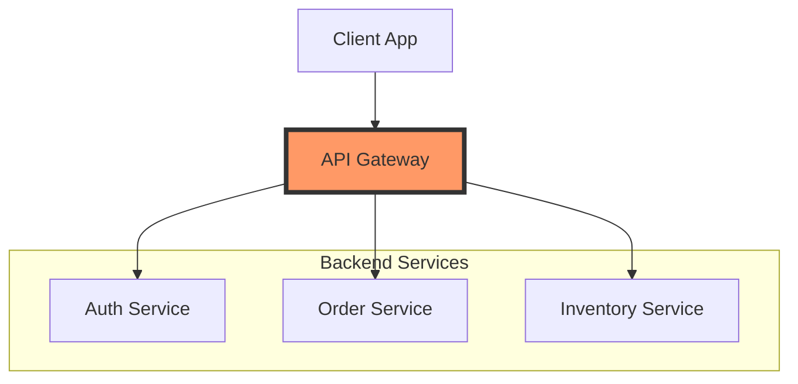

## Responsibilities

- **Authentication:** Verifies JWT tokens or API keys.
- **Rate Limiting:** Prevents abuse by limiting requests per user.
- **Routing:** Maps URLs to specific microservices.
- **Request Aggregation:** Combines results from multiple services into one
  response.

## Architecture Diagram

## Tools

- Kong, Amazon API Gateway, Apigee, Spring Cloud Gateway.
