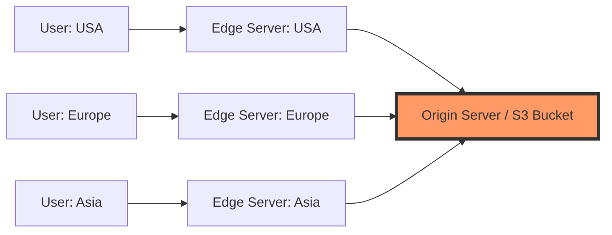

## Why use it?
- **Lower Latency:** Users download content from the "Edge" location nearest to them.
- **Offloads Origin Server:** Reduces bandwidth consumption on the main server.

## How it works
1. User requests a static asset.
2. DNS resolves to the nearest Edge Server.
3. If the asset is not cached, the Edge Server requests it from the **Origin Server** (pulling).
4. Subsequent global requests are served locally.

## Architecture Diagram

