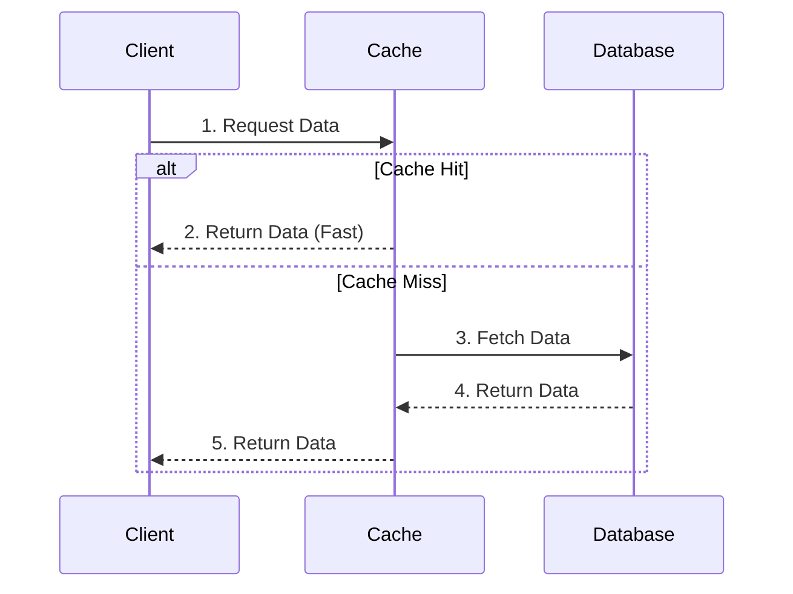

## Why use it?
- **Reduces Latency:** Data is served from memory (microseconds) rather than disk/database (milliseconds).
- **Reduces Database Load:** Fewer reads hit the primary database.

## Caching Strategies
- **Cache-Aside:** Application checks cache first. If not found (cache miss), it queries the DB and updates the cache.
- **Read-Through:** The cache itself fetches data from the DB on a miss.
- **Write-Through:** Writes go to the cache and the DB simultaneously.
- **Write-Behind:** Writes go to the cache first, and later flushed to the DB.

## Eviction Policies
- **LRU (Least Recently Used):** Removes the oldest accessed data.
- **TTL (Time To Live):** Data expires after a set duration.

## Architecture Diagram

## Tools
- **In-Memory:** Redis, Memcached.
- **CDN:** CloudFront, Cloudflare.
