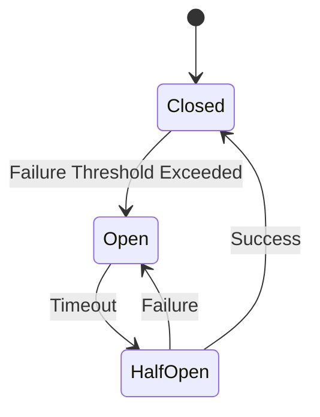

## States
1. **Closed:** Requests flow normally. If failures exceed a threshold, the circuit trips to **Open**.
2. **Open:** Requests fail immediately without hitting the service (to save resources). After a timeout, it moves to **Half-Open**.
3. **Half-Open:** A limited number of requests are allowed. If they succeed, the circuit resets to **Closed**; if they fail, it goes back to **Open**.

## Why use it?
- **Prevents Cascading Failures:** Stops a slow dependency from choking the entire system.

## Architecture Diagram

## Tools
- Resilience4j, Hystrix (Netflix), Sentinel.
