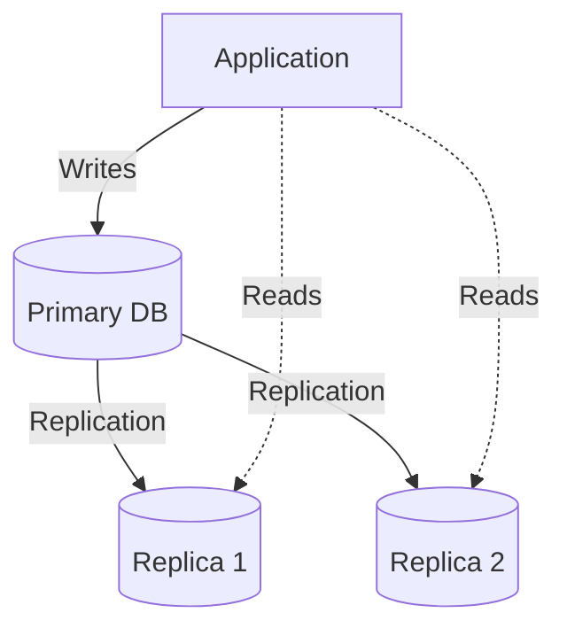

## Why use it?
- **High Availability:** Failover if the primary goes down.
- **Read Scalability:** Route read queries to replicas, preserving the primary for writes.

## Types
- **Master-Slave (Primary-Replica):** Writes go to master; reads go to slaves.
- **Master-Master:** Writes can go to either; complex conflict resolution required.

## Architecture Diagram

## Challenges
- **Replication Lag:** The delay between a write to the master and the update of the replica.
