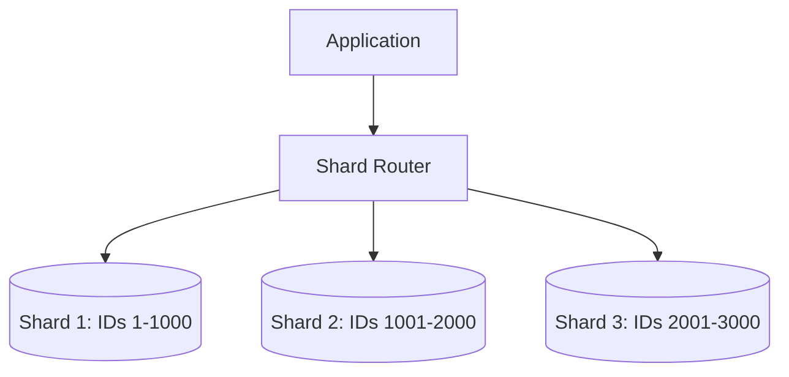

## Why use it?
- **Scale Beyond Single Machine Limits:** If one DB can't hold all data, sharding distributes it.
- **Improved Performance:** Queries are faster because they run on smaller datasets.

## Sharding Strategies
- **Range-Based:** Split by data ranges (e.g., User ID 1-1000 goes to Shard A, 1001-2000 to Shard B).
- **Hash-Based:** Use a hash function on a partition key to distribute data uniformly.
- **Directory-Based:** A lookup service tells the application which shard to query.

## Architecture Diagram

## Challenges
- **Complex Joins:** Joining data across shards is difficult.
- **Rebalancing:** Adding a new shard requires redistributing data.
