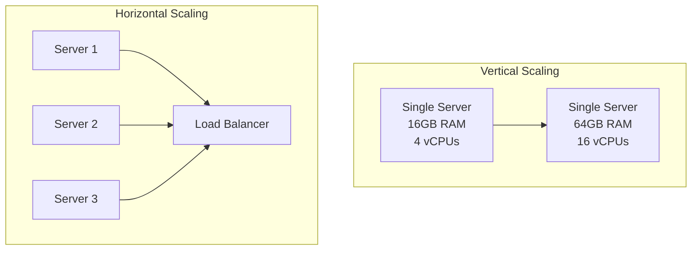
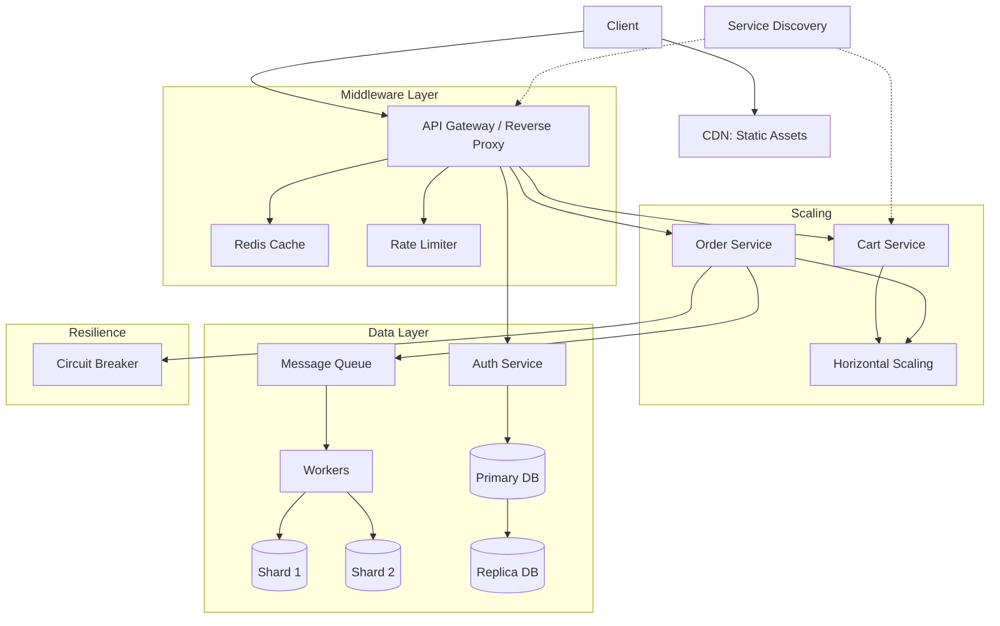

## Vertical Scaling (Scale Up)
**Definition:** Adding more power (CPU, RAM, storage) to an existing machine.
- **Pros:** Simple, no application changes required.
- **Cons:** Physical limits (you can't add infinite RAM); single point of failure; expensive downtime.

## Horizontal Scaling (Scale Out)
**Definition:** Adding more machines (nodes) to a pool of resources.
- **Pros:** Fault tolerance; practically unlimited scaling; cost-effective (commodity hardware).
- **Cons:** Requires application design to be stateless; network overhead; complexity (coordination).

## Decision Matrix

| Aspect | Vertical | Horizontal |
| :--- | :--- | :--- |
| **Upgrade** | Upgrade CPU/RAM | Add new servers |
| **Downtime** | Usually requires downtime | Zero downtime (rolling updates) |
| **Cost** | Expensive high-end hardware | Cheaper standard hardware |
| **Limits** | Single host capacity | Infinite (theoretically) |
| **Complexity** | Low | High |

## Architecture Diagram

---

## Final Architecture: Putting It All Together

Below is a complete microservices system utilizing all 12 principles.

---

## Conclusion
Mastering these 12 concepts provides the foundation for designing systems that can handle millions of users. The key is understanding **trade-offs**:
- **Caching** gives speed but consumes memory.
- **Sharding** gives scale but kills joins.
- **Horizontal Scaling** gives resilience but adds complexity.

*Design is the art of choosing the right compromise for your specific use case.*
