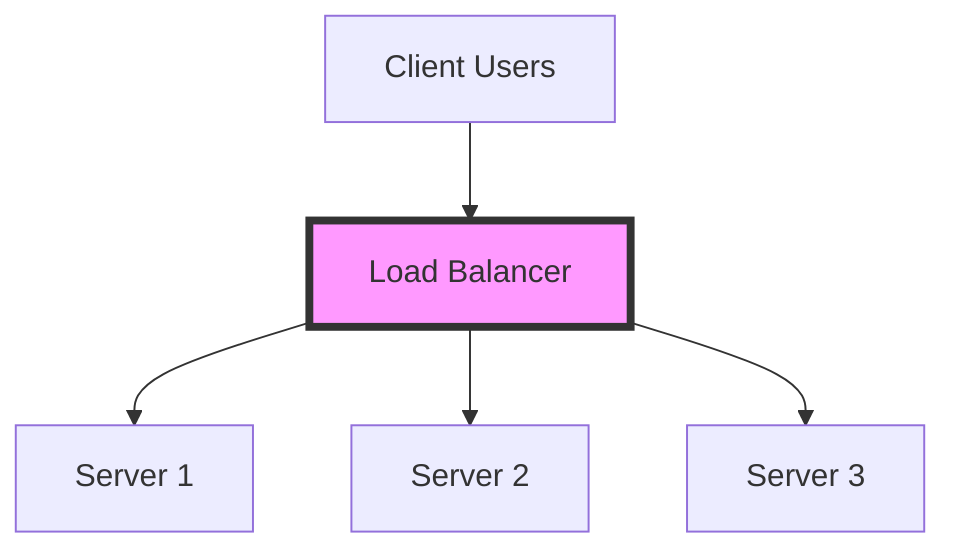

## Why use it?

- **Prevents Overload:** Stops a single server from becoming a bottleneck.
- **High Availability:** If one server fails, the balancer redirects traffic to
  others.
- **Scalability:** Allows you to add more servers seamlessly.

## Algorithms

- **Round Robin:** Cycles through servers in order.
- **Least Connections:** Sends traffic to the server with the fewest active
  connections.
- **IP Hash:** Uses the client's IP address to determine which server receives
  the request (sticky sessions).
- **Weighted Distribution:** Assigns more traffic to powerful servers.

## Architecture Diagram

## Tools

- **Hardware:** F5, Citrix.
- **Software:** Nginx, HAProxy, AWS ELB (Elastic Load Balancing).
