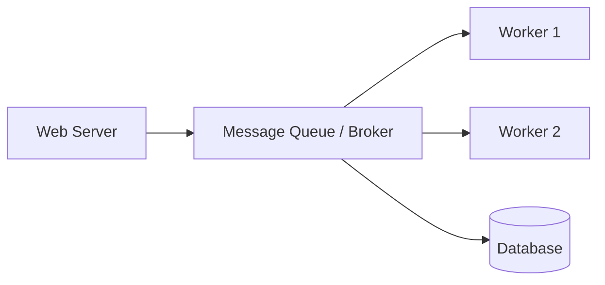

## Why use it?

- **Decoupling:** Services don't need to know about each other.
- **Fault Tolerance:** If a consumer fails, messages persist in the queue.
- **Load Leveling:** Prevents a service from being overwhelmed by a sudden spike
  in requests (e.g., Black Friday).

## Patterns

- **Point-to-Point:** One consumer processes each message.
- **Publish/Subscribe:** Multiple consumers receive copies of the message
  (Topics).

## Architecture Diagram

## Tools

- RabbitMQ, Apache Kafka, Amazon SQS.
