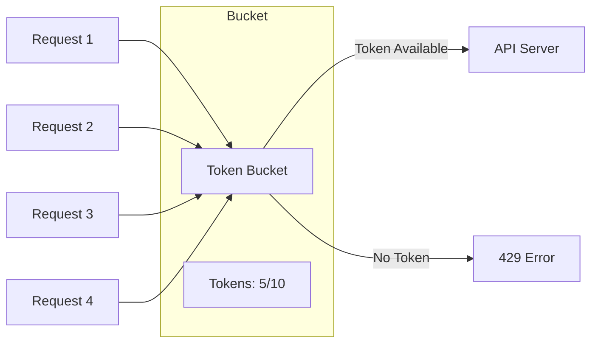

## Algorithms
- **Token Bucket:** A bucket fills with tokens at a set rate. Each request consumes a token.
- **Leaky Bucket:** Requests enter a queue and are processed at a fixed rate.
- **Sliding Window:** Counts requests based on a rolling timestamp.

## Use Cases
- Prevent DDoS attacks.
- Manage costs for paid APIs (Tiered pricing).
- Ensure fair usage among users.

## Diagram (Token Bucket)

