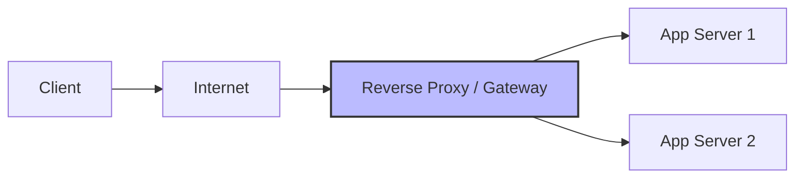

## Functions

- **SSL Termination:** Decrypts incoming HTTPS traffic to reduce load on backend
  servers.
- **Compression:** Compresses outgoing data.
- **Security:** Hides the backend server IPs (DDoS protection).
- **Caching:** Can cache static responses.

## Architecture Diagram

## Tools

- Nginx, Apache, HAProxy.
