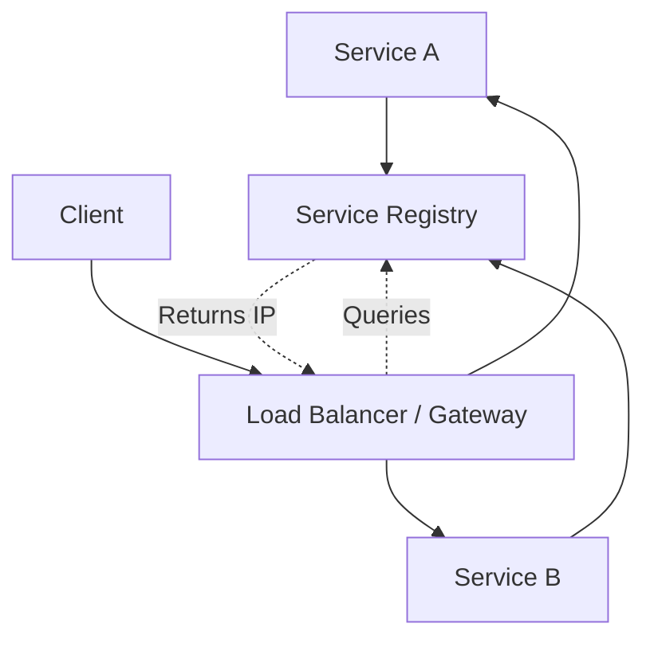

## How it works
- **Client-Side Discovery:** The client queries a registry (e.g., Eureka) to get the service IP.
- **Server-Side Discovery:** A proxy (like a Load Balancer) queries the registry.

## Architecture Diagram

## Tools
- Netflix Eureka, Consul, Zookeeper, Kubernetes DNS.
