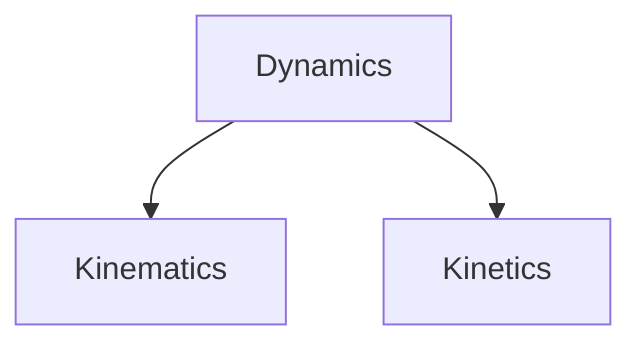
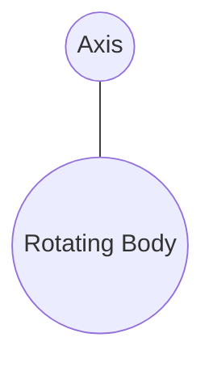
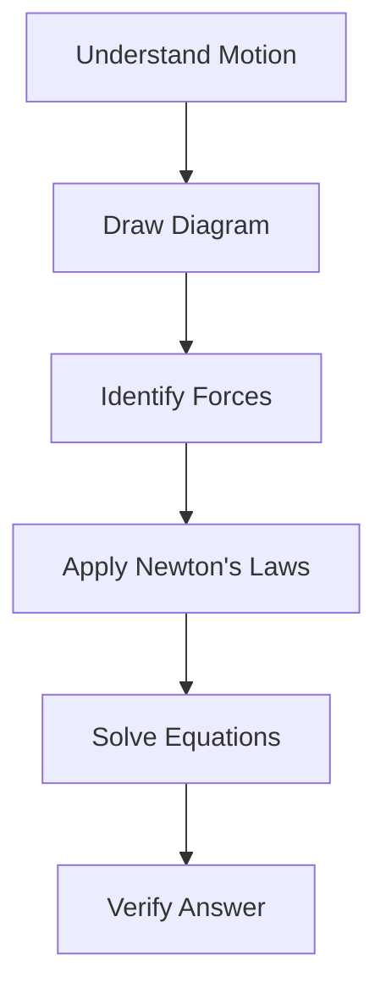

# 🏃 Dynamics

Dynamics is the branch of Engineering Mechanics that studies bodies in motion and the forces causing that motion.

Unlike Statics, where bodies remain at rest or move with constant velocity, Dynamics deals with objects that accelerate due to applied forces.

Dynamics helps engineers understand how vehicles move, machines operate, rockets launch, and robots perform tasks.

---

# 🎯 Why Study Dynamics?

Many engineering systems involve motion.

Examples:

🚗 Cars accelerating on roads

✈️ Aircraft taking off

🚀 Rockets launching into space

⚙️ Rotating machine components

🤖 Industrial robots moving parts

Dynamics helps engineers predict and control these motions safely and efficiently.

---

# 🌍 Real-Life Applications

| Application | Use of Dynamics |
|------------|----------------|
| Automobiles | Acceleration and braking |
| Aircraft | Flight motion |
| Robotics | Movement control |
| Machinery | Rotating components |
| Spacecraft | Orbital motion |
| Sports Engineering | Ball trajectories |

---

# 🧩 Branches of Dynamics

Dynamics is divided into two main parts:



---

# 📍 Kinematics

Kinematics studies motion without considering the forces causing it.

It answers questions like:

- How far did the object move?
- How fast is it moving?
- What is its acceleration?

Kinematics focuses only on motion.

---

# ⚡ Kinetics

Kinetics studies motion along with the forces responsible for it.

It answers:

- Why is the object moving?
- What force caused acceleration?
- How much force is required?

Kinetics is based largely on Newton's Laws of Motion.

---

# 📏 Basic Quantities in Dynamics

---

## Position

Position specifies the location of an object relative to a reference point.

Example:

A car located 100 m from a traffic signal.

---

## Distance

Distance is the total path traveled by an object.

Characteristics:

✅ Scalar quantity

✅ Always positive

Unit:

meter (m)

---

## Displacement

Displacement is the shortest straight-line distance between initial and final positions.

Characteristics:

✅ Vector quantity

✅ Has magnitude and direction

Unit:

meter (m)

---

# 🚗 Speed

Speed indicates how fast an object moves.

Formula:

```text
Speed = Distance / Time
```

Unit:

m/s

Example:

A car travels 100 m in 10 s.

Speed = 100 / 10 = 10 m/s

---

# ➡️ Velocity

Velocity is the rate of change of displacement.

Formula:

```text
Velocity = Displacement / Time
```

Velocity includes direction.

Example:

20 m/s east

---

# ⚡ Acceleration

Acceleration is the rate of change of velocity.

Formula:

```text
Acceleration = Change in Velocity / Time
```

Unit:

m/s²

Examples:

🚗 Car speeding up

✈️ Aircraft taking off

🚀 Rocket launch

---

# 🔄 Types of Motion

---

## Translational Motion

The entire body moves from one position to another.

Examples:

🚗 Moving car

🚂 Train


---

## Rotational Motion

The body rotates about an axis.

Examples:

⚙️ Gear

🛞 Wheel

🌍 Earth rotating



---

## General Plane Motion

Combination of translation and rotation.

Examples:

🚴 Bicycle wheel moving forward

⚙️ Rolling cylinder

---

# 📚 Newton's Laws of Motion

Dynamics is primarily based on Newton's Laws.

---

# 1️⃣ First Law of Motion

A body remains at rest or in uniform motion unless acted upon by an external force.

This law is also called the Law of Inertia.

Examples:

🚌 Passenger moving forward when bus suddenly stops

⚽ Ball remains stationary until kicked

---

# 2️⃣ Second Law of Motion

The acceleration of a body is directly proportional to the net force acting on it.

```text
F = ma
```

Where:

- F = Force (N)
- m = Mass (kg)
- a = Acceleration (m/s²)

This is the most important equation in dynamics.

:contentReference[oaicite:0]{index=0}

Example:

A force of 20 N acts on a 5 kg object.

Acceleration:

a = 20 / 5 = 4 m/s²

---

# 3️⃣ Third Law of Motion

For every action, there is an equal and opposite reaction.

Examples:

🚀 Rocket propulsion

🏊 Swimming

🚶 Walking


---

# 📈 Equations of Motion

For uniformly accelerated motion:

---

## First Equation

```text
v = u + at
```

Where:

- u = Initial velocity
- v = Final velocity
- a = Acceleration
- t = Time

---

## Second Equation

```text
s = ut + 1/2 at²
```

---

## Third Equation

```text
v² = u² + 2as
```

These equations are widely used in engineering calculations.

---

# 📊 Motion Relationships


Position changes create velocity.

Velocity changes create acceleration.

---

# 🔄 Circular Motion

When an object moves along a circular path, it experiences centripetal acceleration.

Examples:

🛞 Rotating wheel

🌍 Planet orbiting the sun

🎡 Ferris wheel

Centripetal acceleration:

```text
a = v² / r
```

Where:

- v = Velocity
- r = Radius

---

# ⚙️ Work, Energy, and Power

Dynamics often involves energy concepts.

---

## Work

Work is done when a force causes displacement.

Formula:

```text
Work = Force × Displacement
```

Unit:

Joule (J)

---

## Kinetic Energy

Energy possessed by a moving body.


::contentReference[oaicite:1]{index=1}


Where:

- m = Mass
- v = Velocity

Example:

Moving vehicle

Rotating machine parts

---

## Potential Energy

Energy due to position.

```text
PE = mgh
```

Where:

- h = Height

Example:

Water stored in a dam

---

## Power

Rate of doing work.

```text
Power = Work / Time
```

Unit:

Watt (W)

---

# 🚗 Dynamics Problem-Solving Procedure



---

# 🏗️ Engineering Applications

🚗 Vehicle Design

✈️ Aircraft Motion Analysis

🚀 Spacecraft Dynamics

⚙️ Mechanical Systems

🤖 Robotics

🏭 Industrial Automation

🚄 Railway Engineering

---

# ❌ Common Mistakes

- Confusing speed with velocity
- Ignoring direction of vectors
- Using incorrect units
- Forgetting acceleration signs
- Applying wrong motion equations

---

# 🌟 Key Takeaways

✅ Dynamics studies bodies in motion.

✅ It consists of Kinematics and Kinetics.

✅ Newton's Laws form the foundation of dynamics.

✅ Force, velocity, and acceleration are closely related.

✅ Motion equations help solve engineering problems.

✅ Dynamics is essential for understanding machines, vehicles, robots, and aerospace systems.
