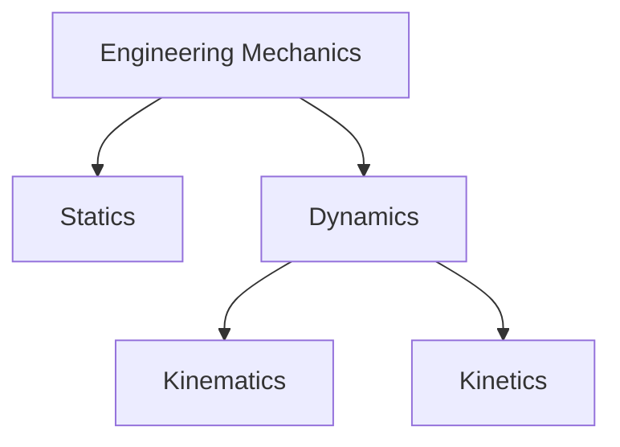

# 📖 Introduction to Engineering Mechanics

Engineering Mechanics is the branch of science that studies the behavior of
physical bodies when subjected to forces or displacements.

It forms the foundation of many engineering fields such as Civil Engineering,
Mechanical Engineering, Aerospace Engineering, and Structural Engineering.

Simply put, Engineering Mechanics helps engineers understand:

✅ Why objects move  
✅ Why objects remain at rest  
✅ How forces affect structures and machines  
✅ How to design safe and efficient systems

---

# 🎯 Why Study Engineering Mechanics?

Every engineering structure or machine experiences forces.

Examples:

🏗️ Buildings support their own weight and occupants.

🚗 Vehicles experience engine force, friction, and air resistance.

🌉 Bridges carry traffic loads and wind loads.

⚙️ Machines transmit forces through gears and shafts.

Engineering Mechanics helps engineers predict and control these forces.

---

# 🌍 Real-Life Applications

| Application | Use of Mechanics           |
| ----------- | -------------------------- |
| Buildings   | Structural stability       |
| Bridges     | Load analysis              |
| Vehicles    | Motion and braking         |
| Aircraft    | Flight dynamics            |
| Robots      | Movement and force control |
| Machines    | Design of components       |

---

# 🏗️ Branches of Engineering Mechanics

Engineering Mechanics is mainly divided into two branches:

---

# ⚖️ Statics

Statics deals with bodies that are in equilibrium.

A body is in equilibrium when:

- Net Force = 0
- Net Moment = 0

Examples:

🏢 Building columns

🌉 Bridge supports

🛠️ Fixed machine components

In statics, objects remain at rest.

---

# 🏃 Dynamics

Dynamics deals with bodies in motion.

Dynamics studies:

- Velocity
- Acceleration
- Forces causing motion

Examples:

🚗 Moving vehicles

🚀 Rockets

⚙️ Rotating machinery

Dynamics is further divided into:

### 1️⃣ Kinematics

Kinematics describes motion without considering forces.

It answers:

- How fast is the object moving?
- How far has it traveled?
- What is its acceleration?

### 2️⃣ Kinetics

Kinetics studies motion along with the forces causing it.

It answers:

- Why is the object moving?
- What force causes acceleration?

---

# 💪 Fundamental Concepts

## Particle

A particle is an object whose size can be neglected.

Example:

⚽ A ball traveling through air

---

## Rigid Body

A rigid body does not deform under applied forces.

Example:

🔩 Steel beam (idealized)

Most engineering structures are analyzed as rigid bodies.

---

## Force

Force is a push or pull acting on an object.

Examples:

- Weight
- Friction
- Tension
- Applied force

Force is a vector quantity.

It has:

- Magnitude
- Direction

Unit:

Newton (N)

---

## Mass

Mass is the amount of matter in a body.

Unit:

Kilogram (kg)

Mass remains constant.

---

## Weight

Weight is the gravitational force acting on a body.

Formula:

W = mg

Where:

- W = Weight (N)
- m = Mass (kg)
- g = Acceleration due to gravity

---

## Moment

Moment is the turning effect produced by a force.

Examples:

🔧 Tightening a bolt using a wrench

🚪 Opening a door

Moment depends on:

- Force magnitude
- Distance from pivot

Unit:

N·m

---

# 🎯 Basic Units Used in Mechanics

| Quantity | Unit          |
| -------- | ------------- |
| Length   | meter (m)     |
| Mass     | kilogram (kg) |
| Time     | second (s)    |
| Force    | newton (N)    |
| Work     | joule (J)     |
| Power    | watt (W)      |

---

# ⚙️ Engineering Mechanics Workflow

---

# 📝 Assumptions in Engineering Mechanics

For simplicity, engineers often assume:

- Bodies are rigid.
- Forces act at specific points.
- Friction may be neglected initially.
- Materials behave ideally.

These assumptions make analysis easier while providing accurate engineering
results.

---

# 🌟 Key Takeaways

✅ Engineering Mechanics studies forces and motion.

✅ It is the foundation of all engineering design.

✅ Main branches are Statics and Dynamics.

✅ Forces, moments, mass, and motion are core concepts.

✅ Engineering structures and machines are designed using mechanics principles.

Engineering Mechanics acts as the language through which engineers understand
and control the physical world.
