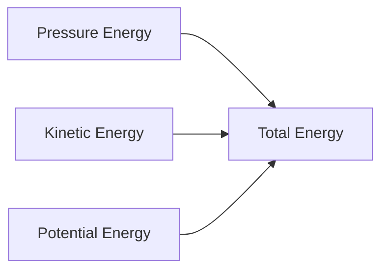
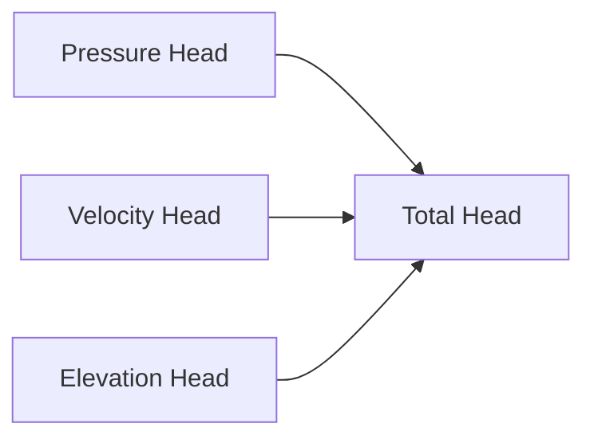
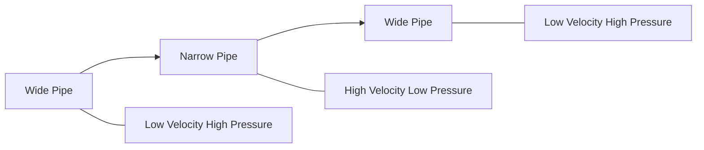
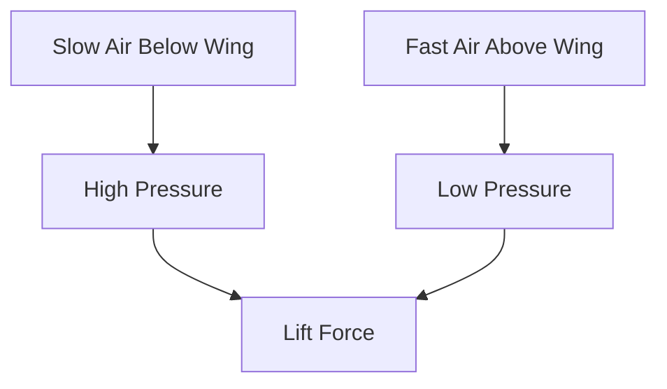
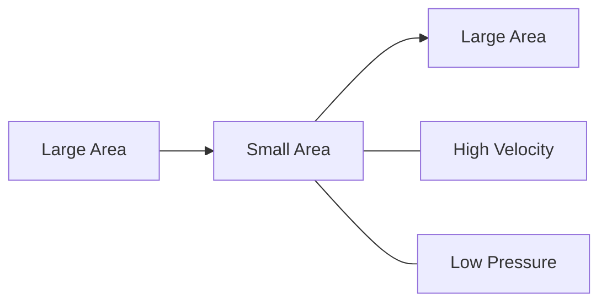
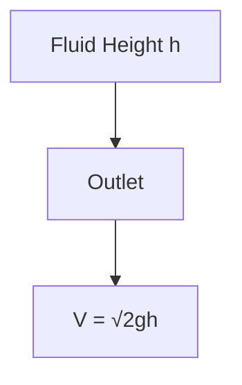
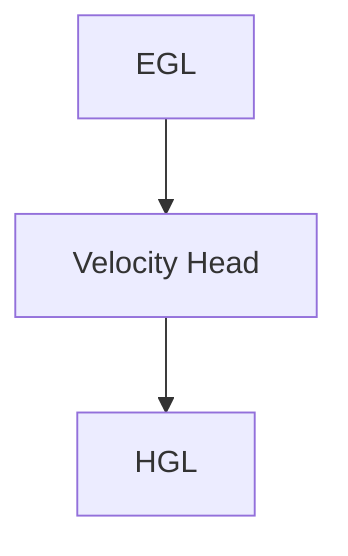

# 📐 Bernoulli's Equation

Bernoulli's Equation is one of the most important principles in fluid mechanics. It explains how pressure, velocity, and elevation are related in a moving fluid.

A simple idea behind Bernoulli's principle is:

> When the velocity of a fluid increases, its pressure decreases, and vice versa.

This principle is widely used in aircraft wings, Venturi meters, nozzles, pipelines, carburetors, and hydraulic systems.

---

# 🌊 What is Bernoulli's Equation?

Bernoulli's Equation is based on the **Law of Conservation of Energy**.

For an ideal fluid flowing steadily through a pipe:

* Total energy remains constant.
* Energy changes form between pressure energy, kinetic energy, and potential energy.

---

# 📌 Assumptions of Bernoulli's Equation

Bernoulli's equation is valid only when:

✅ Fluid flow is steady

✅ Fluid is incompressible

✅ Fluid is non-viscous (ideal)

✅ Flow occurs along a streamline

✅ No energy is added or removed

---

# ⚡ Energy Components in a Fluid

A moving fluid possesses three forms of energy.

### 1. Pressure Energy

Energy due to fluid pressure.

[
\frac{P}{\rho g}
]

---

### 2. Kinetic Energy

Energy due to fluid velocity.

[
\frac{V^2}{2g}
]

---

### 3. Potential Energy

Energy due to elevation.

[
z
]

---

# 📐 Bernoulli's Equation

For two points in a flowing fluid:

[
\frac{P_1}{\rho g}
+
\frac{V_1^2}{2g}
+
z_1
===

\frac{P_2}{\rho g}
+
\frac{V_2^2}{2g}
+
z_2
]

Where:

* P = Pressure
* ρ = Density
* g = Acceleration due to gravity
* V = Velocity
* z = Elevation

The equation states that:

> Total head remains constant along a streamline.

---

# Understanding Bernoulli's Equation Visually

Total Head:

[
H = \frac{P}{\rho g}+\frac{V^2}{2g}+z
]

---

# 🎯 Bernoulli's Principle

When fluid enters a narrow section:

* Velocity increases
* Pressure decreases

When fluid enters a wider section:

* Velocity decreases
* Pressure increases

---

# Example 1: Pressure-Velocity Relationship

Consider water flowing through a pipe that narrows.

At the narrow section:

* Flow speed increases
* Kinetic energy increases

Since total energy remains constant:

* Pressure energy decreases

Therefore:

[
V \uparrow \Rightarrow P \downarrow
]

This is the essence of Bernoulli's principle.

---

# 🛫 Bernoulli's Principle and Aircraft Wings

Air moves faster over the curved upper surface of the wing.

According to Bernoulli's principle:

* Faster air → Lower pressure
* Slower air → Higher pressure

Pressure difference creates lift.

---

# 💨 Venturi Effect

The Venturi Effect is a direct application of Bernoulli's principle.

When fluid passes through a narrow section:

* Velocity increases
* Pressure decreases

Applications:

* Venturi meter
* Carburetor
* Atomizers
* Spray guns

---

# 🚿 Flow from a Tank

Consider water flowing from a hole in a tank.

At the water surface:

* Velocity is nearly zero

At the outlet:

* Velocity is maximum

Applying Bernoulli's equation:

[
V=\sqrt{2gh}
]

This is known as **Torricelli's Theorem**.

---

# Torricelli's Theorem

The velocity of fluid leaving a tank equals the velocity gained by a body freely falling through the same height.

---

# Hydraulic Grade Line (HGL)

Hydraulic Grade Line represents:

[
\frac{P}{\rho g}+z
]

It shows the sum of pressure head and elevation head.

---

# Energy Grade Line (EGL)

Energy Grade Line represents:

[
\frac{P}{\rho g}
+
\frac{V^2}{2g}
+
z
]

The EGL is always above the HGL by the velocity head.

---

# Modified Bernoulli Equation

Real fluids experience friction losses.

Therefore:

[
\frac{P_1}{\rho g}
+
\frac{V_1^2}{2g}
+
z_1
===

\frac{P_2}{\rho g}
+
\frac{V_2^2}{2g}
+
z_2
+
h_f
]

Where:

* (h_f) = Head loss due to friction

---

# Engineering Applications

## ✈️ Aircraft Wings

Pressure difference generates lift.

---

## 💧 Venturi Meter

Measures flow rate in pipelines.

---

## 🚿 Spray Bottles

Low pressure draws liquid upward.

---

## ⛽ Carburetors

Mix fuel and air in engines.

---

## 🏭 Pipelines

Used for pressure and velocity calculations.

---

## 🌬 Chimneys

Fast-moving air creates low pressure, improving draft.

---

# Real-Life Examples

### Cricket Ball Swing

Different air velocities around the ball create pressure differences.

### Perfume Spray

Fast-moving air lowers pressure and pulls liquid upward.

### Airplane Flight

Pressure difference above and below the wing generates lift.

### Garden Hose

Reducing nozzle area increases water speed.

---

# 📋 Advantages of Bernoulli's Equation

✅ Simple and powerful

✅ Based on energy conservation

✅ Useful for pipeline analysis

✅ Helps design hydraulic devices

✅ Applicable to many engineering systems

---

# ⚠️ Limitations

Bernoulli's equation assumes:

* No viscosity
* No turbulence
* No energy losses
* Incompressible fluid

For real systems, correction factors and head losses must be included.

---

# Summary

| Energy Type    | Expression       |
| -------------- | ---------------- |
| Pressure Head  | P/ρg             |
| Velocity Head  | V²/2g            |
| Elevation Head | z                |
| Total Head     | P/ρg + V²/2g + z |

---

# 🎯 Key Takeaways

* Bernoulli's Equation is derived from the conservation of energy.
* Total energy of an ideal fluid remains constant along a streamline.
* An increase in fluid velocity causes a decrease in pressure.
* Bernoulli's principle explains lift generation on aircraft wings.
* The Venturi effect and Torricelli's theorem are important applications.
* Real fluids require the modified Bernoulli equation with head loss terms.
* Bernoulli's Equation is extensively used in fluid engineering and hydraulic design.
