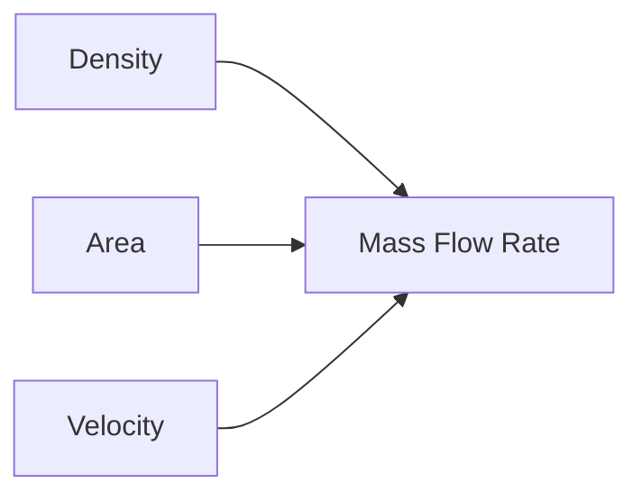
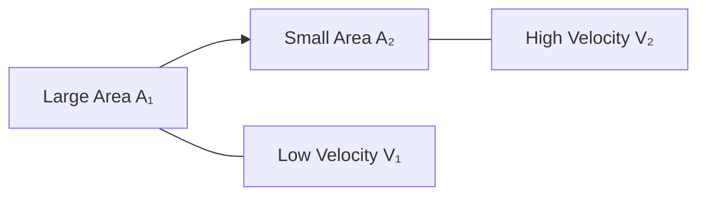
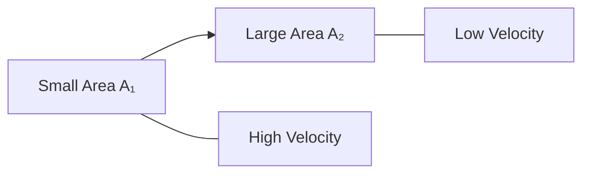
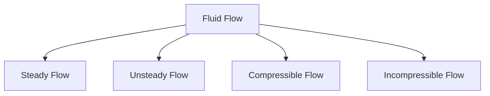
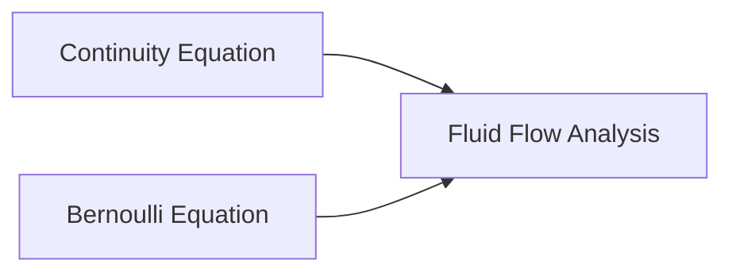

# 🔗 Continuity Equation

The Continuity Equation is one of the fundamental laws of fluid mechanics. It is based on the **Law of Conservation of Mass**, which states:

> Mass can neither be created nor destroyed.

In fluid flow, this means the mass entering a system must equal the mass leaving the system, provided there is no accumulation within the system.

The continuity equation helps engineers analyze flow through pipes, nozzles, diffusers, pumps, turbines, and hydraulic systems.

---

# 📌 What is the Continuity Equation?

The Continuity Equation expresses the conservation of mass in a flowing fluid.

For steady flow:

[
\text{Mass Inflow} = \text{Mass Outflow}
]

---

# 🌊 Mass Flow Rate

Mass flow rate is the mass of fluid passing through a cross-section per unit time.

### Formula

[
\dot{m} = \rho A V
]

Where:

* (\dot{m}) = Mass flow rate (kg/s)
* (\rho) = Fluid density (kg/m³)
* (A) = Cross-sectional area (m²)
* (V) = Fluid velocity (m/s)

---

## Physical Meaning

Larger density, area, or velocity means more fluid passes through the pipe every second.

---

# 📐 General Continuity Equation

For any two sections of a flow:

[
\rho_1 A_1 V_1 = \rho_2 A_2 V_2
]

Where:

* (\rho_1,\rho_2) = Densities
* (A_1,A_2) = Areas
* (V_1,V_2) = Velocities

This equation applies to both liquids and gases.

---

# 💧 Continuity Equation for Incompressible Flow

For liquids such as water, density remains nearly constant.

Therefore:

[
\rho_1 = \rho_2
]

The continuity equation becomes:

[
A_1V_1=A_2V_2
]

This is the most commonly used form.

---

## Important Observation

If pipe area decreases:

[
A \downarrow
]

Then velocity must increase:

[
V \uparrow
]

to maintain the same flow rate.

---

# 🔍 Flow Through a Converging Pipe

Consider water flowing through a pipe that becomes narrower.

Since:

[
A_1V_1=A_2V_2
]

and

[
A_2 < A_1
]

therefore:

[
V_2 > V_1
]

Velocity increases in the narrow section.

---

# 🔍 Flow Through a Diverging Pipe

As area increases:

[
V \downarrow
]

Velocity decreases.

---

# 📊 Volume Flow Rate (Discharge)

Volume flow rate represents the volume of fluid flowing per unit time.

### Formula

[
Q = AV
]

Where:

* (Q) = Discharge (m³/s)
* (A) = Area (m²)
* (V) = Velocity (m/s)

---

## Relationship Between Mass Flow and Discharge

[
\dot{m} = \rho Q
]

Since:

[
Q = AV
]

Therefore:

[
\dot{m} = \rho AV
]

---

# Example 1: Flow in a Pipe

Water flows through a pipe.

Given:

* Area = 0.2 m²
* Velocity = 4 m/s

Find discharge.

### Solution

[
Q = AV
]

[
Q = 0.2 \times 4
]

[
Q = 0.8 \ m^3/s
]

---

# Example 2: Velocity in a Reduced Section

Given:

* (A_1 = 0.4\ m^2)
* (V_1 = 3\ m/s)
* (A_2 = 0.1\ m^2)

Find (V_2).

### Solution

Using continuity equation:

[
A_1V_1=A_2V_2
]

[
0.4 \times 3 = 0.1V_2
]

[
1.2 = 0.1V_2
]

[
V_2=12 \ m/s
]

The velocity increases because the pipe area decreases.

---

# 🧮 Differential Form of Continuity Equation

For advanced fluid mechanics:

[
\frac{\partial \rho}{\partial t}
+
\nabla \cdot (\rho \vec{V})
===========================

0
]

This form is used in:

* Computational Fluid Dynamics (CFD)
* Aerodynamics
* Weather simulations
* Fluid flow analysis software

---

# Types of Flow Based on Continuity

---

## Steady Flow

Flow properties do not change with time.

[
\frac{\partial}{\partial t}=0
]

---

## Unsteady Flow

Flow properties change with time.

Example:

* Opening a water valve.

---

## Compressible Flow

Density changes significantly.

Examples:

* Airflow in jet engines
* High-speed gas flow

---

## Incompressible Flow

Density remains nearly constant.

Examples:

* Water flow
* Oil flow

---

# 🚀 Applications of Continuity Equation

## 💧 Water Supply Systems

Used to determine flow rates and pipe sizes.

---

## 🏭 Industrial Pipelines

Helps calculate fluid velocity in different pipe sections.

---

## ✈️ Aircraft Engineering

Analyzes airflow around aircraft structures.

---

## 🚗 Automotive Engineering

Used in intake and exhaust systems.

---

## ⚙️ Hydraulic Machines

Used in pumps, turbines, and hydraulic circuits.

---

## 🌬 Venturi Meters

Flow rate measurement depends on continuity and Bernoulli's principles.

---

# Real-Life Examples

### Garden Hose

When the nozzle is partially closed:

* Area decreases
* Velocity increases

This is explained by the continuity equation.

---

### River Flow

A narrow river section flows faster than a wider section.

---

### Blood Flow

Blood velocity increases in narrowed arteries.

---

### Spray Nozzle

Small outlet area creates high-speed fluid jets.

---

# Continuity Equation and Bernoulli Equation

Both equations are frequently used together.

### Continuity Equation

Conservation of mass.

### Bernoulli Equation

Conservation of energy.

Together they solve most basic fluid flow problems.

---

# 📋 Summary

| Quantity                    | Formula                     |
| --------------------------- | --------------------------- |
| Mass Flow Rate              | (\dot{m}=\rho AV)           |
| Discharge                   | (Q=AV)                      |
| General Continuity Equation | (\rho_1A_1V_1=\rho_2A_2V_2) |
| Incompressible Flow         | (A_1V_1=A_2V_2)             |

---

# 🎯 Key Takeaways

* The Continuity Equation is based on conservation of mass.
* Mass entering a system equals mass leaving the system.
* For incompressible flow:

[
A_1V_1=A_2V_2
]

* Velocity increases when flow area decreases.
* The continuity equation is used in pipelines, nozzles, hydraulic systems, and aerodynamics.
* It works together with Bernoulli's Equation to analyze fluid flow.
* It is one of the most important equations in fluid mechanics and engineering design.
