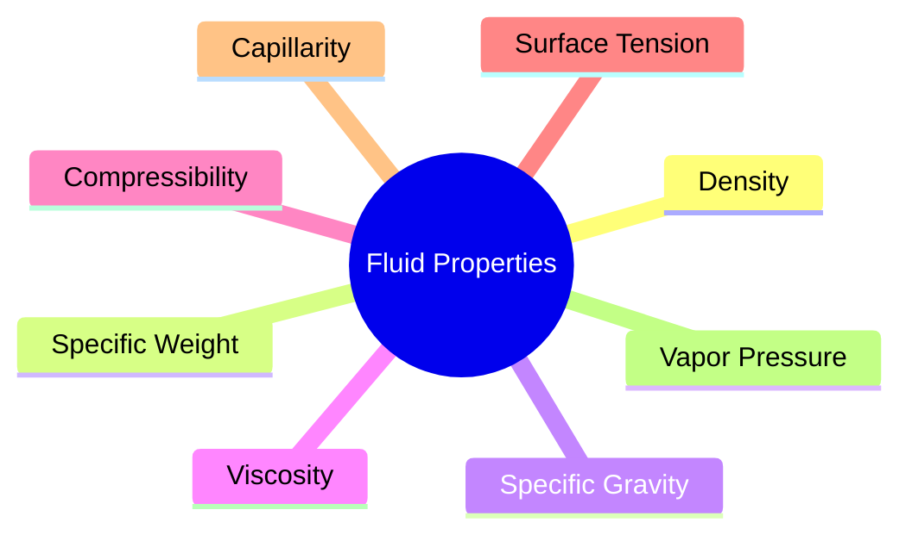
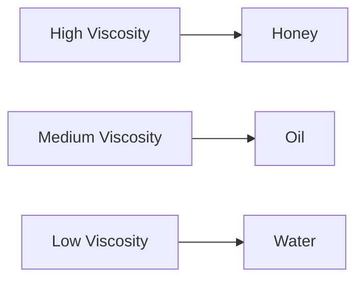
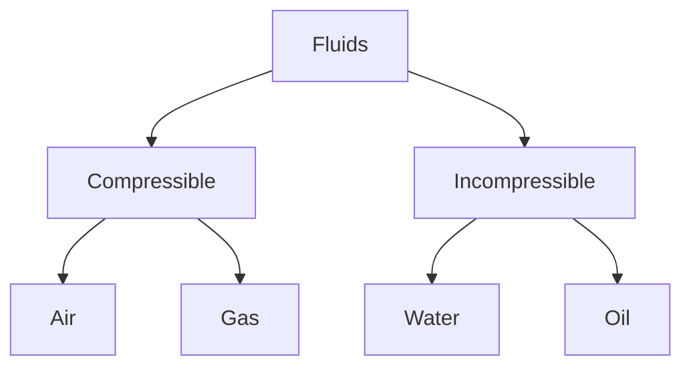
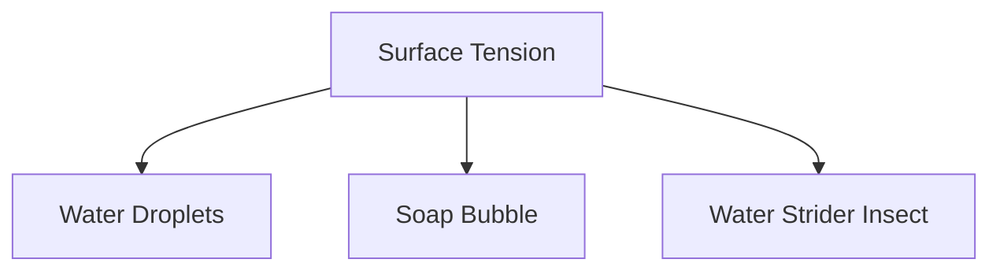
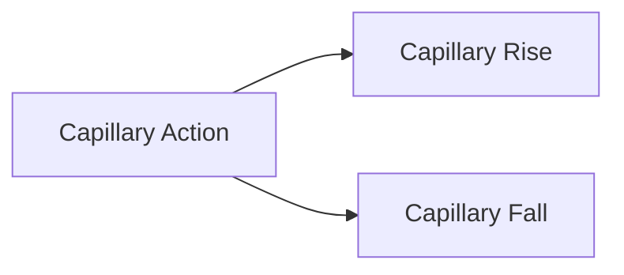
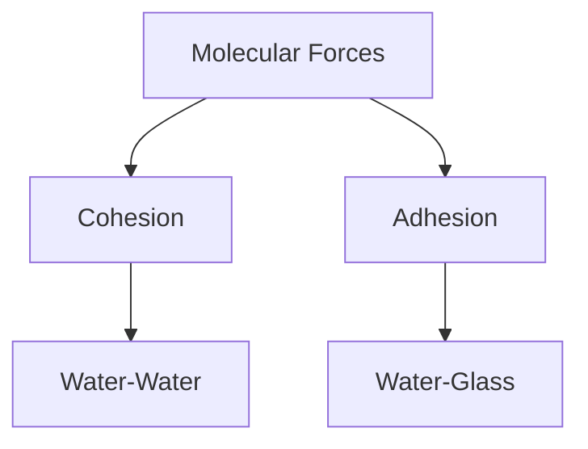

# 💧 Properties of Fluids

Understanding fluid properties is the foundation of fluid mechanics. These properties help engineers predict how fluids behave under different conditions such as pressure, temperature, and flow velocity.

Think of fluid properties as the "characteristics" that define how a fluid responds when forces act on it.

---

# 📌 What Are Fluid Properties?

Fluid properties are measurable characteristics that describe the physical behavior of fluids.

Some of the most important properties are:

---

# 1️⃣ Density (ρ)

Density is the mass of fluid contained in a unit volume.

### Formula

[
\rho = \frac{m}{V}
]

Where:

* ρ = Density (kg/m³)
* m = Mass (kg)
* V = Volume (m³)

### SI Unit

kg/m³

### Examples

| Fluid   | Density (kg/m³) |
| ------- | --------------- |
| Air     | 1.225           |
| Water   | 1000            |
| Mercury | 13600           |

### Example

If 2 m³ of water has a mass of 2000 kg:

[
\rho = \frac{2000}{2}
]

[
\rho = 1000 \ kg/m^3
]

---

# 2️⃣ Specific Weight (γ)

Specific weight is the weight of fluid per unit volume.

### Formula

[
\gamma = \rho g
]

Where:

* γ = Specific Weight (N/m³)
* ρ = Density (kg/m³)
* g = Acceleration due to gravity (9.81 m/s²)

### For Water

[
\gamma = 1000 \times 9.81
]

[
\gamma = 9810 \ N/m^3
]

---

# 3️⃣ Specific Gravity (SG)

Specific gravity is the ratio of fluid density to the density of water.

### Formula

[
SG = \frac{\rho_{fluid}}{\rho_{water}}
]

### Characteristics

* No units
* Pure ratio

### Examples

| Fluid    | Specific Gravity |
| -------- | ---------------- |
| Water    | 1                |
| Mercury  | 13.6             |
| Kerosene | 0.8              |

### Example

For oil having density 800 kg/m³:

[
SG = \frac{800}{1000}
]

[
SG = 0.8
]

---

# 4️⃣ Viscosity (μ)

Viscosity is the resistance offered by a fluid to flow.

It is similar to friction in solids.

### Simple Example

* Honey → High viscosity
* Water → Low viscosity
* Air → Very low viscosity

---

## Dynamic Viscosity

According to Newton's law of viscosity:

[
\tau = \mu \frac{du}{dy}
]

Where:

* τ = Shear stress
* μ = Dynamic viscosity
* du/dy = Velocity gradient

### SI Unit

Pa·s (Pascal-second)

---

## Kinematic Viscosity

Kinematic viscosity is the ratio of dynamic viscosity to density.

### Formula

[
\nu = \frac{\mu}{\rho}
]

Where:

* ν = Kinematic viscosity

### SI Unit

m²/s

---

# 5️⃣ Compressibility

Compressibility is the ability of a fluid to change its volume under pressure.

### Compressible Fluids

* Air
* Steam
* Natural Gas

### Incompressible Fluids

* Water
* Oil
* Mercury

---

# 6️⃣ Surface Tension (σ)

Surface tension is the property by which the surface of a liquid behaves like a stretched elastic membrane.

It occurs due to cohesive forces between liquid molecules.

### Examples

* Water droplets become spherical.
* Insects walk on water.
* Soap bubbles form.

---

# 7️⃣ Capillarity

Capillarity is the rise or fall of liquid in a narrow tube due to surface tension.

### Capillary Rise

Occurs when adhesive force > cohesive force.

Example:

* Water in a thin glass tube

### Capillary Fall

Occurs when cohesive force > adhesive force.

Example:

* Mercury in a glass tube

---

# 8️⃣ Vapor Pressure

Vapor pressure is the pressure exerted by the vapor molecules above a liquid surface.

When vapor pressure becomes equal to surrounding pressure, boiling occurs.

### Examples

* Water boils at 100°C under atmospheric pressure.
* Water boils at lower temperatures at high altitudes.

---

# 9️⃣ Cohesion and Adhesion

### Cohesion

Force of attraction between molecules of the same substance.

Example:

* Water-to-water attraction.

### Adhesion

Force of attraction between molecules of different substances.

Example:

* Water-to-glass attraction.

---

# 🔬 Ideal Fluid vs Real Fluid

| Property        | Ideal Fluid | Real Fluid |
| --------------- | ----------- | ---------- |
| Viscosity       | Zero        | Present    |
| Compressibility | Zero        | Small      |
| Friction Losses | None        | Present    |
| Existence       | Theoretical | Practical  |

### Examples

Ideal Fluid:

* Does not exist in nature.

Real Fluid:

* Water
* Air
* Oil
* Gasoline

---

# 🚀 Engineering Applications

### Hydraulic Systems

Density and viscosity determine system performance.

### Lubrication Systems

Viscosity affects friction reduction.

### Aircraft Design

Air density influences lift and drag.

### Pipeline Design

Fluid properties affect pressure losses.

### Biomedical Engineering

Blood viscosity influences circulation.

---

# 📋 Summary

| Property            | Symbol | Unit    |
| ------------------- | ------ | ------- |
| Density             | ρ      | kg/m³   |
| Specific Weight     | γ      | N/m³    |
| Specific Gravity    | SG     | No unit |
| Dynamic Viscosity   | μ      | Pa·s    |
| Kinematic Viscosity | ν      | m²/s    |
| Surface Tension     | σ      | N/m     |
| Vapor Pressure      | Pv     | Pa      |

---

# 🎯 Key Takeaways

* Density measures mass per unit volume.
* Specific weight is weight per unit volume.
* Specific gravity compares density with water.
* Viscosity represents resistance to flow.
* Surface tension causes liquid surfaces to behave like stretched membranes.
* Capillarity causes liquid rise or fall in narrow tubes.
* Compressibility is significant in gases and negligible in most liquids.
* These properties are essential for analyzing fluid behavior in engineering systems.
