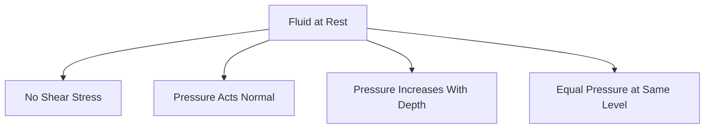
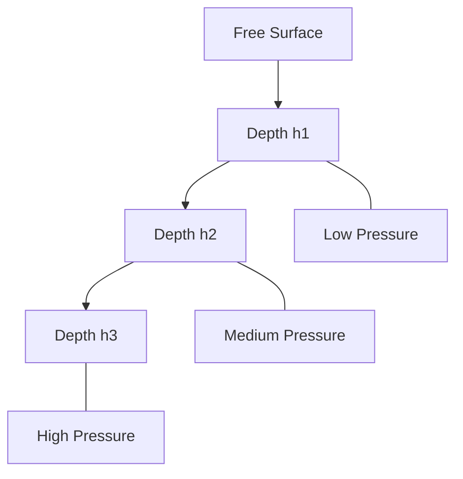
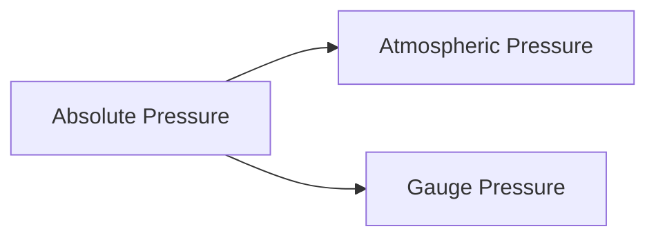
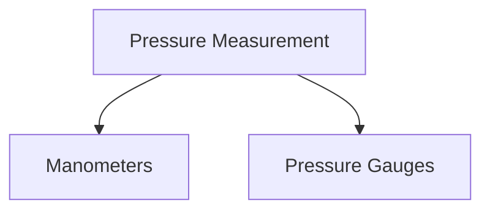
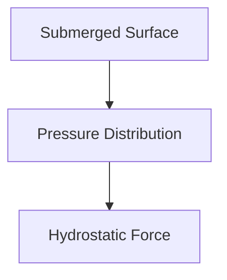
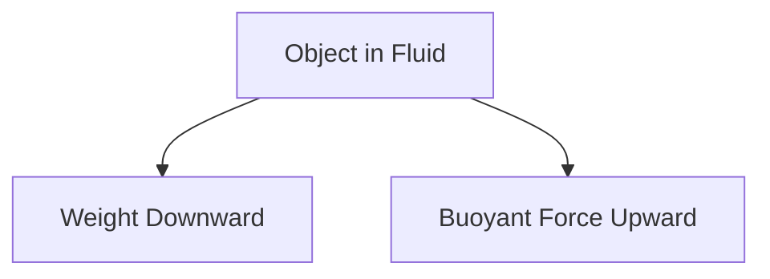
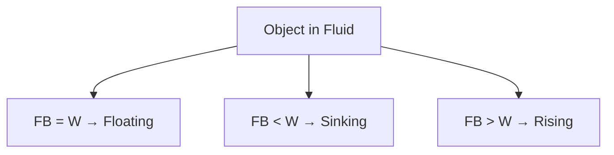
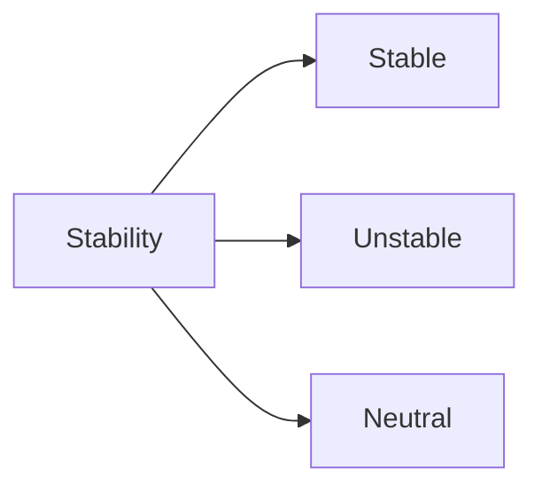

# ⚖️ Fluid Statics

Fluid Statics is the branch of fluid mechanics that deals with fluids at rest. Since the fluid is not moving, there are no shear stresses caused by motion. The only significant force acting inside the fluid is pressure.

Fluid statics helps engineers design dams, water tanks, hydraulic systems, submarines, and ships.

---

# 📌 What is Fluid Statics?

Fluid statics studies fluids that are completely at rest or moving as a rigid body without relative motion between fluid layers.

### Examples

✅ Water stored in a tank

✅ Water in a dam reservoir

✅ Oil inside a container

✅ Liquid inside a hydraulic jack

---

## Characteristics of Fluid at Rest

When a fluid is at rest:

* Shear stress is zero
* Pressure acts perpendicular to surfaces
* Pressure increases with depth
* Pressure at the same horizontal level is equal

---

# 1️⃣ Pressure in a Fluid

Pressure is the normal force acting per unit area.

### Formula

[
P = \frac{F}{A}
]

Where:

* P = Pressure (Pa)
* F = Force (N)
* A = Area (m²)

### SI Unit

Pascal (Pa)

[
1 , Pa = 1 , N/m^2
]

---

## Example

A force of 500 N acts on an area of 0.5 m².

[
P = \frac{500}{0.5}
]

[
P = 1000 , Pa
]

---

# 2️⃣ Hydrostatic Pressure

Hydrostatic pressure is the pressure exerted by a fluid at rest due to its weight.

Pressure increases as depth increases.

### Formula

[
P = \rho g h
]

Where:

* ρ = Density (kg/m³)
* g = Gravitational acceleration (9.81 m/s²)
* h = Depth below fluid surface (m)

---

## Pressure Variation with Depth

The deeper we go, the greater the pressure.

---

## Example

Find pressure at a depth of 5 m in water.

Given:

* ρ = 1000 kg/m³
* g = 9.81 m/s²
* h = 5 m

[
P = 1000 \times 9.81 \times 5
]

[
P = 49050 , Pa
]

[
P = 49.05 , kPa
]

---

# 3️⃣ Absolute, Atmospheric, and Gauge Pressure

Pressure can be measured relative to different reference points.

---

## Atmospheric Pressure

Pressure exerted by the Earth's atmosphere.

At sea level:

[
P_{atm}=101.325,kPa
]

---

## Gauge Pressure

Pressure measured relative to atmospheric pressure.

### Formula

[
P_g=P_{abs}-P_{atm}
]

---

## Absolute Pressure

Pressure measured relative to a perfect vacuum.

### Formula

[
P_{abs}=P_{atm}+P_g
]

---

# 4️⃣ Pascal's Law

Pascal's Law states:

> Pressure applied at any point in a confined fluid is transmitted equally in all directions.

---

## Hydraulic Principle

Hydraulic machines work using Pascal's Law.

---

## Mathematical Form

[
\frac{F_1}{A_1}=\frac{F_2}{A_2}
]

Where:

* F₁ = Input force
* F₂ = Output force
* A₁ = Small piston area
* A₂ = Large piston area

---

## Applications

* Hydraulic jack
* Hydraulic press
* Hydraulic lift
* Automobile braking system

---

# 5️⃣ Pressure Measurement Devices

Pressure is commonly measured using manometers and gauges.

---

## Manometer

A device that measures pressure using liquid columns.

### Types

* Simple manometer
* Differential manometer

---

## Bourdon Pressure Gauge

Widely used industrial pressure measuring device.

Applications:

* Boilers
* Compressors
* Pipelines

---

# 6️⃣ Hydrostatic Law

Hydrostatic law states that the rate of increase of pressure with depth equals the specific weight of the fluid.

### Mathematical Form

[
\frac{dP}{dh}=\rho g
]

This explains why pressure increases linearly with depth.

---

# 7️⃣ Pressure on Submerged Surfaces

When a surface is submerged in a fluid, pressure acts over the entire area.

Since pressure varies with depth, the total force is called hydrostatic force.

---

## Total Hydrostatic Force

[
F=\rho g h_c A
]

Where:

* hₙ = Depth of centroid
* A = Area

---

# 8️⃣ Center of Pressure

The center of pressure is the point where the resultant hydrostatic force acts.

Important facts:

* Always lies below the centroid for vertical surfaces.
* Used in dam and gate design.

---

# 9️⃣ Buoyancy

Buoyancy is the upward force exerted by a fluid on a submerged or floating body.

---

# Archimedes' Principle

Archimedes stated:

> A body immersed in a fluid experiences an upward force equal to the weight of the displaced fluid.

---

## Buoyant Force Formula

[
F_B=\rho g V
]

Where:

* ρ = Fluid density
* V = Displaced fluid volume

---

# Floating and Sinking

### Floating Condition

[
F_B=W
]

Buoyant force equals weight.

### Sinking Condition

[
F_B<W
]

Weight exceeds buoyant force.

### Rising Condition

[
F_B>W
]

Buoyant force exceeds weight.

---

# 🔟 Stability of Floating Bodies

A floating body should return to its original position after a small disturbance.

### Stable Equilibrium

Returns to original position.

### Unstable Equilibrium

Moves farther away.

### Neutral Equilibrium

Remains in the new position.

---

# Engineering Applications

## Dams

Hydrostatic pressure determines dam thickness and strength.

## Ships

Buoyancy keeps ships afloat.

## Submarines

Control depth using buoyancy principles.

## Hydraulic Lifts

Use Pascal's Law to multiply force.

## Water Tanks

Pressure calculations help determine tank design.

---

# Real-Life Examples

### Dam Walls

Dam walls are thicker at the bottom because pressure increases with depth.

### Scuba Diving

Divers experience higher pressure as they go deeper underwater.

### Ships

Large ships float because they displace enough water to create buoyant force.

### Hydraulic Car Lift

A small force lifts a heavy vehicle using Pascal's Law.

---

# 📋 Summary

| Concept              | Formula          |
| -------------------- | ---------------- |
| Pressure             | P = F/A          |
| Hydrostatic Pressure | P = ρgh          |
| Gauge Pressure       | Pg = Pabs − Patm |
| Absolute Pressure    | Pabs = Patm + Pg |
| Pascal's Law         | F₁/A₁ = F₂/A₂    |
| Buoyant Force        | FB = ρgV         |

---

# 🎯 Key Takeaways

* Fluid statics deals with fluids at rest.
* Pressure acts normal to surfaces.
* Hydrostatic pressure increases with depth.
* Pascal's Law forms the basis of hydraulic machines.
* Archimedes' Principle explains buoyancy.
* Floating bodies depend on the balance between weight and buoyant force.
* Fluid statics is essential for designing dams, ships, hydraulic systems, and submerged structures.
