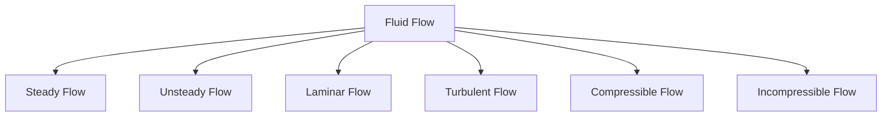
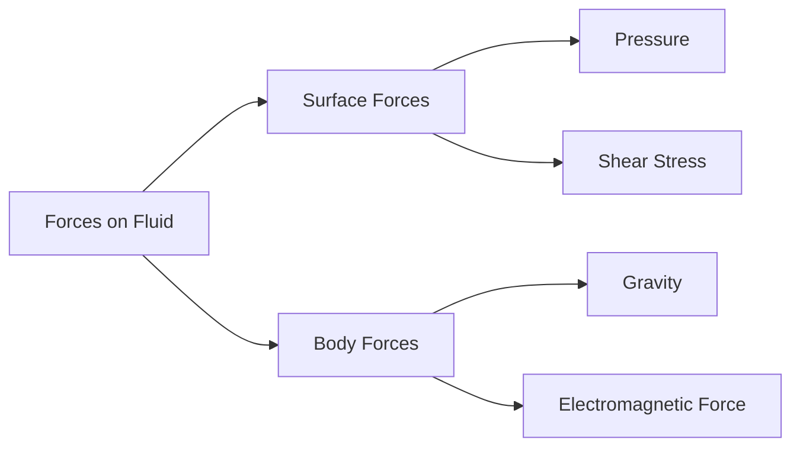

# 📖 Introduction to Fluid Mechanics

Fluid Mechanics is the branch of engineering and physics that studies the behavior of fluids (liquids and gases) at rest and in motion. It helps engineers understand how water flows through pipes, how airplanes fly, how ships float, and how pumps and turbines work.

A fluid is any substance that continuously deforms when subjected to a shear force, no matter how small the force is.

---

## 🌍 Why Study Fluid Mechanics?

Fluid mechanics is important because fluids are everywhere around us.

### Common Applications

* Water supply systems
* Hydraulic machines
* Aircraft design
* Automobile aerodynamics
* Blood flow in the human body
* Power generation plants
* Oil and gas transportation

---

## 💧 What is a Fluid?

A fluid is a substance that cannot resist shear stress and continuously changes its shape when a force is applied.

### Examples

✅ Water

✅ Air

✅ Oil

✅ Steam

✅ Natural gas

---

## 🔍 Difference Between Solids and Fluids

| Property            | Solid         | Fluid          |
| ------------------- | ------------- | -------------- |
| Shape               | Fixed         | No fixed shape |
| Volume              | Fixed         | May change     |
| Resistance to Shear | High          | Very low       |
| Flow                | Does not flow | Flows easily   |

---

## ⚖️ Branches of Fluid Mechanics

Fluid mechanics is mainly divided into two branches.

### 1. Fluid Statics

Study of fluids at rest.

Examples:

* Water stored in a tank
* Pressure at the bottom of a dam
* Floating objects

### 2. Fluid Dynamics

Study of fluids in motion.

Examples:

* Water flowing through pipes
* Air flowing around an airplane wing
* Flow through pumps and turbines

---

## 🔄 Classification of Fluid Flow

Fluid flow can be classified into different types.

### Steady Flow

Flow properties remain constant with time.

Example:

* Water flowing at a constant rate in a pipe.

### Unsteady Flow

Flow properties change with time.

Example:

* Water flow during opening or closing of a valve.

### Laminar Flow

Fluid particles move in smooth layers.

### Turbulent Flow

Fluid particles move randomly and chaotically.

---

## 📏 Continuum Hypothesis

In fluid mechanics, fluids are treated as continuous matter rather than individual molecules.

This assumption simplifies analysis and is valid for most engineering applications.

---

## ⚡ Forces Acting on Fluids

Two major types of forces act on fluids.

### Surface Forces

Act on the surface of a fluid element.

Examples:

* Pressure force
* Shear force

### Body Forces

Act throughout the fluid volume.

Examples:

* Gravity
* Magnetic force

---

## 🎯 Importance in Engineering

Fluid mechanics helps engineers:

* Design efficient pipelines
* Improve aircraft performance
* Develop hydraulic systems
* Predict weather patterns
* Design turbines and pumps
* Analyze blood circulation systems

---

## 🚀 Real-Life Examples

### Airplane Flight

Air moving around wings creates lift force that allows airplanes to fly.

### Hydraulic Brakes

Brake fluid transmits force from the pedal to the wheels.

### Water Distribution

Municipal water systems use fluid mechanics principles to supply water to homes.

### Wind Turbines

Energy from moving air is converted into electrical energy.

---

## 📌 Key Points

* Fluid mechanics studies liquids and gases.
* Fluids continuously deform under shear force.
* It consists of fluid statics and fluid dynamics.
* Fluid flow can be steady, unsteady, laminar, or turbulent.
* Fluid mechanics has applications in aerospace, mechanical, civil, and biomedical engineering.
* Understanding fluid behavior is essential for designing modern engineering systems.
