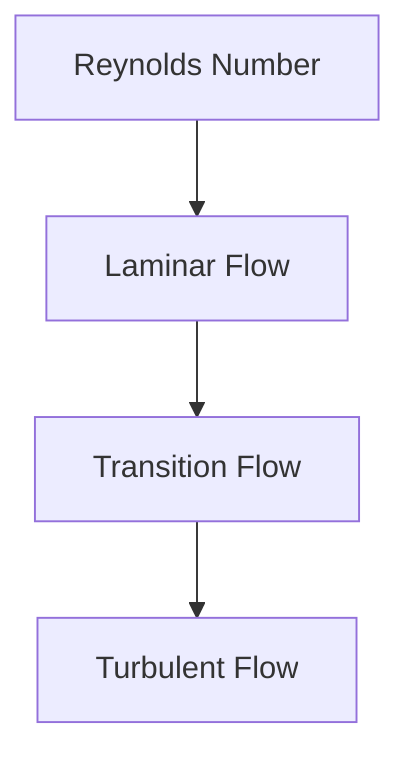
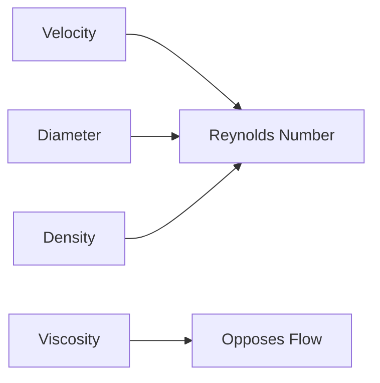
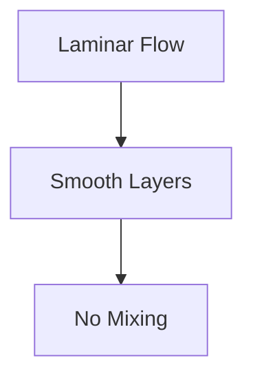
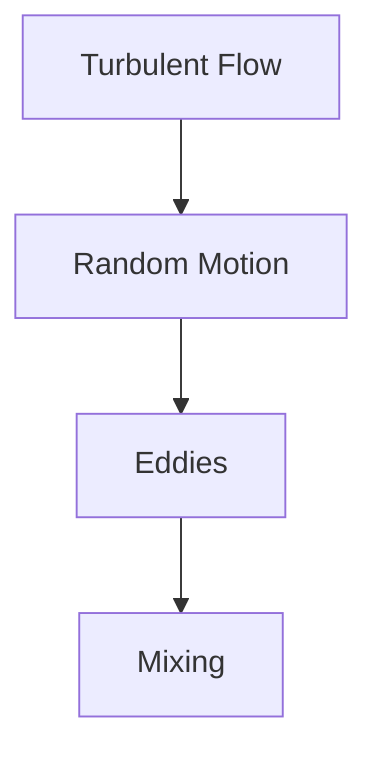
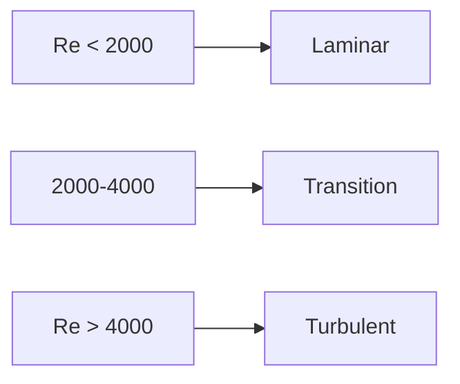
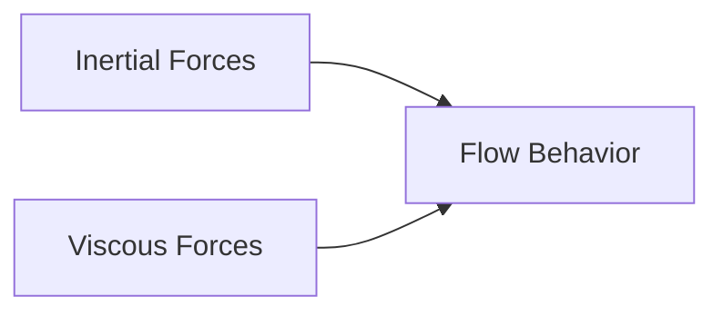
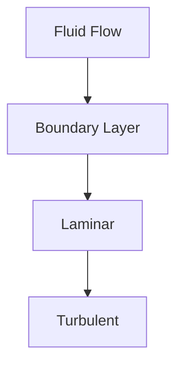

# 🔢 Reynolds Number

The Reynolds Number is one of the most important dimensionless numbers in fluid
mechanics. It helps predict whether a fluid flow will be **laminar**,
**turbulent**, or in a **transition state**.

It was introduced by the British engineer and physicist Osborne Reynolds through
his famous flow experiments.

In simple terms:

> Reynolds Number compares inertial forces to viscous forces in a fluid.

---

# 📌 Why is Reynolds Number Important?

Different types of fluid flow behave differently.

For example:

- Honey flows smoothly.
- River water may flow turbulently.
- Airflow around aircraft can become turbulent.

The Reynolds Number helps engineers predict these behaviors.

---

# 🌊 What is Reynolds Number?

Reynolds Number is the ratio of:

[ \text{Inertial Forces} ]

to

[ \text{Viscous Forces} ]

Mathematically:

[ Re ==

\frac{\text{Inertial Force}} {\text{Viscous Force}} ]

---

# 📐 Reynolds Number Formula

For flow inside a circular pipe:

[ Re ==

\frac{\rho VD}{\mu} ]

Where:

- (Re) = Reynolds Number
- (\rho) = Fluid density (kg/m³)
- (V) = Flow velocity (m/s)
- (D) = Pipe diameter (m)
- (\mu) = Dynamic viscosity (Pa·s)

---

# Alternative Formula

Using kinematic viscosity:

[ Re ==

\frac{VD}{\nu} ]

Where:

- (\nu) = Kinematic viscosity (m²/s)

Both formulas produce the same value.

---

# Understanding the Formula

### Observations

Reynolds Number increases when:

- Velocity increases
- Pipe diameter increases
- Density increases

Reynolds Number decreases when:

- Viscosity increases

---

# 🧪 Osborne Reynolds Experiment

Reynolds conducted experiments using a glass pipe and colored dye.

He observed three flow patterns:

---

## 1️⃣ Laminar Flow

The dye moved in smooth, straight lines.

Characteristics:

- Fluid layers move smoothly.
- Very little mixing.
- Low energy loss.

---

## 2️⃣ Transition Flow

The dye became unstable.

Characteristics:

- Intermediate condition.
- Flow may switch between laminar and turbulent.

---

## 3️⃣ Turbulent Flow

The dye mixed completely with water.

Characteristics:

- Random motion.
- High mixing.
- Higher energy losses.

---

# Flow Classification in Pipes

For circular pipes:

| Reynolds Number  | Flow Type  |
| ---------------- | ---------- |
| Re < 2000        | Laminar    |
| 2000 ≤ Re ≤ 4000 | Transition |
| Re > 4000        | Turbulent  |

---

# Physical Meaning of Reynolds Number

The Reynolds Number represents the competition between two forces.

---

## Inertial Forces

These forces keep fluid moving.

High inertial forces promote turbulence.

Examples:

- Fast-moving river
- Air around a jet aircraft

---

## Viscous Forces

These forces resist motion.

High viscosity promotes smooth flow.

Examples:

- Honey
- Glycerin
- Lubricating oil

---

# Example 1

Water flows through a pipe.

Given:

- Density = 1000 kg/m³
- Velocity = 2 m/s
- Diameter = 0.05 m
- Dynamic viscosity = 0.001 Pa·s

Find Reynolds Number.

### Solution

[ Re ==

\frac{\rho VD}{\mu} ]

# [

\frac{1000\times2\times0.05}{0.001} ]

# [

100000 ]

Since:

[ Re > 4000 ]

Flow is turbulent.

---

# Example 2

Oil flows through a small tube.

Given:

- Density = 900 kg/m³
- Velocity = 0.1 m/s
- Diameter = 0.01 m
- Viscosity = 0.2 Pa·s

### Solution

[ Re ==

\frac{900\times0.1\times0.01}{0.2} ]

[ Re=4.5 ]

Since:

[ Re < 2000 ]

Flow is laminar.

---

# Reynolds Number for Different Situations

Different characteristic lengths are used depending on the problem.

| Application     | Characteristic Length |
| --------------- | --------------------- |
| Pipe Flow       | Diameter              |
| Flow Over Plate | Plate Length          |
| Sphere          | Diameter              |
| Aircraft Wing   | Chord Length          |

---

# Reynolds Number and Drag

Reynolds Number significantly affects drag force.

Different Reynolds Numbers produce different boundary layer behavior and drag
characteristics.

---

# Reynolds Number and Boundary Layer

A boundary layer forms near a solid surface.

The Reynolds Number determines when the boundary layer transitions from laminar
to turbulent.

---

# Applications of Reynolds Number

## ✈️ Aerodynamics

Used in aircraft wing design.

---

## 🚗 Automotive Engineering

Predicts airflow around vehicles.

---

## 🏭 Pipeline Design

Determines flow regime and friction losses.

---

## 🚢 Marine Engineering

Analyzes ship resistance.

---

## ⚙️ Turbomachinery

Used in pumps and turbines.

---

## 🌡 Heat Transfer

Helps determine convection coefficients.

---

# Real-Life Examples

### Smoke from a Candle

Near the wick:

- Laminar flow

Farther away:

- Turbulent flow

---

### River Flow

Slow-moving streams often exhibit laminar behavior.

Fast rivers become turbulent.

---

### Airplane Wings

Engineers calculate Reynolds Number to predict airflow characteristics.

---

### Blood Flow

Reynolds Number helps determine whether blood flow remains smooth or becomes
disturbed.

---

# Advantages of Reynolds Number

✅ Predicts flow behavior

✅ Simplifies fluid analysis

✅ Applicable to many engineering systems

✅ Helps in model testing and scaling

✅ Essential in aerodynamic and hydraulic design

---

# Limitations

Reynolds Number alone cannot fully describe every flow.

Other dimensionless numbers may also be needed:

- Mach Number
- Froude Number
- Weber Number
- Prandtl Number

---

# 📋 Summary

| Parameter        | Formula                  |
| ---------------- | ------------------------ |
| Reynolds Number  | (Re=\frac{\rho VD}{\mu}) |
| Alternative Form | (Re=\frac{VD}{\nu})      |

---

## Pipe Flow Classification

| Reynolds Number | Flow Type  |
| --------------- | ---------- |
| Re < 2000       | Laminar    |
| 2000–4000       | Transition |
| Re > 4000       | Turbulent  |

---

# 🎯 Key Takeaways

- Reynolds Number compares inertial forces with viscous forces.
- It predicts whether flow is laminar or turbulent.
- Low Reynolds Number indicates smooth flow.
- High Reynolds Number indicates turbulent flow.
- Reynolds Number depends on velocity, density, diameter, and viscosity.
- It is one of the most important dimensionless numbers in fluid mechanics.
- Engineers use it extensively in pipelines, aircraft, automobiles, turbines,
  and heat transfer systems.
