# 🔧 Turbomachinery

Turbomachinery is a branch of fluid mechanics that deals with machines that transfer energy between a fluid and a rotating element called a **rotor**.

These machines are used in:

* Power plants
* Aircraft engines
* Hydroelectric stations
* Water supply systems
* Oil and gas industries
* HVAC systems

Almost every modern power generation system depends on turbomachinery.

---

# 📌 What is Turbomachinery?

Turbomachinery refers to machines in which energy transfer occurs between a continuously flowing fluid and a rotating shaft.

The energy transfer may occur in two ways:

1. Fluid gives energy to the rotor.
2. Rotor gives energy to the fluid.

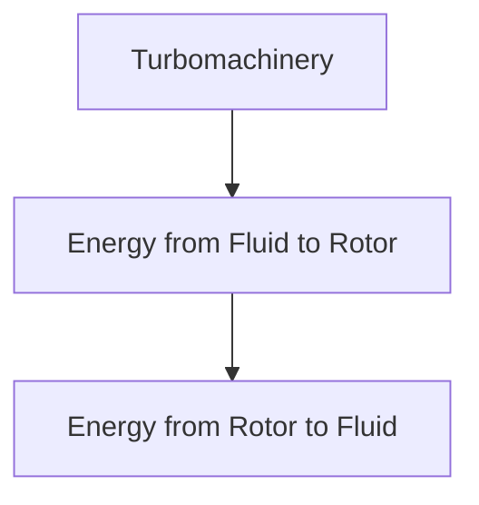

---

# Basic Working Principle

Turbomachines operate based on the **change in momentum of the fluid**.

When fluid velocity changes:

* Force is produced.
* Torque is generated.
* Energy transfer occurs.

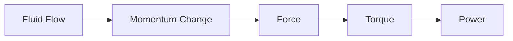

---

# Classification of Turbomachines

Turbomachines are broadly classified into:

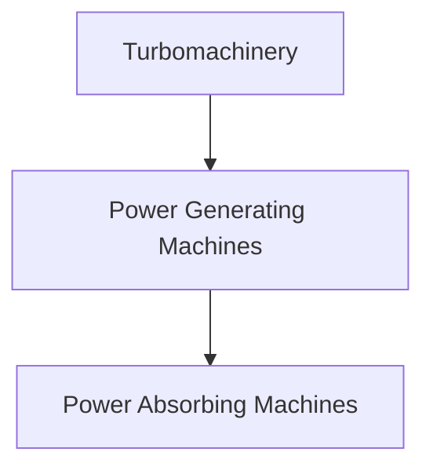

---

# 1️⃣ Power Generating Machines

These machines extract energy from a fluid and convert it into mechanical power.

Examples:

* Hydraulic turbines
* Steam turbines
* Gas turbines
* Wind turbines

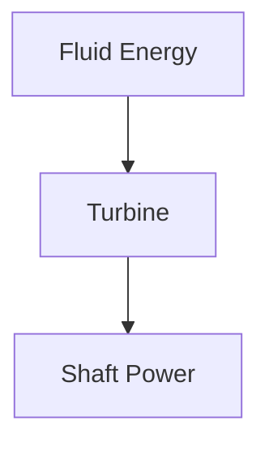

---

# 2️⃣ Power Absorbing Machines

These machines receive mechanical power and transfer it to a fluid.

Examples:

* Pumps
* Compressors
* Fans
* Blowers

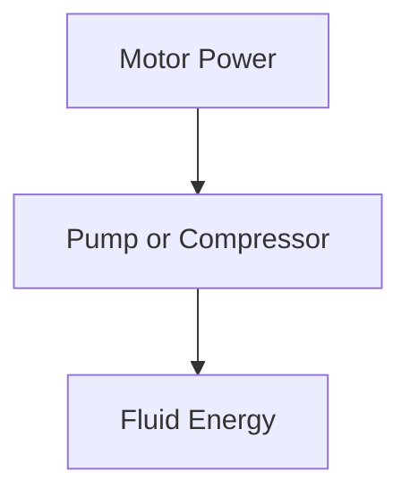

---

# Major Components of Turbomachines

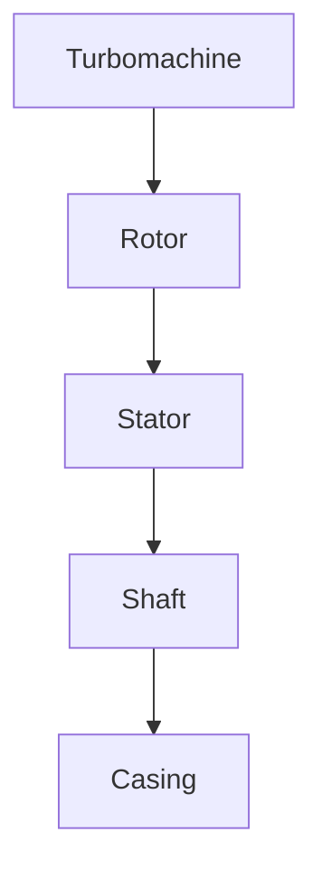

---

## Rotor

The rotating component that exchanges energy with the fluid.

Examples:

* Turbine runner
* Pump impeller
* Compressor rotor

---

## Stator

The stationary component that guides fluid flow.

Functions:

* Directs fluid
* Improves efficiency
* Controls velocity

---

## Shaft

Transmits mechanical power between the machine and external devices.

---

## Casing

Protects internal components and guides fluid flow.

---

# Energy Transfer in Turbomachinery

Energy transfer occurs due to changes in:

* Velocity
* Pressure
* Momentum

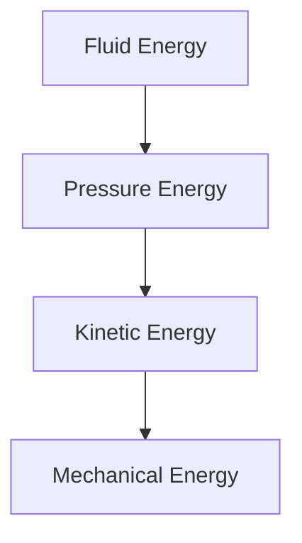

---

# Euler's Turbomachine Equation

The fundamental equation governing turbomachinery is Euler's Equation.

It relates energy transfer to changes in angular momentum.

[
W
=

## U_2V_{w2}

U_1V_{w1}
]

Where:

* (W) = Work done per unit mass
* (U) = Blade velocity
* (V_w) = Whirl velocity component

---

# Importance of Euler's Equation

It helps determine:

* Turbine power output
* Pump power requirement
* Compressor performance

---

# Hydraulic Turbines

Hydraulic turbines convert water energy into mechanical energy.

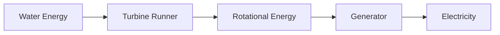

---

## Applications

* Hydroelectric power plants
* Dams
* Irrigation projects

---

# Types of Hydraulic Turbines

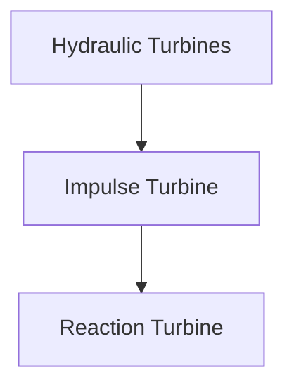

---

# Impulse Turbine

The entire pressure energy is converted into kinetic energy before striking the turbine blades.

### Example

* Pelton Wheel

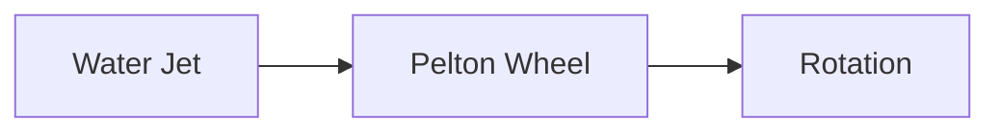

---

# Reaction Turbine

Energy transfer occurs through both pressure and velocity changes.

### Examples

* Francis Turbine
* Kaplan Turbine

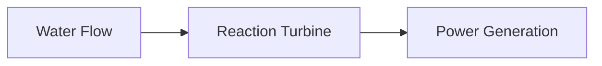

---

# Pumps

Pumps transfer mechanical energy to fluids.

Their main purpose is to increase:

* Pressure
* Flow rate
* Elevation

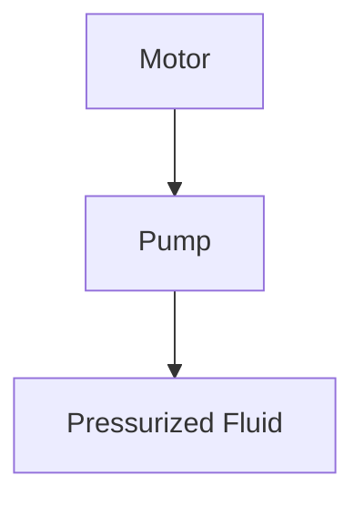

---

# Types of Pumps

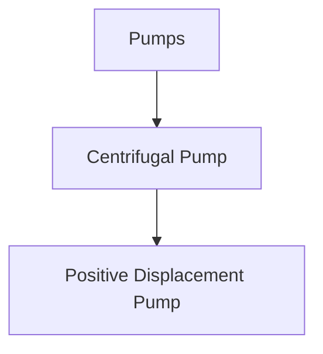

---

# Centrifugal Pump

Most commonly used pump.

Working principle:

* Fluid enters the impeller.
* Rotating blades increase fluid velocity.
* Velocity converts into pressure.

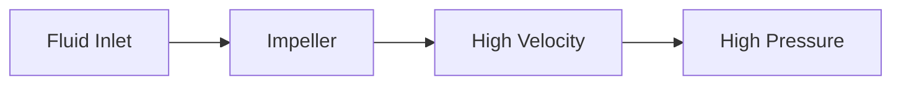

---

# Compressors

Compressors increase the pressure of gases.

Applications:

* Refrigeration
* Air conditioning
* Aircraft engines
* Gas pipelines

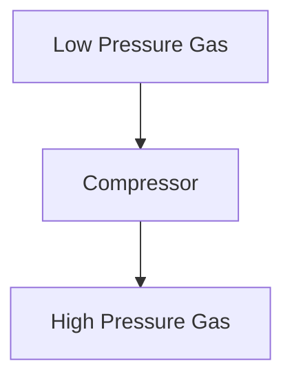

---

# Fans and Blowers

Both devices move air.

### Fan

Produces a small pressure rise.

Examples:

* Ceiling fan
* Cooling fan

---

### Blower

Produces a larger pressure rise than a fan.

Examples:

* Industrial ventilation systems
* Furnaces

---

# Velocity Triangles

Velocity triangles help analyze fluid flow through turbomachines.

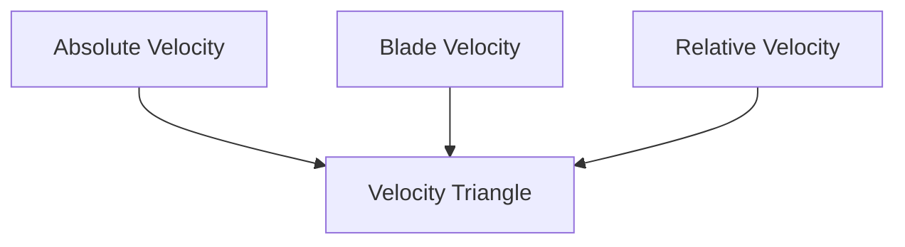

These triangles are used to:

* Calculate work done
* Design blades
* Predict performance

---

# Specific Speed

Specific speed helps select the appropriate turbomachine.

[
N_s
===

\frac{N\sqrt{P}}
{H^{5/4}}
]

Where:

* (N) = Rotational speed
* (P) = Power
* (H) = Head

---

# Cavitation

Cavitation occurs when fluid pressure drops below vapor pressure.

Tiny vapor bubbles form and collapse violently.

---

## Effects of Cavitation

❌ Noise

❌ Vibration

❌ Reduced efficiency

❌ Surface damage

---

## Prevention

* Proper pump design
* Increase inlet pressure
* Reduce operating speed
* Maintain adequate NPSH

---

# Turbomachinery in Power Plants

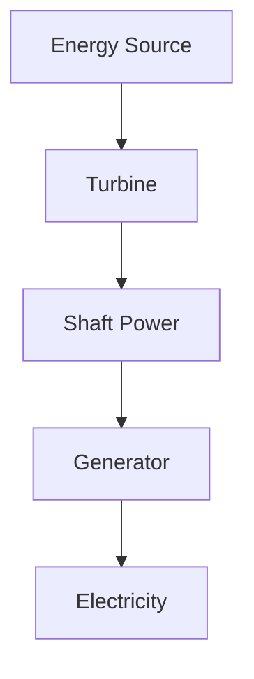

Examples:

* Hydroelectric plants
* Thermal plants
* Nuclear plants
* Wind farms

---

# Applications of Turbomachinery

## ⚡ Power Generation

Steam, gas, hydro, and wind turbines.

---

## 💧 Water Supply Systems

Pumps transport water over long distances.

---

## ✈️ Aerospace Engineering

Jet engines use compressors and turbines.

---

## 🏭 Industrial Processes

Fans, pumps, and compressors are widely used.

---

## ❄ HVAC Systems

Air conditioning and ventilation systems rely on turbomachinery.

---

# Real-Life Examples

### Hydroelectric Dam

Water drives turbines that generate electricity.

---

### Aircraft Engine

Compressors and turbines work together to produce thrust.

---

### Water Pump

Used to lift water from wells and reservoirs.

---

### Wind Turbine

Converts wind energy into electrical energy.

---

# Advantages of Turbomachinery

✅ High efficiency

✅ Continuous operation

✅ Large power handling capability

✅ Reliable performance

✅ Suitable for industrial applications

---

# Limitations

❌ Cavitation problems

❌ Maintenance requirements

❌ High initial cost

❌ Performance losses due to friction

---

# 📋 Summary

| Machine    | Energy Conversion                       |
| ---------- | --------------------------------------- |
| Turbine    | Fluid → Mechanical                      |
| Pump       | Mechanical → Fluid                      |
| Compressor | Mechanical → Gas Pressure               |
| Fan        | Mechanical → Air Movement               |
| Blower     | Mechanical → Moderate Pressure Increase |

---

# 🎯 Key Takeaways

* Turbomachinery deals with energy transfer between fluids and rotating machines.
* Turbines extract energy from fluids, while pumps and compressors add energy to fluids.
* Euler's Turbomachine Equation is the fundamental governing equation.
* Hydraulic turbines generate power from water.
* Centrifugal pumps are the most widely used pumps in industry.
* Compressors increase gas pressure for various engineering applications.
* Cavitation is a major operational issue that must be prevented.
* Turbomachinery is essential in power generation, aerospace, water supply, and industrial systems.
