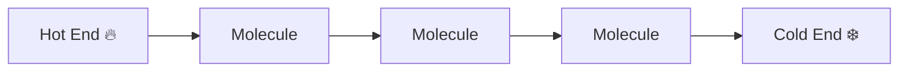
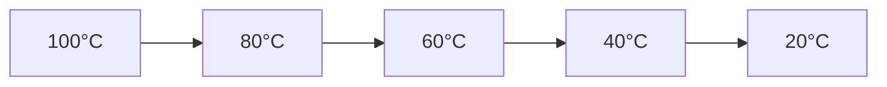

# 🔥 Conduction

Conduction is the transfer of heat through a material without any actual
movement of the material itself.

Heat is transferred from one molecule to another through direct contact.
Molecules in the hotter region vibrate more vigorously and pass energy to
neighboring molecules.

### ☕ Everyday Examples

- A metal spoon becomes hot when placed in hot tea.
- The handle of a frying pan gets hot during cooking.
- Walking barefoot on a hot floor transfers heat to your feet.

## 🎯 How Conduction Works

When one end of a material is heated:

1. Molecules near the heat source gain energy.
2. They vibrate faster.
3. Energy is transferred to neighboring molecules.
4. Heat gradually moves through the material.



## 🧱 Types of Materials

Materials conduct heat at different rates.

### Good Conductors

These materials transfer heat quickly.

- Copper
- Aluminum
- Silver
- Iron

Applications:

- Cooking utensils
- Heat sinks
- Heat exchangers

### Insulators

These materials resist heat flow.

- Wood
- Plastic
- Rubber
- Glass wool
- Thermocol

Applications:

- Building insulation
- Refrigerator walls
- Electrical insulation

## 🌡️ Temperature Gradient

Heat always flows from a higher temperature region to a lower temperature
region.



The rate of temperature change with distance is called the temperature gradient.

## 📏 Fourier's Law of Heat Conduction

The fundamental law governing conduction is Fourier's Law.

:contentReference[oaicite:0]{index=0}

Where:

- Q = Rate of heat transfer (W)
- k = Thermal conductivity (W/m·K)
- A = Cross-sectional area (m²)
- dT/dx = Temperature gradient

### Meaning of Negative Sign

The negative sign indicates that heat flows in the direction of decreasing
temperature.

## 🧮 Heat Conduction Through a Plane Wall

For steady one-dimensional conduction:

```
Q = kA(T₁ - T₂)/L
```

Where:

- T₁ = Hot side temperature
- T₂ = Cold side temperature
- L = Thickness of wall

### Observation

- Larger temperature difference → More heat transfer
- Larger area → More heat transfer
- Greater thickness → Less heat transfer

## ⚡ Thermal Conductivity (k)

Thermal conductivity measures a material's ability to conduct heat.

Higher k means better heat conduction.

| Material | Thermal Conductivity (Approx.) W/m·K |
| -------- | ------------------------------------ |
| Silver   | 429                                  |
| Copper   | 401                                  |
| Aluminum | 237                                  |
| Steel    | 50                                   |
| Glass    | 1                                    |
| Wood     | 0.12                                 |
| Air      | 0.026                                |

## 🔄 Thermal Resistance Concept

Heat flow can be compared to electric current flow.

| Electrical System | Thermal System         |
| ----------------- | ---------------------- |
| Voltage           | Temperature Difference |
| Current           | Heat Flow              |
| Resistance        | Thermal Resistance     |

Thermal resistance:

```
R = L / kA
```

Heat transfer becomes:

```
Q = ΔT / R
```

This makes thermal calculations much easier.

## 🏭 Engineering Applications

### Heat Exchangers

Heat passes through metal walls separating two fluids.

### Building Insulation

Walls and roofs reduce heat loss during winter.

### Electronic Cooling

Heat generated by CPUs is conducted to heat sinks.

### Boiler Tubes

Heat from combustion gases conducts through tube walls.

## Advantages of Good Conductors

✅ Fast heat transfer

✅ High thermal efficiency

✅ Better cooling performance

## Advantages of Insulators

✅ Reduced energy loss

✅ Improved safety

✅ Better temperature control

## 📌 Key Points

✅ Conduction occurs without bulk movement of material

✅ Heat flows from higher temperature to lower temperature

✅ Metals are generally good conductors

✅ Insulators resist heat flow

✅ Fourier's Law is the fundamental equation of heat conduction

✅ Thermal conductivity determines how effectively a material transfers heat
