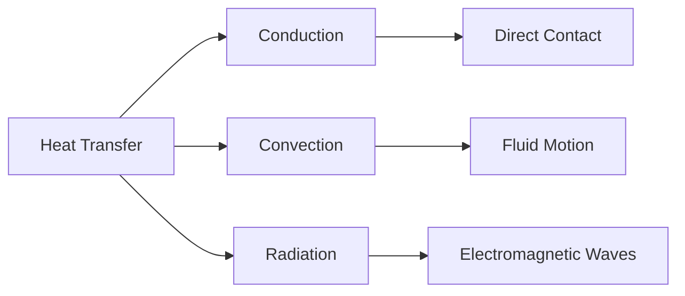

# 📖 Introduction to Heat Transfer

Heat Transfer is the science of studying how thermal energy moves from one place
to another due to a temperature difference.

Whenever two objects have different temperatures, heat naturally flows from the
hotter object to the colder object until thermal equilibrium is reached.

### 🌍 Why Heat Transfer Matters

Heat transfer is used in almost every engineering system:

- Car radiators
- Air conditioners
- Refrigerators
- Boilers
- Power plants
- Electronic cooling systems
- Solar heaters

Understanding heat transfer helps engineers design efficient systems and reduce
energy losses.

## 🔥 What is Heat?

Heat is a form of energy that transfers because of temperature difference.

Example:

- A hot cup of tea cools down because heat moves to the surrounding air.
- Ice melts because heat flows from the environment into the ice.

## 🌡️ What is Temperature?

Temperature indicates the degree of hotness or coldness of a body.

Heat flows only when there is a temperature difference.

Example:

- Water at 80°C transfers heat to water at 30°C.

## 🔄 Modes of Heat Transfer

Heat can be transferred in three ways:

1. Conduction
2. Convection
3. Radiation

## 🔥 Conduction

Heat transfer through direct molecular interaction without movement of material.

Example:

- A metal spoon becomes hot when placed in hot tea.

## 🌬️ Convection

Heat transfer due to movement of fluids.

Example:

- Boiling water in a pot.

## ☀️ Radiation

Heat transfer through electromagnetic waves.

No medium is required.

Example:

- Heat from the Sun reaching Earth.

## 📊 Temperature Difference Drives Heat Transfer

The larger the temperature difference, the faster the heat transfer.

Example:

- Ice melts faster in hot water than in cold water.

## ⚙️ Engineering Applications

- Engine cooling
- Heat exchangers
- Electronic devices
- HVAC systems
- Thermal power plants
- Solar energy systems

## 📌 Key Points

✅ Heat flows from high temperature to low temperature

✅ Heat transfer occurs because of temperature difference

✅ Three modes: Conduction, Convection and Radiation

✅ Heat transfer is essential in all thermal engineering systems
