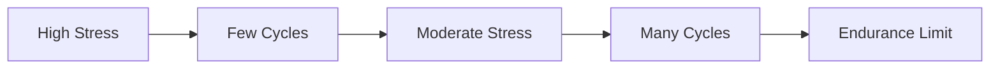
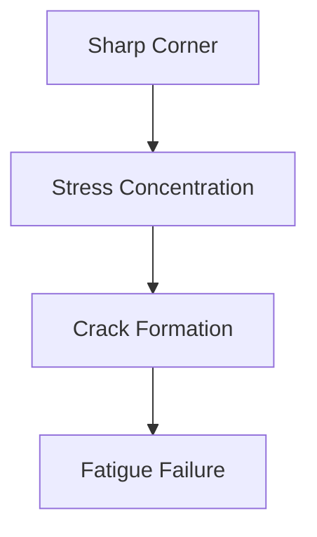
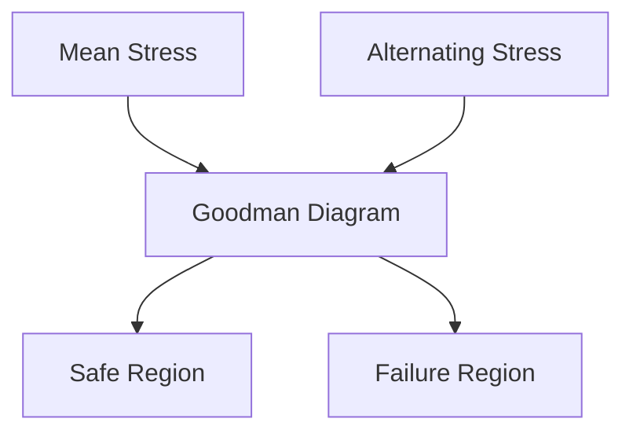
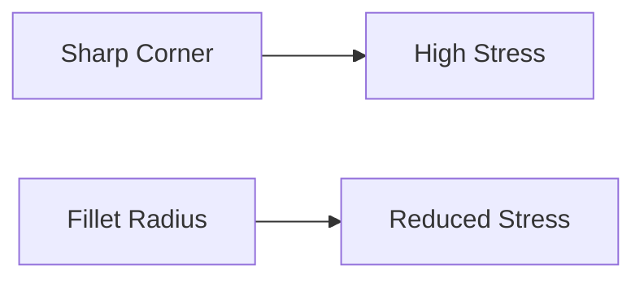

# 🔄 Fatigue Analysis

Fatigue is one of the most common causes of machine component failure. Many
machine parts fail not because of a single large load, but because of repeated
loading and unloading over time.

Components such as shafts, gears, springs, bolts, crankshafts, and connecting
rods are continuously subjected to cyclic stresses. Even when these stresses are
below the material's yield strength, failure can still occur due to fatigue.

---

# 🎯 Why Fatigue is Important

Studies show that a large percentage of machine failures occur because of
fatigue.

Examples:

- Aircraft wings
- Engine crankshafts
- Rotating shafts
- Railway axles
- Springs
- Gear teeth

A component may appear perfectly safe but can suddenly fail after thousands or
millions of load cycles.

---

# 💡 What is Fatigue?

Fatigue is the progressive weakening and eventual failure of a material caused
by repeated or fluctuating stresses.

Unlike static failure:

- Static failure occurs due to one large load.
- Fatigue failure occurs due to many repeated loads.

---

# ⚙️ Fatigue Failure Process

Fatigue failure usually occurs in three stages.


---

# 1️⃣ Crack Initiation

Tiny cracks begin to form at:

- Surface defects
- Scratches
- Sharp corners
- Holes
- Material imperfections

These locations are called stress concentration points.

---

# 2️⃣ Crack Propagation

As loading continues:

- Crack size increases
- Material becomes weaker
- Cross-sectional area decreases

The crack grows gradually over many cycles.

---

# 3️⃣ Final Fracture

Once the remaining area becomes too small:

- Sudden failure occurs
- Failure is often catastrophic
- Little warning is observed

---

# 🔄 Cyclic Loading

Fatigue occurs due to repeated stresses.

Examples:


---

# Types of Cyclic Stress

## Completely Reversed Stress

Stress alternates between equal tension and compression.

Example:

- Rotating shafts

```
+σ → 0 → -σ → 0 → +σ
```

---

## Repeated Stress

Stress varies from zero to a maximum value.

Example:

- Crane cables

```
0 → +σ → 0 → +σ
```

---

## Fluctuating Stress

Stress varies between two unequal values.

Example:

- Engine components

```
σ₁ ↔ σ₂
```

---

# 📊 S-N Curve (Wöhler Curve)

The relationship between stress and fatigue life is represented by the S-N
Curve.

Where:

- S = Stress Amplitude
- N = Number of Cycles to Failure



---

# Endurance Limit

The endurance limit is the maximum stress a material can withstand indefinitely
without fatigue failure.

For many steels:

- If stress remains below endurance limit,
- The component can theoretically survive infinite cycles.

---

# 📈 Fatigue Life Regions

| Region               | Description             |
| -------------------- | ----------------------- |
| Low Cycle Fatigue    | High stress, few cycles |
| High Cycle Fatigue   | Low stress, many cycles |
| Infinite Life Region | Below endurance limit   |

---

# 🏗️ Stress Concentration

Fatigue cracks usually start where stress is highest.

Examples:

- Keyways
- Holes
- Threads
- Sharp corners
- Grooves



---

# Stress Concentration Factor

The severity of stress concentration is represented by:

```
Kt = Maximum Stress / Nominal Stress
```

Where:

- Kt = Stress Concentration Factor

Higher Kt means higher fatigue risk.

---

# 🔧 Factors Affecting Fatigue Strength

Several factors influence fatigue life.

---

## Surface Finish

Rough surfaces contain microscopic notches.

Result:

- More crack initiation sites
- Lower fatigue strength

Better polished surfaces improve fatigue resistance.

---

## Size of Component

Larger components generally have:

- More defects
- Greater stress variations

Therefore:

- Fatigue strength decreases as size increases.

---

## Temperature

High temperatures:

- Reduce material strength
- Accelerate fatigue damage

---

## Corrosion

Corrosion creates pits on the surface.

These pits act as crack initiation points.

This phenomenon is called:

### Corrosion Fatigue

---

## Residual Stresses

Compressive residual stresses improve fatigue life.

Methods:

- Shot peening
- Surface rolling

These processes delay crack formation.

---

# 🧮 Mean Stress and Alternating Stress

For fluctuating loads:

## Mean Stress

```
σm = (σmax + σmin) / 2
```

---

## Alternating Stress

```
σa = (σmax - σmin) / 2
```

These values are used in fatigue design calculations.

---

# Goodman Failure Criterion

One of the most common fatigue design methods.

It relates:

- Mean stress
- Alternating stress
- Material strength



---

# Design Against Fatigue Failure

Engineers use several methods to improve fatigue life.

---

## Increase Fillet Radius

Sharp corners create stress concentration.

Solution:

- Use smooth fillets



---

## Improve Surface Finish

Methods:

- Grinding
- Polishing
- Surface treatment

Benefits:

- Fewer crack initiation sites

---

## Use Stronger Materials

Materials with higher fatigue strength survive more cycles.

Examples:

- Alloy steels
- Heat-treated steels

---

## Reduce Operating Stress

Lower stress levels greatly increase fatigue life.

---

## Apply Surface Treatments

Methods include:

- Shot peening
- Carburizing
- Nitriding

Benefits:

- Improved surface strength
- Better fatigue resistance

---

# 🏭 Practical Examples

## Rotating Shaft

Experiences:

- Reversed bending stresses
- Millions of cycles

Fatigue design is critical.

---

## Gear Teeth

Repeated contact causes:

- Surface fatigue
- Tooth root fatigue

---

## Springs

Undergo continuous loading cycles.

Must be designed using fatigue principles.

---

## Aircraft Components

Aircraft structures experience:

- Vibrations
- Repeated loading

Fatigue analysis is mandatory.

---

# ⚠️ Characteristics of Fatigue Failure

Fatigue failures usually:

- Occur suddenly
- Show little deformation
- Start from surface cracks
- Occur below yield strength
- Are dangerous and difficult to predict

---

# 📝 Key Points

- Fatigue failure occurs due to repeated loading.
- It can occur even below yield strength.
- Fatigue failure progresses through crack initiation, crack growth, and final
  fracture.
- Stress concentration greatly affects fatigue life.
- The S-N curve is used to estimate fatigue life.
- Endurance limit is a key design parameter.
- Good surface finish and smooth geometry improve fatigue strength.
- Fatigue analysis is essential for shafts, gears, springs, bolts, and aircraft
  components.
