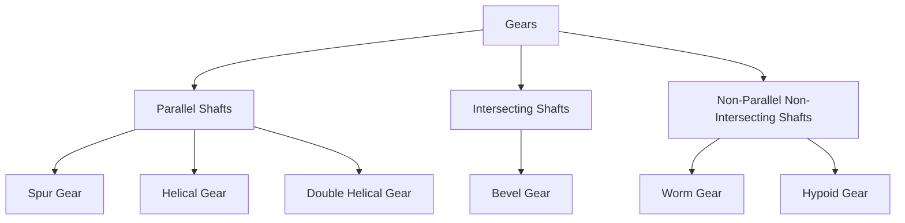
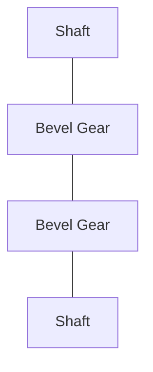
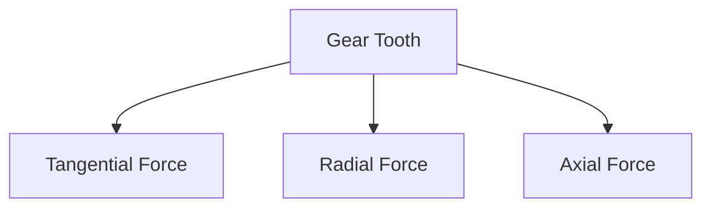
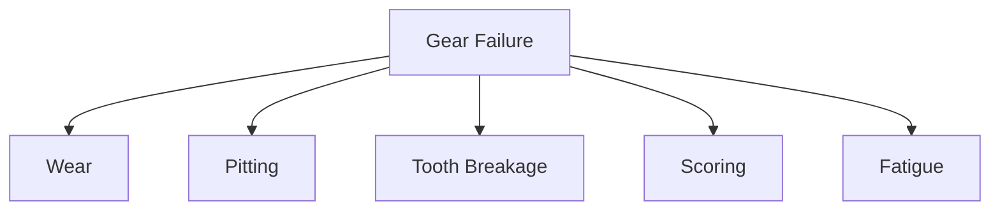

# ⚙️ Gears

Gears are machine elements used to transmit power and motion between rotating
shafts. They provide a positive drive, meaning there is no slip between the
driving and driven members.

Gears are widely used in automobiles, industrial machinery, clocks, turbines,
conveyors, and robotics.

---

# 🎯 Functions of Gears

Gears are used to:

✅ Transmit power

✅ Change rotational speed

✅ Change torque

✅ Change direction of rotation

✅ Transfer motion between shafts

---

# 🚗 Real-Life Examples

- Car gearbox
- Bicycle gear system
- Industrial reducers
- Wind turbines
- Lathe machines
- Robotic arms

---

# ⚙️ Basic Terminology


### Driver Gear

The gear that supplies power.

### Driven Gear

The gear that receives power.

---

# 📏 Gear Ratio

Gear ratio determines speed and torque relationship.

```
Gear Ratio = Number of Teeth on Driven Gear / Number of Teeth on Driver Gear
```

Example:

Driver Gear = 20 teeth

Driven Gear = 40 teeth

```
Gear Ratio = 40 / 20 = 2
```

Result:

- Speed reduces by half
- Torque doubles

---

# 🔄 Principle of Gear Operation

When teeth of two gears mesh:

- Driver rotates
- Teeth push driven gear
- Motion is transferred


---

# 📚 Classification of Gears



---

# 1️⃣ Spur Gears

The simplest and most commonly used gears.

Characteristics:

- Straight teeth
- Parallel shafts
- Easy manufacturing


### Advantages

✅ Simple design

✅ Low cost

✅ High efficiency

### Disadvantages

❌ Noisy at high speed

---

# Applications

- Gear pumps
- Machine tools
- Speed reducers

---

# 2️⃣ Helical Gears

Teeth are cut at an angle.


Characteristics:

- Smooth operation
- Quiet running
- Higher load capacity

---

# Advantages

✅ Less vibration

✅ Higher strength

✅ Suitable for high speeds

---

# Disadvantages

❌ Generates axial thrust

❌ More expensive

---

# Applications

- Automobile gearboxes
- Compressors
- Turbines

---

# 3️⃣ Double Helical Gears

Consist of two opposite helical gears.


Benefits:

- Axial thrust cancellation
- Smooth power transmission

---

# Applications

- Heavy machinery
- Marine drives

---

# 4️⃣ Bevel Gears

Used when shafts intersect.

Usually at 90°.



---

# Advantages

✅ Change direction of motion

✅ Compact design

---

# Applications

- Differential systems
- Power tools

---

# 5️⃣ Worm Gears

Used between non-parallel shafts.

Consists of:

- Worm
- Worm Wheel


---

# Advantages

✅ Very high reduction ratio

✅ Smooth operation

✅ Self-locking capability

---

# Disadvantages

❌ Lower efficiency

❌ Heat generation

---

# Applications

- Elevators
- Conveyors
- Hoists

---

# 📏 Important Gear Terms

## Pitch Circle

Imaginary circle where gear teeth engage.

---

## Pitch Diameter

Diameter of the pitch circle.

---

## Module

Size of gear teeth.

```
Module = Pitch Diameter / Number of Teeth
```

Unit: mm

---

## Circular Pitch

Distance between corresponding points on adjacent teeth.

---

## Pressure Angle

Angle between line of action and tangent to pitch circle.

Common values:

- 20°
- 14.5°

---

## Addendum

Distance from pitch circle to tooth tip.

---

## Dedendum

Distance from pitch circle to tooth root.

---

# ⚡ Gear Forces

When gears mesh, forces act on teeth.



---

## Tangential Force

Responsible for power transmission.

---

## Radial Force

Acts toward gear center.

---

## Axial Force

Present mainly in helical gears.

---

# 🔩 Gear Materials

Selection depends on:

- Load
- Speed
- Cost
- Wear resistance

---

| Material    | Application    |
| ----------- | -------------- |
| Cast Iron   | Light duty     |
| Mild Steel  | General use    |
| Alloy Steel | Heavy duty     |
| Bronze      | Worm gears     |
| Plastic     | Low load gears |

---

# ⚠️ Gear Failures

Common gear failures include:



---

# 1. Wear

Gradual removal of tooth material.

Causes:

- Poor lubrication
- Dust particles

---

# 2. Pitting

Small surface cavities caused by contact fatigue.

---

# 3. Tooth Breakage

Occurs due to overload.

---

# 4. Scoring

Surface damage caused by excessive friction.

---

# 5. Fatigue Failure

Repeated stress causes crack formation.

---

# 🛢️ Gear Lubrication

Lubrication is essential to:

- Reduce wear
- Reduce friction
- Dissipate heat
- Increase service life

Methods:

- Oil bath lubrication
- Splash lubrication
- Forced lubrication

---

# 🏭 Gear Applications

## Automotive

- Gearboxes
- Differentials

## Manufacturing

- Machine tools
- Conveyors

## Power Plants

- Turbines
- Generators

## Robotics

- Motion control systems

## Aerospace

- Transmission systems

---

# 📈 Advantages of Gears

✅ Positive transmission

✅ High efficiency

✅ Compact size

✅ Accurate speed ratio

✅ Long service life

---

# ⚠️ Limitations

❌ Expensive manufacturing

❌ Precise alignment required

❌ Lubrication needed

❌ Can become noisy at high speed

---

# 📝 Key Points

- Gears transmit power and motion without slip.
- Spur gears are used for parallel shafts.
- Helical gears provide smoother operation.
- Bevel gears connect intersecting shafts.
- Worm gears provide large speed reductions.
- Gear ratio determines speed and torque relationships.
- Proper lubrication greatly increases gear life.
- Common failures include wear, pitting, and tooth breakage.
- Gears are essential components in almost every mechanical system.
