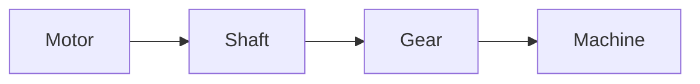
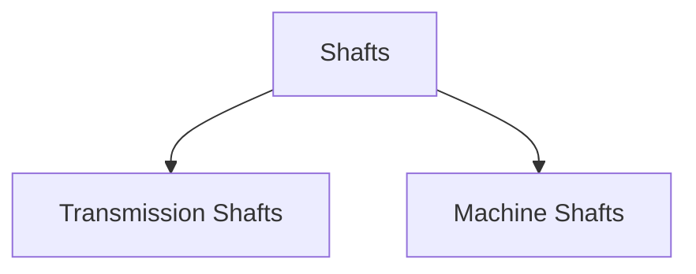
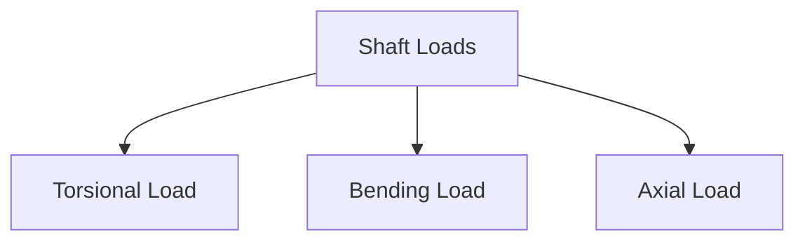
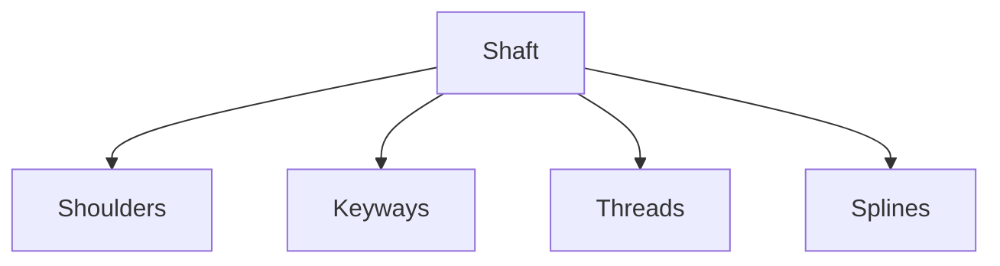
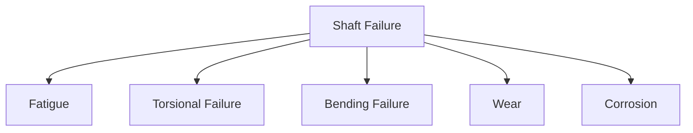
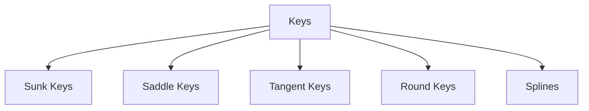
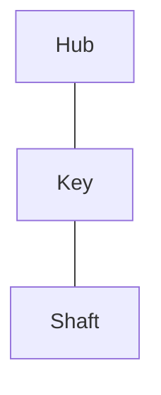
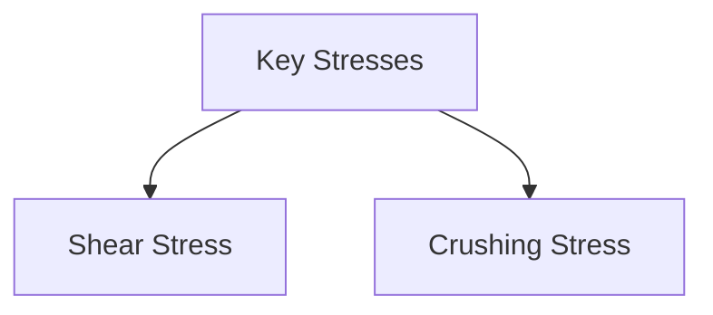

# 🔧 Shafts & Keys

Shafts and keys are fundamental machine elements used for power transmission. A
shaft transmits torque and rotational motion, while a key connects machine
components such as gears, pulleys, and couplings to the shaft.

Almost every mechanical power transmission system contains shafts and keys.

Examples:

- Automobile transmissions
- Gearboxes
- Pumps
- Compressors
- Electric motors
- Industrial machinery

---

# 🎯 Functions of Shafts

A shaft is a rotating machine element used to transmit power and motion.

Main functions:

✅ Transmit torque

✅ Support rotating elements

✅ Transfer power between components

✅ Maintain alignment of machine elements

---

# ⚙️ Power Transmission Through Shaft



The shaft acts as the backbone of the power transmission system.

---

# 📚 Classification of Shafts



---

# 1️⃣ Transmission Shafts

Used primarily to transmit power.

Examples:

- Line shafts
- Counter shafts
- Propeller shafts

---

## Line Shaft

Connects multiple machines from a common power source.

Used in older factories.

---

## Counter Shaft

Intermediate shaft used between driving and driven shafts.

---

## Propeller Shaft

Used in automobiles to transmit power from gearbox to differential.

---

# 2️⃣ Machine Shafts

Integral part of machines.

Examples:

- Crankshaft
- Camshaft
- Turbine shaft
- Rotor shaft

---

# Crankshaft

Converts reciprocating motion into rotary motion.

Used in:

- Internal combustion engines

---

# Camshaft

Operates engine valves.

---

# Turbine Shaft

Transfers power generated by turbines.

---

# 🔩 Materials Used for Shafts

Material selection depends on:

- Strength
- Toughness
- Wear resistance
- Cost

Common materials:

| Material        | Application            |
| --------------- | ---------------------- |
| Mild Steel      | Light duty             |
| Carbon Steel    | General purpose        |
| Alloy Steel     | Heavy duty             |
| Stainless Steel | Corrosive environments |

---

# 📏 Loads Acting on Shafts

Shafts experience multiple loads simultaneously.



---

# 1️⃣ Torsional Load

Occurs due to transmitted torque.


Produces:

- Shear stress

---

# 2️⃣ Bending Load

Caused by:

- Gears
- Pulleys
- External forces

Produces:

- Bending stress

---

# 3️⃣ Axial Load

Acts along shaft axis.

Common in:

- Helical gears
- Thrust bearings

---

# Shaft Design Considerations

While designing a shaft, engineers consider:

- Strength
- Rigidity
- Deflection
- Fatigue life
- Critical speed

---

# 🔄 Torque Transmission

Power transmitted by a shaft depends on torque and rotational speed.

Relationship:

```
Power = Torque × Angular Velocity
```

Higher torque requires larger shaft diameter.

---

# Common Shaft Features



---

# Shoulders

Provide support and positioning for components.

---

# Keyways

Slots cut into shafts for fitting keys.

---

# Threads

Used for locking components.

---

# Splines

Multiple keys integrated into the shaft surface.

Used for transmitting higher torque.

---

# ⚠️ Shaft Failures

Common shaft failures include:



---

# Fatigue Failure

Most common shaft failure.

Caused by:

- Repeated loading
- Stress concentration

Usually occurs near:

- Keyways
- Shoulders
- Grooves

---

# Torsional Failure

Occurs when transmitted torque exceeds capacity.

---

# Bending Failure

Caused by excessive transverse loading.

---

# 🔑 What is a Key?

A key is a machine element used to connect a rotating component to a shaft.

Purpose:

- Prevent relative motion
- Transmit torque

---

# Shaft-Key Assembly


---

# Functions of Keys

✅ Transmit torque

✅ Prevent slipping

✅ Secure mounted components

---

# Classification of Keys



---

# 1️⃣ Sunk Keys

Most commonly used keys.

Half of the key fits into the shaft and half into the hub.



---

## Types of Sunk Keys

### Rectangular Key

Most common design.

---

### Square Key

Width equals thickness.

---

### Gib Head Key

Contains a head for easy removal.

---

# 2️⃣ Saddle Keys

Key sits on shaft surface.

No keyway in shaft.

Advantages:

- Easy installation

Limitations:

- Low torque capacity

---

# 3️⃣ Tangent Keys

Used in pairs.

Suitable for heavy-duty applications.

Examples:

- Flywheels
- Large gears

---

# 4️⃣ Round Keys

Cylindrical in shape.

Used for light loads.

---

# 5️⃣ Splines

Multiple keys formed directly on shaft.


Advantages:

✅ High torque transmission

✅ Better alignment

✅ Allows axial movement

---

# Stresses in Keys

Keys mainly experience:



---

# Shear Failure

Key shears due to excessive torque.

---

# Crushing Failure

Key surface gets compressed and damaged.

---

# Key Design Requirements

A good key should:

✅ Transmit required torque

✅ Fit accurately

✅ Be easy to manufacture

✅ Be easy to replace

---

# Applications of Shafts and Keys

## Gearboxes

Connect gears to shafts.

---

## Electric Motors

Transmit motor power.

---

## Pumps

Drive impellers.

---

## Compressors

Transfer rotational motion.

---

## Automobiles

Used in:

- Transmission systems
- Differential systems
- Steering mechanisms

---

# Advantages of Shafts

✅ Efficient power transmission

✅ Reliable operation

✅ Simple construction

✅ Long service life

---

# Advantages of Keys

✅ Simple design

✅ Low manufacturing cost

✅ Easy assembly

✅ Easy replacement

---

# Limitations

## Shafts

❌ Subject to fatigue failure

❌ Require bearings for support

---

## Keys

❌ Create stress concentration

❌ Can loosen under vibration

---

# 📝 Key Points

- Shafts transmit power and rotational motion.
- Shafts experience torsional, bending, and axial loads.
- Machine shafts include crankshafts and camshafts.
- Keys connect gears, pulleys, and couplings to shafts.
- Sunk keys are the most commonly used keys.
- Keys are subjected to shear and crushing stresses.
- Splines are used when high torque transmission is required.
- Proper shaft and key design is essential for reliable power transmission.
