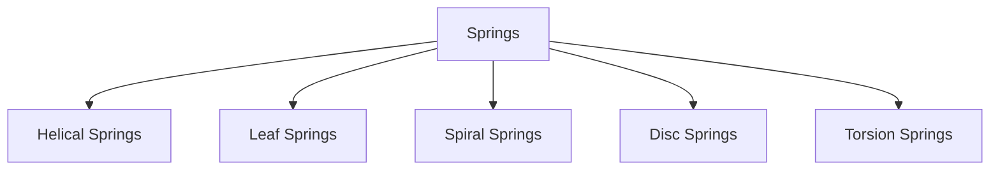
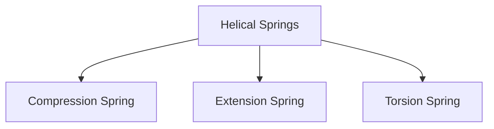
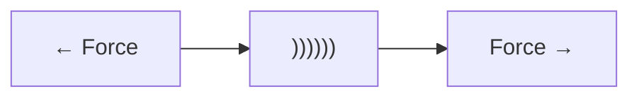
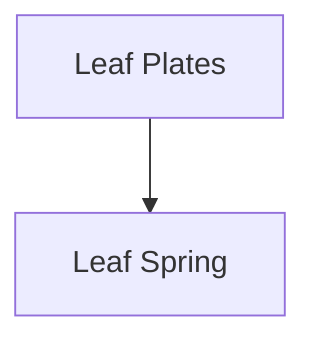
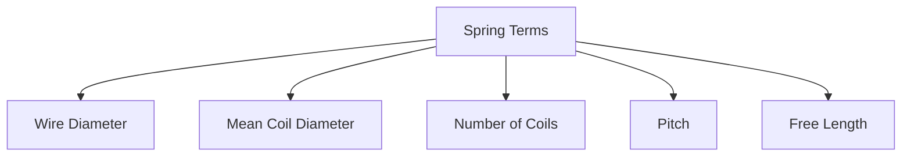
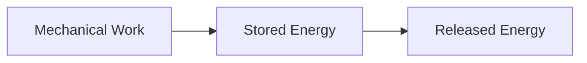
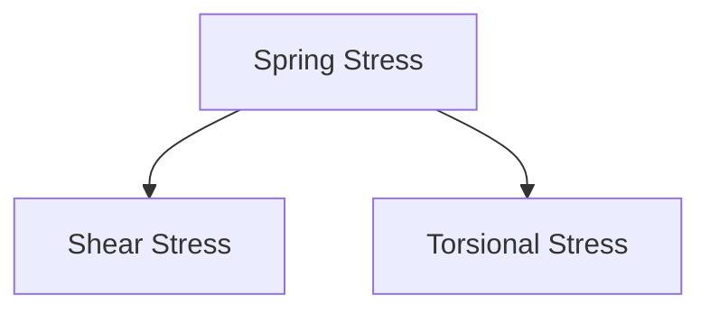
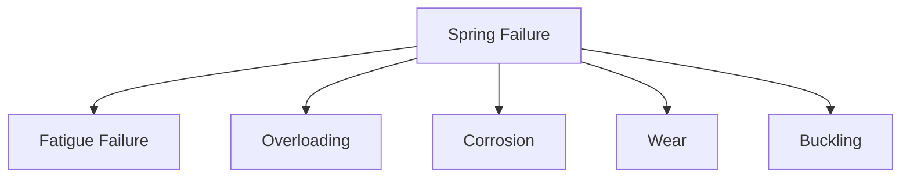
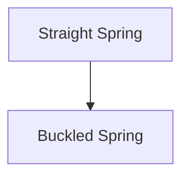

# 🌀 Springs

A spring is an elastic machine element that stores mechanical energy when
subjected to a load and releases that energy when the load is removed.

Springs are among the most widely used machine components. They absorb shocks,
store energy, control motion, and maintain forces between machine parts.

Examples:

- Vehicle suspension systems
- Ballpoint pens
- Clutches
- Valves
- Weighing machines
- Railway buffers

---

# 🎯 Functions of Springs

Springs perform several important functions in machines.

✅ Store mechanical energy

✅ Absorb shocks and vibrations

✅ Control motion

✅ Maintain contact force

✅ Measure forces

✅ Return components to their original position

---

# 💡 Everyday Examples

### Car Suspension

Spring absorbs road shocks and improves ride comfort.

### Ballpoint Pen

Spring returns the refill after pressing.

### Door Closer

Spring automatically closes the door.

### Weighing Scale

Spring deformation is used to measure weight.

---

# ⚙️ Principle of Operation

When a force is applied:

- Spring deforms
- Energy is stored

When the force is removed:

- Spring returns to its original shape
- Stored energy is released


---

# 📚 Classification of Springs



---

# 1️⃣ Helical Springs

Most commonly used spring type.

Made by winding wire into a helix.


---

## Types of Helical Springs



---

# Compression Spring

Designed to resist compressive forces.

```mermaid
graph LR
A[Force]
--> B["))))))"]
<-- C[Force]
```

Examples:

- Vehicle suspension
- Shock absorbers
- Industrial presses

---

# Extension Spring

Designed to resist tensile forces.



Examples:

- Garage doors
- Mechanical linkages

---

# Torsion Spring

Works under twisting action.

Examples:

- Cloth clips
- Hinges
- Door mechanisms

---

# 2️⃣ Leaf Springs

Made from multiple steel plates stacked together.



---

# Applications

- Trucks
- Buses
- Railway vehicles

---

# Advantages

✅ High load capacity

✅ Simple construction

---

# 3️⃣ Spiral Springs

Flat strip wound into a spiral shape.

Examples:

- Clocks
- Measuring tapes

---

# 4️⃣ Disc Springs

Also called Belleville springs.

Cone-shaped spring washers.

Applications:

- Clutches
- Brakes
- Bolted joints

---

# 5️⃣ Torsion Bars

A straight bar that stores energy by twisting.

Applications:

- Vehicle suspensions
- Military vehicles

---

# 🧪 Hooke's Law

Within the elastic limit:

The load applied is directly proportional to the spring deflection.

::contentReference[oaicite:0]{index=0}

Where:

- F = Applied Force
- k = Spring Constant
- x = Deflection

---

# What is Spring Constant?

Spring constant represents stiffness.

Higher value of k means:

- Stiffer spring
- Less deflection

Lower value of k means:

- Softer spring
- More deflection

---

# 📈 Load-Deflection Curve


Within the elastic range:

- Relationship is linear.

---

# 📏 Spring Terminology



---

# Wire Diameter

Diameter of spring wire.

---

# Mean Coil Diameter

Average diameter of spring coil.

---

# Number of Coils

Total turns in the spring.

---

# Pitch

Distance between adjacent coils.

---

# Free Length

Length of spring without load.

---

# 🔋 Energy Stored in a Spring

Springs store strain energy.



Applications:

- Mechanical clocks
- Toys
- Suspension systems

---

# ⚡ Stresses in Springs

Helical springs mainly experience:



---

# Shear Stress

Produced due to applied load.

---

# Torsional Stress

Occurs because the wire twists during loading.

---

# Spring Materials

Good spring materials must possess:

✅ High elasticity

✅ High fatigue strength

✅ Good toughness

✅ Corrosion resistance

---

# Common Materials

| Material         | Application             |
| ---------------- | ----------------------- |
| Carbon Steel     | General purpose         |
| Alloy Steel      | Heavy-duty springs      |
| Stainless Steel  | Corrosive environments  |
| Phosphor Bronze  | Electrical applications |
| Beryllium Copper | Precision instruments   |

---

# 🛡️ Fatigue in Springs

Springs are often subjected to repeated loading.

Examples:

- Vehicle suspension
- Engine valve springs

Repeated loading may cause:

- Crack formation
- Fatigue failure

---

# Methods to Improve Spring Life

✅ Proper heat treatment

✅ Surface polishing

✅ Shot peening

✅ Corrosion protection

---

# ⚠️ Spring Failures



---

# Fatigue Failure

Most common spring failure.

Occurs due to cyclic loading.

---

# Overloading

Excessive load causes permanent deformation.

---

# Corrosion

Reduces material strength.

---

# Wear

Occurs due to rubbing between coils.

---

# Buckling

Occurs in long compression springs.



---

# Spring Design Considerations

Engineers consider:

- Load capacity
- Deflection
- Stiffness
- Fatigue life
- Available space
- Material properties

---

# 🏭 Applications of Springs

## Automotive Industry

- Suspension systems
- Clutches
- Brakes

---

## Industrial Machinery

- Presses
- Valves
- Vibration isolators

---

## Aerospace Industry

- Landing gear systems
- Control mechanisms

---

## Railway Systems

- Buffers
- Suspension units

---

## Consumer Products

- Pens
- Toys
- Watches

---

# 📈 Advantages of Springs

✅ Store energy efficiently

✅ Absorb shocks and vibrations

✅ Simple construction

✅ Long service life

✅ Low maintenance

---

# ⚠️ Limitations

❌ Subject to fatigue failure

❌ Sensitive to corrosion

❌ May buckle under excessive compression

❌ Performance decreases at high temperatures

---

# 📝 Key Points

- Springs are elastic machine elements used for storing and releasing energy.
- The most common type is the helical spring.
- Springs follow Hooke's Law within the elastic range.
- Springs absorb shocks, control motion, and maintain forces.
- Common spring types include helical, leaf, spiral, and disc springs.
- Fatigue is the most common mode of spring failure.
- Material selection and proper design are critical for spring performance.
- Springs are widely used in automobiles, machinery, aerospace, and consumer
  products.
