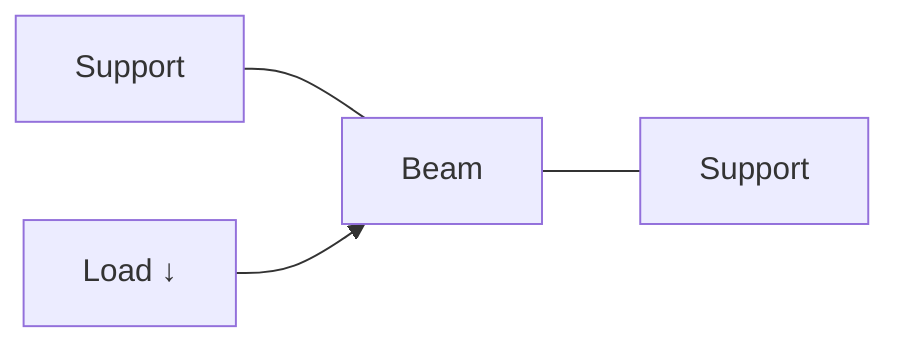
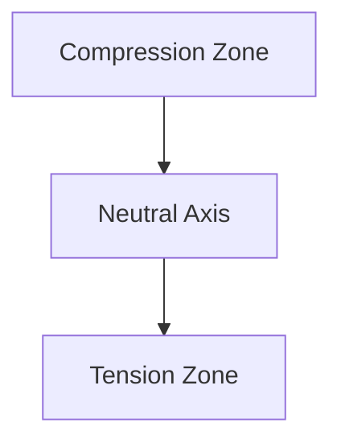
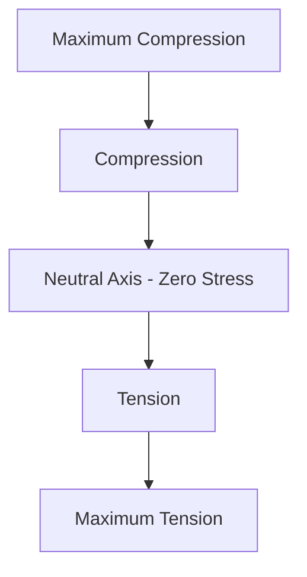
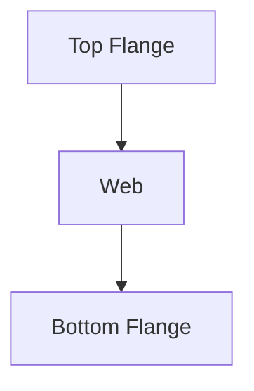

# ↘️ Bending Stress

Bending stress is the stress developed in a beam when it is subjected to bending
moments caused by external loads.

When a beam carries loads, it bends. During bending:

- The upper fibers may compress.
- The lower fibers may stretch.
- Some fibers experience no stress at all.

Understanding bending stress is essential for designing beams used in buildings,
bridges, machines, and vehicles.

---

# 🎯 Why Study Bending Stress?

Engineers use bending stress analysis to:

- Design safe beams
- Prevent beam failure
- Calculate required beam dimensions
- Select suitable materials
- Estimate load carrying capacity

Applications include:

- Building beams
- Bridge girders
- Railway tracks
- Crane booms
- Machine frames

---

# 🏗️ What Happens During Bending?

Consider a simply supported beam carrying a load.



As the load acts:

- Top fibers shorten (compression)
- Bottom fibers elongate (tension)

---

# 📊 Fiber Behavior During Bending



---

## Compression Zone

Located above the neutral axis.

Fibers become shorter.

Stress developed:

```
Compressive Stress
```

---

## Tension Zone

Located below the neutral axis.

Fibers become longer.

Stress developed:

```
Tensile Stress
```

---

## Neutral Axis

An imaginary line inside the beam where:

```
Stress = 0
```

Fibers on the neutral axis neither elongate nor shorten.

---

# 🔍 Neutral Surface

The surface passing through all neutral axis points along the beam is called the
neutral surface.

It separates:

- Compression region
- Tension region

---

# 📏 Bending Moment

The tendency of a load to bend a beam is called the bending moment.

Formula:

```
M = F × d
```

Where:

- M = Bending Moment
- F = Force
- d = Perpendicular Distance

Unit:

```
N·m
```

or

```
kN·m
```

---

# 📚 Theory of Simple Bending

The theory of simple bending is based on the following assumptions:

1. Material is homogeneous.
2. Material is isotropic.
3. Beam is initially straight.
4. Hooke's Law is valid.
5. Plane sections remain plane after bending.
6. Young's modulus remains constant.

---

# ⚡ Bending Equation

The fundamental bending equation is:

```
M/I = σ/y = E/R
```

Where:

- M = Bending Moment
- I = Moment of Inertia
- σ = Bending Stress
- y = Distance from Neutral Axis
- E = Young's Modulus
- R = Radius of Curvature

---

# 📖 Bending Stress Formula

From the bending equation:

```
σ = My/I
```

Where:

- σ = Bending Stress
- M = Bending Moment
- y = Distance from Neutral Axis
- I = Moment of Inertia

---

# 📌 Important Observations

## At Neutral Axis

```
y = 0
```

Therefore,

```
σ = 0
```

Stress is zero.

---

## At Outer Fibers

Maximum value of y occurs.

Therefore:

```
Stress = Maximum
```

Failure usually begins at outer surfaces.

---

# 📊 Stress Distribution

Stress varies linearly across beam depth.



---

# 🧮 Section Modulus

Section modulus indicates the bending strength of a section.

Formula:

```
Z = I/ymax
```

Where:

- Z = Section Modulus
- I = Moment of Inertia
- ymax = Distance to Extreme Fiber

Unit:

```
mm³
```

---

# 📖 Alternative Bending Stress Formula

Using section modulus:

```
σ = M/Z
```

This formula is commonly used in design calculations.

---

# 📌 Example

A beam has:

- Bending Moment = 10 kN·m
- Section Modulus = 200 × 10³ mm³

Convert moment:

```
M = 10 × 10⁶ N·mm
```

Using:

```
σ = M/Z
```

```
σ = (10 × 10⁶)/(200 × 10³)
```

```
σ = 50 N/mm²
```

Therefore,

```
Bending Stress = 50 MPa
```

---

# 📚 Types of Bending

## Simple Bending

Only bending moment acts.

No shear force effect considered.

---

## Pure Bending

Constant bending moment exists throughout a region.

Example:

Beam loaded by equal and opposite couples.

---

## Unsymmetrical Bending

Occurs when loading is not along a principal axis.

Common in:

- Angle sections
- Channel sections

---

# 🏗️ Common Beam Sections

Different beam shapes are used to resist bending efficiently.

## Rectangular Section

Simple and easy to manufacture.

---

## Circular Section

Used in shafts and poles.

---

## I-Section

Most widely used in structures.

Advantages:

- High strength
- Low weight
- Excellent bending resistance



---

# ⚙️ Factors Affecting Bending Stress

## Applied Load

Higher load produces higher stress.

---

## Span Length

Longer span increases bending moment.

---

## Cross Section

Larger section reduces stress.

---

## Material Properties

Stronger materials withstand higher stresses.

---

# 🚨 Beam Failure Due to Bending

Failure may occur when:

- Stress exceeds allowable limit
- Excessive deflection occurs
- Material yields
- Cracks develop

Engineers apply a factor of safety to prevent failure.

---

# 🌍 Real-Life Examples

## Building Beam

Supports floor loads.

---

## Bridge Girder

Carries vehicle loads.

---

## Crane Arm

Experiences heavy bending moments.

---

## Shelf Bracket

Supports objects placed on shelves.

---

# 📝 Key Formulas

Bending Moment:

```
M = F × d
```

Bending Stress:

```
σ = My/I
```

Section Modulus:

```
Z = I/ymax
```

Design Formula:

```
σ = M/Z
```

---

# 🎓 Summary

Bending stress develops when a beam is subjected to external loads that cause
bending.

- Top fibers experience compression.
- Bottom fibers experience tension.
- Neutral axis experiences zero stress.
- Maximum stress occurs at outer fibers.

The bending equation and section modulus are fundamental tools used in beam
design and structural analysis.
