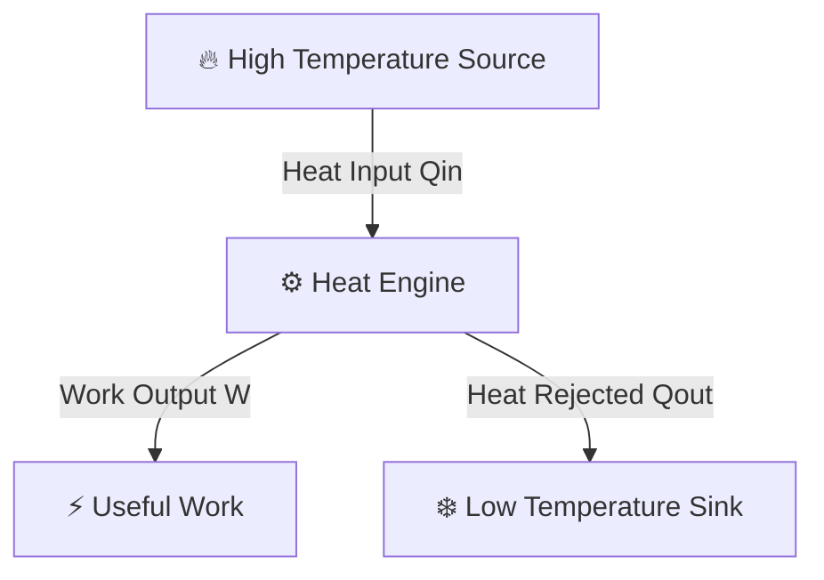
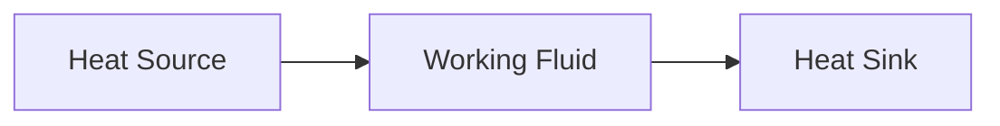
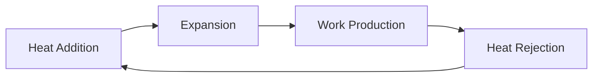
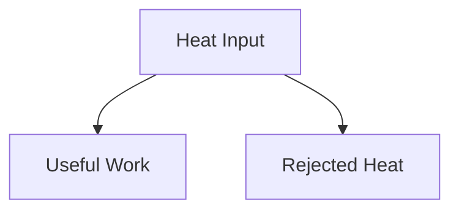
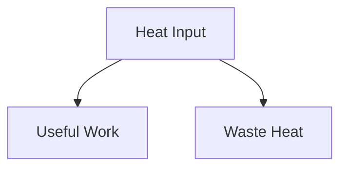
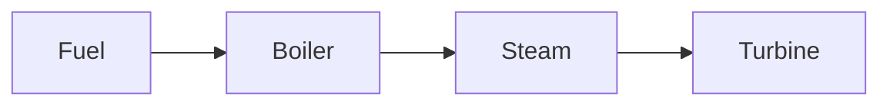
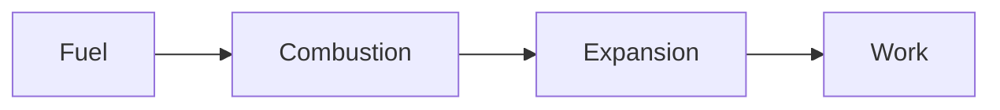
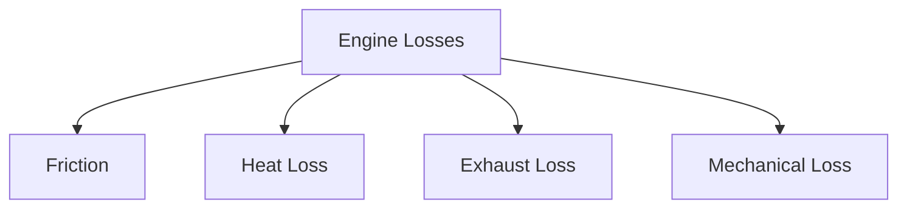

# 🔧 Heat Engines

A heat engine is a device that converts **thermal energy (heat)** into
**mechanical work**.

Heat engines play a crucial role in modern society and are used in:

- 🚗 Automobiles
- 🏭 Thermal Power Plants
- ✈️ Aircraft Engines
- 🚢 Ships
- ⚡ Electricity Generation Systems

Every heat engine operates according to the laws of thermodynamics and works in
a cyclic manner.

---

# 🎯 What is a Heat Engine?

A heat engine absorbs heat from a high-temperature source, converts part of that
heat into useful work, and rejects the remaining heat to a low-temperature sink.

Since complete conversion of heat into work is impossible, some heat must always
be rejected according to the Second Law of Thermodynamics.



---

# ⚙️ Basic Working Principle

A heat engine operates through three main steps:

### 1️⃣ Heat Absorption

The engine absorbs heat from a high-temperature source.

Examples:

- Burning fuel
- Steam from a boiler
- Nuclear reactor heat

### 2️⃣ Work Production

Part of the absorbed heat is converted into useful work.

Examples:

- Rotating turbine shaft
- Moving piston
- Propelling an aircraft

### 3️⃣ Heat Rejection

The remaining heat is rejected to a low-temperature sink.

Examples:

- Atmosphere
- Cooling water
- Condenser

---

# 🌡️ Essential Components

Every heat engine requires three basic elements.

## 🔥 Heat Source

Provides thermal energy.

Examples:

- Combustion chamber
- Boiler
- Nuclear reactor

## ⚙️ Working Substance

Transfers and converts energy.

Examples:

- Steam
- Air
- Combustion gases
- Refrigerants

## ❄️ Heat Sink

Receives rejected heat.

Examples:

- Cooling towers
- Rivers
- Atmosphere



---

# 🔄 Heat Engine Cycle

Most heat engines operate continuously in a cycle.



The cycle repeats as long as heat is supplied.

---

# ⚡ Energy Balance of a Heat Engine

According to the First Law of Thermodynamics:

```
Qin = W + Qout
```

Where:

- Qin = Heat supplied
- W = Useful work output
- Qout = Heat rejected

This equation shows that all supplied heat is either converted into work or
rejected.



---

# 📊 Thermal Efficiency

Thermal efficiency measures how effectively a heat engine converts heat into
work.

```
η = W / Qin
```

or

```
η = (Qin - Qout) / Qin
```

Where:

- η = Thermal Efficiency
- W = Net Work Output
- Qin = Heat Input
- Qout = Heat Rejected

---

# 🧮 Example

Suppose:

- Heat supplied = 1000 kJ
- Heat rejected = 600 kJ

Work output:

```
W = Qin - Qout
```

```
W = 1000 - 600
```

```
W = 400 kJ
```

Efficiency:

```
η = 400 / 1000
```

```
η = 0.4
```

```
η = 40%
```

### Result

The heat engine converts 40% of supplied heat into useful work.

---

# 🚫 Why Can't Efficiency Reach 100%?

According to the Second Law of Thermodynamics:

- Some heat must always be rejected.
- Complete conversion of heat into work is impossible.



Therefore:

```
η < 100%
```

for all real heat engines.

---

# 🏭 Types of Heat Engines

Heat engines are broadly classified into two categories.

## 🔥 External Combustion Engines (ECE)

Fuel burns outside the working fluid.

Examples:

- Steam engines
- Steam turbines

### Working Principle

Fuel heats water in a boiler.

Steam then produces work.



---

## 💥 Internal Combustion Engines (ICE)

Fuel burns inside the engine cylinder.

Examples:

- Petrol engines
- Diesel engines
- Gasoline generators

### Working Principle

Fuel-air mixture burns directly inside the cylinder.



---

# 🚗 Examples of Heat Engines

## Petrol Engine

Works on the Otto Cycle.

Applications:

- Cars
- Motorcycles

## Diesel Engine

Works on the Diesel Cycle.

Applications:

- Trucks
- Buses
- Generators

## Steam Turbine

Works on the Rankine Cycle.

Applications:

- Power plants

## Gas Turbine

Works on the Brayton Cycle.

Applications:

- Aircraft engines
- Power generation

---

# 🌍 Heat Engine and Thermodynamic Cycles

Different heat engines operate on different cycles.

| Engine        | Cycle         |
| ------------- | ------------- |
| Petrol Engine | Otto Cycle    |
| Diesel Engine | Diesel Cycle  |
| Steam Turbine | Rankine Cycle |
| Gas Turbine   | Brayton Cycle |
| Ideal Engine  | Carnot Cycle  |

---

# ⚠️ Sources of Efficiency Losses

Real heat engines experience losses due to:

- Friction
- Heat leakage
- Incomplete combustion
- Fluid resistance
- Mechanical wear
- Exhaust losses



---

# 🏭 Applications of Heat Engines

### 🚗 Transportation

- Cars
- Trucks
- Trains
- Ships

### ✈️ Aerospace

- Jet engines
- Aircraft turbines

### ⚡ Power Generation

- Steam power plants
- Gas turbine plants
- Nuclear power stations

### 🏗️ Industrial Equipment

- Compressors
- Heavy machinery
- Manufacturing systems

---

# 📊 Heat Engine vs Refrigerator

| Feature   | Heat Engine    | Refrigerator  |
| --------- | -------------- | ------------- |
| Purpose   | Produce Work   | Transfer Heat |
| Work      | Output         | Input         |
| Heat Flow | Hot → Cold     | Cold → Hot    |
| Main Goal | Generate Power | Cooling       |

---

# 💡 Key Points

✅ A heat engine converts heat into mechanical work.

✅ Every heat engine requires a heat source and heat sink.

✅ Some heat must always be rejected.

✅ Thermal efficiency is always less than 100%.

✅ Heat engines operate in thermodynamic cycles.

✅ Otto, Diesel, Rankine, Brayton, and Carnot cycles are important heat engine
cycles.

---

# 📚 Quick Summary

A heat engine is a device that converts thermal energy into useful mechanical
work. It absorbs heat from a high-temperature source, converts part of it into
work, and rejects the remaining heat to a low-temperature sink. Heat engines are
the foundation of automobiles, turbines, power plants, aircraft engines, and
many industrial systems.
