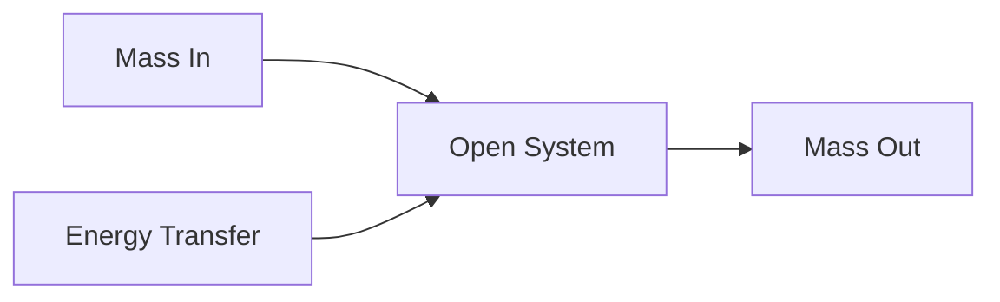
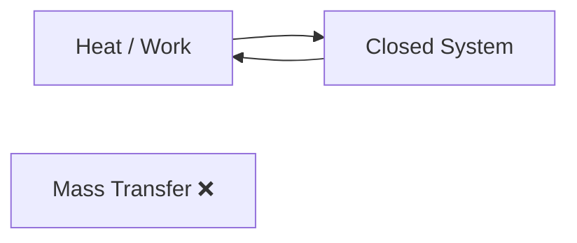
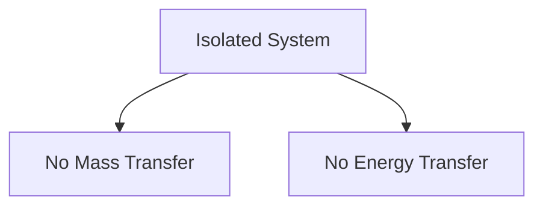
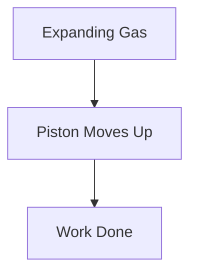
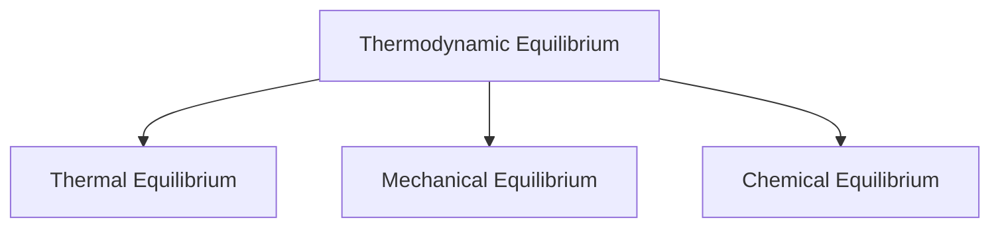

# 📖 Introduction to Thermodynamics

Thermodynamics is the branch of physics that studies **energy**, **heat**,
**work**, and how they interact with matter.

Whenever energy changes from one form to another, thermodynamics helps us
understand what happens.

### 🌍 Real-Life Examples

- 🚗 Car engines convert heat into mechanical work.
- ❄️ Refrigerators remove heat from food and release it outside.
- ☕ Hot coffee cools down by transferring heat to the surroundings.
- ⚡ Power plants convert thermal energy into electrical energy.

---

# 🤔 What Does Thermodynamics Study?

Thermodynamics mainly deals with:

1. Heat (Q)
2. Work (W)
3. Energy (E)
4. Temperature (T)

These quantities determine how a system behaves when energy is transferred.

---

# 🧩 Basic Terminology

## 1. System

A system is the part of the universe selected for study.

Example:

- Water inside a bottle
- Gas inside a cylinder
- Steam inside a turbine

## 2. Surroundings

Everything outside the system is called surroundings.

Example: If water in a bottle is the system, then the bottle, air, table, and
room are surroundings.

## 3. Boundary

The real or imaginary surface separating system and surroundings.

---

# 🎯 Types of Systems

## Open System

Both mass and energy can cross the boundary.

Examples:

- Steam turbine
- Pump
- Compressor

### Diagram

---

## Closed System

Energy can cross the boundary but mass cannot.

Example:

- Gas inside a sealed piston-cylinder arrangement

### Diagram

---

## Isolated System

Neither mass nor energy can cross the boundary.

Example:

- Ideal thermos flask

### Diagram

---

# 🌡️ Thermodynamic Properties

Properties are characteristics used to describe a system.

Examples:

- Temperature (T)
- Pressure (P)
- Volume (V)
- Density (ρ)
- Internal Energy (U)

---

## Intensive Properties

Independent of the amount of substance.

Examples:

- Temperature
- Pressure
- Density

If the system size doubles, these properties remain unchanged.

---

## Extensive Properties

Depend on the amount of substance.

Examples:

- Mass
- Volume
- Total Energy

If the system size doubles, these properties also double.

---

# 🔥 Heat and Work

## Heat

Heat is energy transferred due to temperature difference.

Example: A hot cup of tea transfers heat to the surrounding air.

---

## Work

Work is energy transferred when a force causes displacement.

Example: Gas expanding inside a cylinder pushes the piston upward.

### Diagram

---

# ⚡ Energy Forms

Thermodynamics deals with different forms of energy.

## Kinetic Energy

Energy due to motion.

Example: Moving vehicle

---

## Potential Energy

Energy due to position.

Example: Water stored in a dam

---

## Internal Energy

Microscopic energy stored inside molecules.

It includes:

- Molecular motion
- Molecular vibration
- Molecular rotation

---

# 🌡️ Thermodynamic Equilibrium

A system is in thermodynamic equilibrium when no changes occur with time.

Three conditions must be satisfied:

### Thermal Equilibrium

Temperature remains uniform.

### Mechanical Equilibrium

Pressure remains uniform.

### Chemical Equilibrium

Chemical composition remains unchanged.

### Diagram

---

# 🏭 Applications of Thermodynamics

Thermodynamics is widely used in:

- Power plants
- Automobile engines
- Refrigerators
- Air conditioners
- Aerospace systems
- Chemical industries
- Renewable energy systems

---

# 📝 Key Points

✅ Thermodynamics studies heat, work, and energy.

✅ A system may be open, closed, or isolated.

✅ Heat flows because of temperature difference.

✅ Work occurs when energy causes motion.

✅ Thermodynamic properties describe the state of a system.

✅ Equilibrium exists when thermal, mechanical, and chemical conditions are
satisfied.

---

# 🎓 Quick Summary

Thermodynamics explains how energy moves and transforms. It helps engineers
design engines, refrigerators, turbines, power plants, and many other systems
that make modern life possible.
