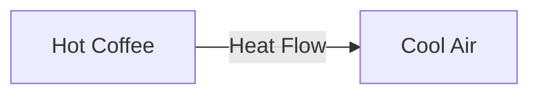
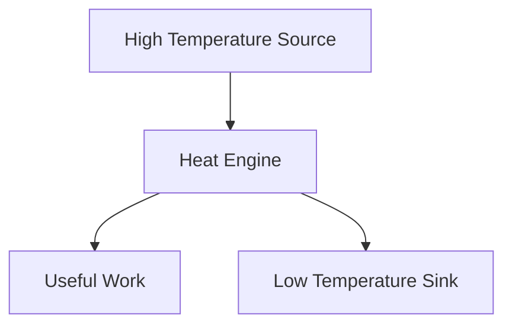
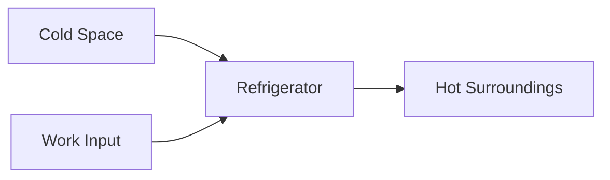
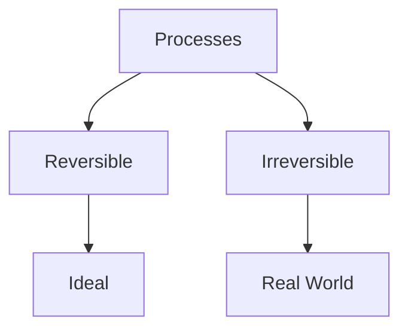

# 2️⃣ Second Law of Thermodynamics

The First Law tells us that energy is conserved, but it does not tell us the **direction** in which a process occurs.

The Second Law of Thermodynamics explains why some processes occur naturally while others do not. It introduces the concept of **entropy** and places limits on the conversion of heat into work.

## 🎯 Statement of the Second Law

The Second Law can be expressed in two common forms:

### Kelvin-Planck Statement

**It is impossible for a heat engine operating in a cycle to convert all the heat supplied into useful work.**

Some heat must always be rejected to a low-temperature reservoir.

### Clausius Statement

**Heat cannot flow naturally from a colder body to a hotter body without external work being supplied.**

## 🌍 Natural Direction of Processes

Heat always flows naturally:

- From hot objects to cold objects
- Never from cold to hot without external work

### Example

A hot cup of coffee cools down in a room.

- Heat flows from coffee to air.
- The reverse process does not happen naturally.



## 🚫 Impossible Process

The following process cannot occur naturally:


To make this happen, external work is required.

Example:

- Refrigerator
- Air conditioner
- Heat pump

## 🔥 Heat Engine

A heat engine converts part of the supplied heat into useful work.

However, not all heat can be converted into work.

### Working Principle

1. Heat is absorbed from a high-temperature source.
2. Part of the heat is converted into work.
3. Remaining heat is rejected to a low-temperature sink.



## ⚙️ Why 100% Efficiency Is Impossible

Every heat engine must reject some heat.

Therefore:

```
Efficiency < 100%
```

Examples:

- Car engines
- Steam power plants
- Gas turbines

All lose some energy as waste heat.

## ❄️ Refrigerator and Second Law

A refrigerator transfers heat from a cold region to a hot region.

This process violates natural heat flow and therefore requires work input.



## 📈 Entropy

The Second Law introduces a new property called **Entropy**.

Entropy is a measure of:

- Disorder
- Randomness
- Energy unavailability

Symbol:

```
S
```

### Simple Interpretation

- Organized system → Low entropy
- Disorganized system → High entropy

### Example

A neatly arranged room has lower entropy than a messy room.

## 🌡️ Entropy and Heat Transfer

When heat flows naturally from a hot object to a cold object:

- Total entropy increases.
- The process becomes more spontaneous.


## 📊 Entropy Change Formula

For a reversible process:

```
ΔS = Qrev / T
```

Where:

- ΔS = Change in entropy
- Qrev = Reversible heat transfer
- T = Absolute temperature

This relation helps quantify disorder in thermodynamic systems.

## 🔄 Reversible and Irreversible Processes

### Reversible Process

An ideal process that can be reversed without leaving any effect on the surroundings.

Characteristics:

- Extremely slow
- No friction
- No energy loss

### Irreversible Process

Real-world processes are irreversible.

Examples:

- Friction
- Mixing of gases
- Heat transfer across finite temperature differences
- Combustion



## 🌍 Everyday Examples of the Second Law

### ☕ Cooling Coffee

Hot coffee cools naturally.

### 🧊 Melting Ice

Ice melts at room temperature.

### 🚗 Car Engine

Not all fuel energy becomes useful work.

### 🌬️ Air Conditioner

Requires electrical work to move heat from indoors to outdoors.

## 🏭 Engineering Applications

### 🚗 Internal Combustion Engines

Used to determine maximum achievable efficiency.

### 🏭 Thermal Power Plants

Helps analyze heat losses and performance.

### ❄️ Refrigeration Systems

Explains why work input is required.

### ✈️ Gas Turbines

Used to evaluate efficiency limits.

### ⚙️ Industrial Processes

Entropy analysis helps improve energy utilization.

## ⚠️ Common Misconceptions

### Energy Is Not Lost

The First Law states energy is conserved.

The Second Law states that energy quality degrades.

### Entropy Is Not Energy

Entropy measures the availability of energy for useful work.

### Perfect Heat Engine Cannot Exist

No engine can convert all heat into work.

## 💡 Key Points

✅ Heat naturally flows from hot to cold.

✅ Complete conversion of heat into work is impossible.

✅ Every heat engine rejects some heat.

✅ Entropy of an isolated system never decreases.

✅ Real processes are irreversible.

✅ The Second Law determines the direction of natural processes.

## 📚 Quick Summary

The Second Law of Thermodynamics explains the natural direction of energy transfer and introduces entropy. It states that heat flows naturally from hot to cold, no heat engine can be 100% efficient, and the entropy of an isolated system tends to increase. This law is fundamental in understanding engines, refrigerators, power plants, and all real-world energy systems.
