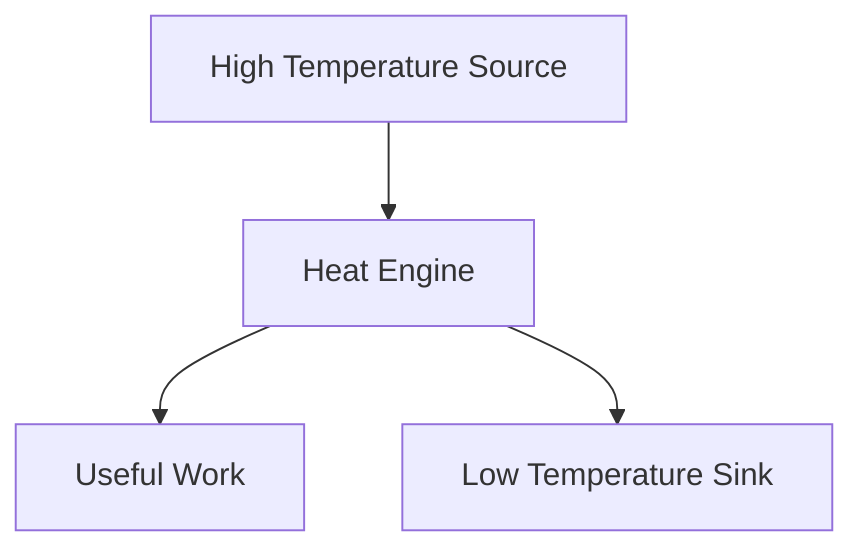
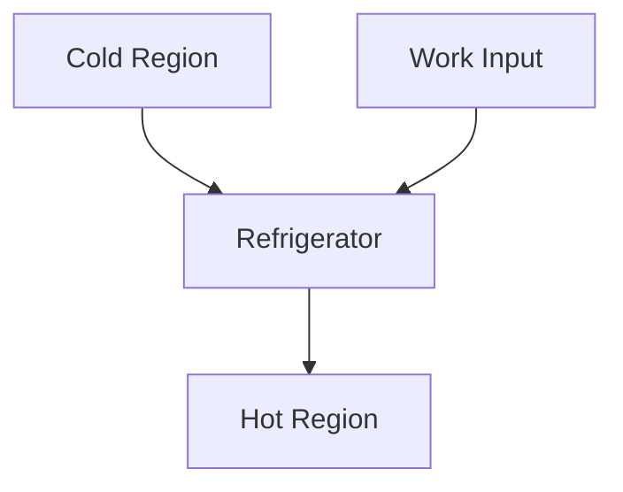
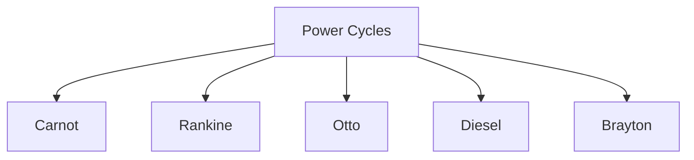
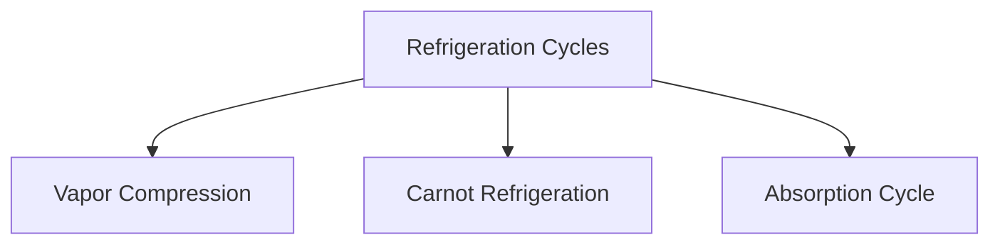
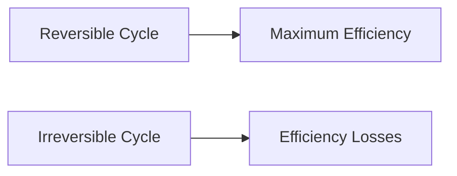

# ♻️ Thermodynamic Cycles

A thermodynamic cycle is a series of thermodynamic processes that return a
system to its initial state.

During a cycle, the working fluid undergoes changes in pressure, temperature,
and volume while exchanging heat and work with the surroundings.

Thermodynamic cycles form the foundation of:

- Power plants
- Automobile engines
- Refrigeration systems
- Air conditioners
- Gas turbines

## 🎯 What is a Thermodynamic Cycle?

A thermodynamic cycle begins at an initial state and passes through several
processes before returning to the same state.

Since the system returns to its original condition:

```
ΔU = 0
```

Where:

- ΔU = Change in Internal Energy

According to the First Law:

```
Q = W
```

Net heat transfer equals net work done over an entire cycle.

## 🔄 Basic Cycle Representation


The system continuously repeats this sequence.

## ⚙️ Why Are Thermodynamic Cycles Important?

Most engineering systems operate in cycles.

Examples:

### 🚗 Automobile Engine

Fuel burns repeatedly to produce power.

### 🏭 Steam Power Plant

Steam continuously circulates through the system.

### ❄️ Refrigerator

Refrigerant repeatedly absorbs and rejects heat.

### ✈️ Gas Turbine

Air continuously undergoes compression, heating, and expansion.

## 🔥 Heat Engine Cycle

A heat engine converts thermal energy into useful work.

### Working Principle

1. Heat is absorbed from a high-temperature source.
2. Part of the heat is converted into work.
3. Remaining heat is rejected to a low-temperature sink.
4. The cycle repeats.



## ❄️ Refrigeration Cycle

A refrigeration cycle works in the opposite direction of a heat engine.

It uses work input to transfer heat from a low-temperature region to a
high-temperature region.



## 📊 Types of Thermodynamic Cycles

Thermodynamic cycles are broadly classified into two categories.

### Power Cycles

Power cycles produce work output.

Examples:

- Carnot Cycle
- Rankine Cycle
- Otto Cycle
- Diesel Cycle
- Brayton Cycle



### Refrigeration Cycles

Refrigeration cycles consume work to move heat.

Examples:

- Vapor Compression Cycle
- Carnot Refrigeration Cycle
- Absorption Refrigeration Cycle



## 🌡️ Reversible and Irreversible Cycles

### Reversible Cycle

An ideal cycle with no losses.

Characteristics:

- No friction
- No heat loss
- Maximum possible efficiency

Example:

- Carnot Cycle

### Irreversible Cycle

Real-world cycles always contain losses.

Sources of irreversibility:

- Friction
- Heat loss
- Fluid resistance
- Turbulence



## 📈 Thermodynamic Cycle on a P-V Diagram

A cycle is often represented on a Pressure-Volume diagram.

The enclosed area represents net work done.


### Important Observation

- Larger enclosed area → More work output
- Smaller enclosed area → Less work output

## 🔥 Carnot Cycle

The Carnot Cycle is an ideal cycle with the highest possible efficiency between
two temperatures.

Characteristics:

- Fully reversible
- No entropy generation
- Maximum theoretical efficiency

Applications:

- Efficiency benchmark for heat engines

## 🏭 Rankine Cycle

The Rankine Cycle is the basic operating cycle of steam power plants.

Main components:

- Boiler
- Turbine
- Condenser
- Pump

Applications:

- Thermal power stations
- Nuclear power plants

## 🚗 Otto Cycle

The Otto Cycle represents the ideal cycle of petrol engines.

Processes include:

- Compression
- Combustion
- Expansion
- Exhaust

Applications:

- Cars
- Motorcycles
- Small gasoline engines

## 🚚 Diesel Cycle

The Diesel Cycle represents compression ignition engines.

Applications:

- Trucks
- Buses
- Heavy machinery
- Generators

## ✈️ Brayton Cycle

The Brayton Cycle is used in gas turbines and jet engines.

Main components:

- Compressor
- Combustion chamber
- Turbine

Applications:

- Aircraft engines
- Gas turbine power plants

## ⚡ Efficiency of a Cycle

Thermal efficiency measures how effectively heat is converted into work.

```
η = Wnet / Qin
```

Where:

- η = Thermal Efficiency
- Wnet = Net Work Output
- Qin = Heat Supplied

Higher efficiency means:

- More useful work
- Less wasted energy

## 🏭 Applications of Thermodynamic Cycles

### 🚗 Automobile Industry

Used in petrol and diesel engines.

### 🏭 Power Generation

Used in thermal, nuclear, and gas turbine power plants.

### ✈️ Aerospace Industry

Used in aircraft propulsion systems.

### ❄️ Refrigeration and Air Conditioning

Used to transfer heat efficiently.

### ⚙️ Industrial Systems

Used in turbines, compressors, and process plants.

## 💡 Key Points

✅ A thermodynamic cycle returns the system to its initial state.

✅ Net change in internal energy over a cycle is zero.

✅ Heat engines produce work output.

✅ Refrigeration cycles consume work input.

✅ Real cycles are irreversible.

✅ Thermodynamic cycles are the basis of engines, power plants, and cooling
systems.

## 📚 Quick Summary

A thermodynamic cycle is a sequence of thermodynamic processes that returns a
system to its original state. These cycles form the basis of heat engines, power
plants, refrigerators, air conditioners, and gas turbines. The most important
cycles include Carnot, Rankine, Otto, Diesel, and Brayton cycles.
