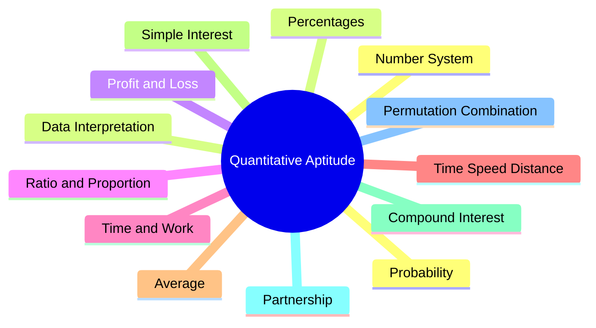

# 📖 Introduction

Quantitative Aptitude is a section commonly asked in placement tests, competitive exams, banking exams, government exams, and aptitude assessments. It tests your ability to solve mathematical problems quickly and accurately.

The main goal is not difficult mathematics. It is about:

✅ Logical thinking
✅ Problem-solving skills
✅ Speed and accuracy
✅ Understanding numerical relationships

---

# 🎯 Why Learn Quantitative Aptitude?

Companies and examiners use aptitude tests to evaluate:

* Analytical skills
* Numerical ability
* Decision-making capability
* Time management skills

Popular exams that include Quantitative Aptitude:

* Campus Placements
* CAT
* MAT
* XAT
* SSC
* Banking Exams
* UPSC CSAT
* Railway Exams

---

# 📚 Major Topics in Quantitative Aptitude



---

# 🧠 Skills Required

## 1. Basic Arithmetic

You should know:

* Addition
* Subtraction
* Multiplication
* Division
* Fractions
* Decimals

Example:

```
25 × 12 = 300
```

---

## 2. Percentage Calculations

Example:

Find 20% of 250.

```
20/100 × 250
= 50
```

Answer = **50**

---

## 3. Ratio Understanding

Example:

Ratio of boys to girls is 3:2.

If boys = 30

```
3 parts = 30
1 part = 10

Girls = 2 × 10
      = 20
```

---

## 4. Speed Calculation

Formula:

```
Speed = Distance / Time
```

Example:

Distance = 120 km

Time = 2 hours

```
Speed = 120/2
      = 60 km/hr
```

---

# ⚡ Importance of Speed

In aptitude exams:

* Questions are usually easy to moderate.
* Time is limited.
* Speed matters more than lengthy calculations.

Example:

Instead of:

```
25 × 4
```

Calculate mentally:

```
100
```

---

# 🎯 Common Mathematical Formulas

## Percentage

```
Percentage = (Value / Total Value) × 100
```

---

## Profit

```
Profit = SP - CP
```

Where:

* SP = Selling Price
* CP = Cost Price

---

## Loss

```
Loss = CP - SP
```

---

## Average

```
Average = Sum of observations / Number of observations
```

Example:

```
10 + 20 + 30 = 60

Average = 60/3
        = 20
```

---

## Ratio

```
a:b = a/b
```

Example:

```
4:5 = 4/5
```

---

# 🔥 Problem Solving Approach

Whenever you see a question:

### Step 1

Read carefully.

### Step 2

Identify topic.

Example:

Question contains:

* Profit
* Loss
* Discount

➡ Profit & Loss topic

---

### Step 3

Write given values.

Example:

```
CP = ₹500
SP = ₹600
```

---

### Step 4

Apply formula.

```
Profit = SP - CP

= 600 - 500
= 100
```

---

### Step 5

Check answer.

Many mistakes happen due to calculation errors.

---

# 🚀 Tips to Improve Quantitative Aptitude

## Learn Tables

Memorize:

```
2 to 20 tables
```

Example:

```
17 × 8 = 136
18 × 9 = 162
```

---

## Learn Squares

```
11² = 121
12² = 144
13² = 169
...
30² = 900
```

---

## Learn Cubes

```
1³ = 1
2³ = 8
3³ = 27
...
20³ = 8000
```

---

## Learn Percentage Equivalents

| Fraction | Percentage |
| -------- | ---------- |
| 1/2      | 50%        |
| 1/3      | 33.33%     |
| 1/4      | 25%        |
| 1/5      | 20%        |
| 1/8      | 12.5%      |
| 3/4      | 75%        |

---

# 📝 Sample Questions

### Question 1

Find 25% of 800.

Solution:

```
25/100 × 800

= 200
```

Answer = **200**

---

### Question 2

A product costs ₹400 and sells for ₹500.

Find profit.

```
Profit = 500 - 400
       = 100
```

Answer = **₹100**

---

### Question 3

Ratio of two numbers is 2:3.

If first number is 20, find second number.

```
2 parts = 20

1 part = 10

Second number = 3 × 10
              = 30
```

Answer = **30**

---

# 📌 Exam Strategy

### Easy Questions First

Attempt:

* Percentages
* Ratio
* Profit & Loss

before difficult topics.

---

### Avoid Long Calculations

Use shortcuts whenever possible.

---

### Practice Daily

Recommended:

* 20 Aptitude Questions/day
* 30 Minutes Practice/day

---

# ✅ Summary

Quantitative Aptitude is the foundation of most aptitude exams. The key areas include arithmetic, percentages, ratios, profit & loss, time-work, and speed-distance problems. Success depends on understanding formulas, practicing regularly, improving calculation speed, and applying logical thinking.
