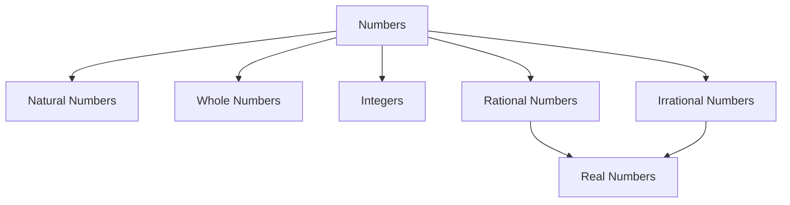

# 🔢 Number System

The **Number System** is one of the most important topics in Quantitative
Aptitude. Many advanced topics such as percentages, ratios, HCF-LCM,
simplification, and algebra depend on a strong understanding of numbers.

---

## What is a Number System?

A Number System is a way of representing and classifying numbers.

<!-- Visual flow for 🔢 Number System. -->


## 1⃣ Natural Numbers (N)

Natural numbers are counting numbers.

```text
1, 2, 3, 4, 5, 6...
```

Properties:

- Smallest natural number = 1
- No largest natural number
- Infinite in count

Example:

```text
10, 25, 100, 999
```

## 2⃣ Whole Numbers (W)

Whole numbers include zero and all natural numbers.

```text
0, 1, 2, 3, 4, 5...
```

- Smallest whole number = 0
- Infinite

## 3⃣ Integers (Z)

Integers include positive numbers, negative numbers, and zero.

```text
..., -3, -2, -1, 0, 1, 2, 3 ...
```

Examples:

```text
-100
45
0
```

## 4⃣ Rational Numbers

Numbers that can be expressed as:

```text
p/q
```

Where:

```text
q ≠ 0
```

```text
1/2
3/4
5
0.25
```

Since:

```text
5 = 5/1
```

it is also rational.

## 5⃣ Irrational Numbers

Cannot be expressed as p/q.

```text
√2
√3
π
```

Decimal values never terminate and never repeat.

```text
√2 = 1.414213...
```

## 6⃣ Real Numbers

Combination of:

- Rational Numbers
- Irrational Numbers

```text
5
-3
0
1/4
√2
π
```

## Even Number

Divisible by 2.

```text
2, 4, 6, 8, 10
```

Formula:

```text
2n
```

## Odd Number

Not divisible by 2.

```text
1, 3, 5, 7, 9
```

```text
2n + 1
```

## Even + Even

```text
Even
```

```text
8 + 4 = 12
```

## Odd + Odd

```text
7 + 3 = 10
```

## Even + Odd

```text
Odd
```

```text
6 + 5 = 11
```

## Odd × Odd

```text
5 × 3 = 15
```

## Even × Any Number

```text
8 × 17 = 136
```

## Prime Numbers

A number having exactly two factors:

```text
1 and itself
```

```text
2, 3, 5, 7, 11, 13, 17...
```

Special Fact:

```text
2 is the only even prime number.
```

## Composite Numbers

Numbers having more than two factors.

```text
4, 6, 8, 9, 10, 12
```

## Co-prime Numbers

Two numbers whose HCF is 1.

```text
8 and 15
```

Factors:

```text
8 = 1,2,4,8
15 = 1,3,5,15
```

Common factor:

```text
1
```

Hence co-prime.

## Factor

A number that divides another number completely.

Factors of 12

```text
1, 2, 3, 4, 6, 12
```

## Multiple

Obtained by multiplying a number.

Multiples of 12

```text
12, 24, 36, 48, 60...
```

## Divisibility Rules

These rules save time in aptitude exams.

## Divisible by 2

Last digit must be:

```text
0, 2, 4, 6, 8
```

```text
248
```

## Divisible by 3

Sum of digits divisible by 3.

```text
246

2+4+6=12
```

12 divisible by 3.

Therefore 246 divisible by 3.

## Divisible by 4

Last two digits divisible by 4.

```text
512

12 divisible by 4
```

Hence divisible by 4.

## Divisible by 5

Last digit:

```text
0 or 5
```

```text
125
```

## Divisible by 6

Divisible by:

```text
2 and 3
```

```text
324
```

Even and digit sum:

```text
3+2+4=9
```

Therefore divisible by 6.

## Divisible by 8

Last 3 digits divisible by 8.

```text
7128

128 ÷ 8 = 16
```

## Divisible by 9

Sum of digits divisible by 9.

```text
729

7+2+9=18
```

18 divisible by 9.

## Divisible by 11

Difference between alternate digit sums must be 0 or multiple of 11.

```text
121
```

```text
(1+1)-2 = 0
```

Hence divisible by 11.

## HCF (Highest Common Factor)

Largest factor common to all numbers.

Find HCF of:

```text
12 and 18
```

```text
12 → 1,2,3,4,6,12
18 → 1,2,3,6,9,18
```

Highest common factor:

```text
6
```

Answer:

```text
HCF = 6
```

## LCM (Least Common Multiple)

Smallest number divisible by all given numbers.

Multiples:

```text
12 → 12,24,36,48...
18 → 18,36,54...
```

Common smallest:

```text
36
```

```text
LCM = 36
```

## Relationship Between HCF and LCM

For two numbers:

```text
HCF × LCM = Product of Numbers
```

```text
12 × 18 = 216

HCF = 6
LCM = 36

6 × 36 = 216
```

Verified.

## Remainder Concept

```text
Dividend = Divisor × Quotient + Remainder
```

```text
17 ÷ 5
```

```text
17 = 5 × 3 + 2
```

Remainder:

```text
2
```

## Unit Digit Pattern (Cyclicity)

Useful for powers.

Find unit digit of:

```text
7^103
```

Pattern:

```text
7¹ = 7
7² = 49 → 9
7³ = 343 → 3
7⁴ = 2401 → 1
```

Cycle:

```text
7,9,3,1
```

Length:

```text
4
```

```text
103 ÷ 4
```

```text
3
```

3rd number in cycle:

```text
Unit Digit = 3
```

## Number of Factors Formula

If:

```text
N = pᵃ × qᵇ × rᶜ
```

Number of factors:

```text
(a+1)(b+1)(c+1)
```

```text
72 = 2³ × 3²
```

```text
(3+1)(2+1)

= 4 × 3

= 12
```

```text
12 factors
```

### Question 1

```text
24 and 36
```

Solution:

```text
Factors of 24:
1,2,3,4,6,8,12,24

Factors of 36:
1,2,3,4,6,9,12,18,36
```

```text
12
```

✅ Answer: 12

### Question 2

Find LCM of:

```text
15 and 20
```

Prime factors:

```text
15 = 3 × 5

20 = 2² × 5
```

LCM:

```text
2² × 3 × 5

= 60
```

✅ Answer: 60

### Question 3

How many factors does 100 have?

```text
100 = 2² × 5²
```

```text
(2+1)(2+1)

= 3 × 3

= 9
```

✅ Answer: 9

### Memorize Squares

```text
11² = 121
12² = 144
13² = 169
...
30² = 900
```

### Memorize Cubes

```text
1³ = 1
2³ = 8
3³ = 27
...
20³ = 8000
```

### Learn Prime Numbers Up To 100

```text
2,3,5,7,11,13,17,19,23,29,
31,37,41,43,47,53,59,61,
67,71,73,79,83,89,97
```

## ✅ Summary

The Number System topic covers:

- Natural, Whole, Integers
- Rational & Irrational Numbers
- Prime & Composite Numbers
- Factors & Multiples
- Divisibility Rules
- HCF & LCM
- Remainders
- Unit Digit & Cyclicity
- Number of Factors

These concepts form the foundation for most aptitude questions and frequently
appear in placement exams.

## Quick Reference

| Area | Revision point |
|---|---|
| Definition | State exactly what the topic means. |
| Mechanism | Explain the steps that produce the result. |
| Example | Use a small realistic case. |
| Pitfalls | Know common mistakes and boundary cases. |
