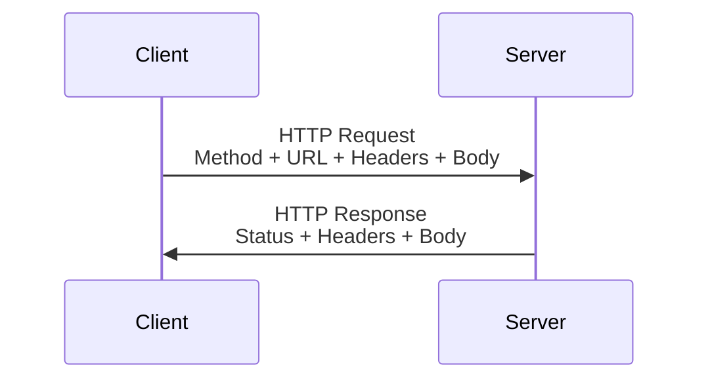
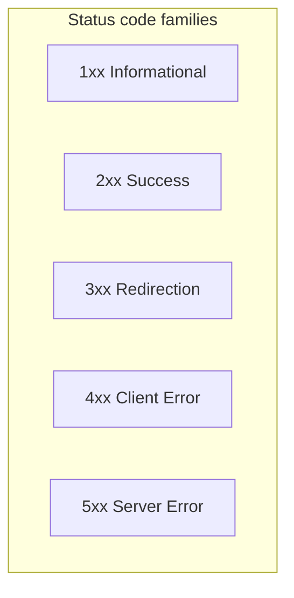
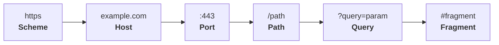

# HTTP cheat sheet

### HTTP Methods (Verbs)

| Method  | Description                             | Idempotent | Safe |
| ------- | --------------------------------------- | ---------- | ---- |
| GET     | Retrieve a resource                     | Yes        | Yes  |
| POST    | Create or process a resource            | No         | No   |
| PUT     | Replace a resource (full update)        | Yes        | No   |
| PATCH   | Partially update a resource             | No         | No   |
| DELETE  | Delete a resource                       | Yes        | No   |
| HEAD    | Like GET but returns headers only       | Yes        | Yes  |
| OPTIONS | List allowed methods for a resource     | Yes        | Yes  |
| TRACE   | Echoes the received request (debugging) | Yes        | Yes  |
| CONNECT | Establish a tunnel (e.g., for HTTPS)    | No         | No   |

---

### HTTP Status Codes

| Code                   | Name                  | Description                                        |
| ---------------------- | --------------------- | -------------------------------------------------- |
| **1xx: Informational** |
| 100                    | Continue              | Server acknowledges partial request                |
| 101                    | Switching Protocols   | Client requested protocol switch (e.g., WebSocket) |
| **2xx: Success**       |
| 200                    | OK                    | Standard success response                          |
| 201                    | Created               | Resource created (POST/PUT)                        |
| 204                    | No Content            | Success but no body returned                       |
| **3xx: Redirection**   |
| 301                    | Moved Permanently     | Resource has a new permanent URL                   |
| 302                    | Found                 | Temporary redirect (use GET)                       |
| 304                    | Not Modified          | Cached version still valid                         |
| **4xx: Client Errors** |
| 400                    | Bad Request           | Malformed syntax                                   |
| 401                    | Unauthorized          | Authentication needed                              |
| 403                    | Forbidden             | No permission                                      |
| 404                    | Not Found             | Resource doesn’t exist                             |
| 405                    | Method Not Allowed    | Invalid HTTP method                                |
| 429                    | Too Many Requests     | Rate limiting                                      |
| **5xx: Server Errors** |
| 500                    | Internal Server Error | Generic server error                               |
| 502                    | Bad Gateway           | Proxy received invalid response                    |
| 503                    | Service Unavailable   | Server overloaded/maintenance                      |
| 504                    | Gateway Timeout       | Proxy timeout                                      |

---

### Common HTTP Headers

| Header                      | Type             | Description                                             |
| --------------------------- | ---------------- | ------------------------------------------------------- |
| **General Headers**         |
| `Cache-Control`             | Request/Response | Caching directives (e.g., `no-cache`)                   |
| `Connection`                | Request/Response | Control connection behavior (e.g., `keep-alive`)        |
| **Request Headers**         |
| `Accept`                    | Request          | Content types client accepts (e.g., `application/json`) |
| `Authorization`             | Request          | Credentials (e.g., `Bearer <token>`)                    |
| `User-Agent`                | Request          | Client software info                                    |
| `Content-Type`              | Request          | Body MIME type (e.g., `application/json`)               |
| **Response Headers**        |
| `Content-Type`              | Response         | Body MIME type (e.g., `text/html`)                      |
| `Location`                  | Response         | Redirect URL (for 3xx codes)                            |
| `Set-Cookie`                | Response         | Server sets a cookie                                    |
| **Security Headers**        |
| `Strict-Transport-Security` | Response         | Enforce HTTPS (HSTS)                                    |
| `Content-Security-Policy`   | Response         | Mitigate XSS attacks                                    |

---

### URL Structure

Example: `https://example.com:443/path?query=param#fragment`

---

### HTTP vs HTTPS

| Feature    | HTTP               | HTTPS          |
| ---------- | ------------------ | -------------- |
| Encryption | No                 | Yes (TLS/SSL)  |
| Port       | 80                 | 443            |
| Security   | Vulnerable to MITM | Encrypted      |
| SEO        | Lower ranking      | Higher ranking |

---

### Common Content Types (MIME)

| Type                  | Description  |
| --------------------- | ------------ |
| `text/html`           | HTML content |
| `application/json`    | JSON data    |
| `application/xml`     | XML data     |
| `multipart/form-data` | File uploads |
| `image/png`           | PNG image    |

---

### Quick Tips

1. **Idempotent**: Repeated requests have the same effect (e.g., GET, PUT,
   DELETE).
2. **Safe**: Doesn’t modify server state (e.g., GET, HEAD).
3. Use `POST` for creation, `PUT` for full updates, `PATCH` for partial updates.
4. Always sanitize inputs to prevent SQLi/XSS.
5. Prefer HTTPS over HTTP for security.
