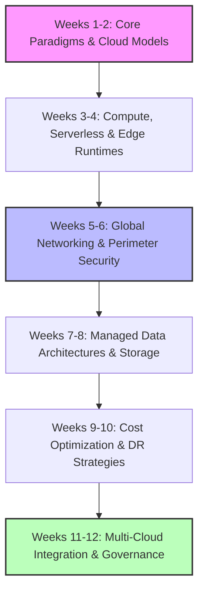
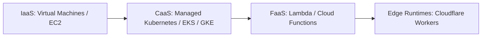
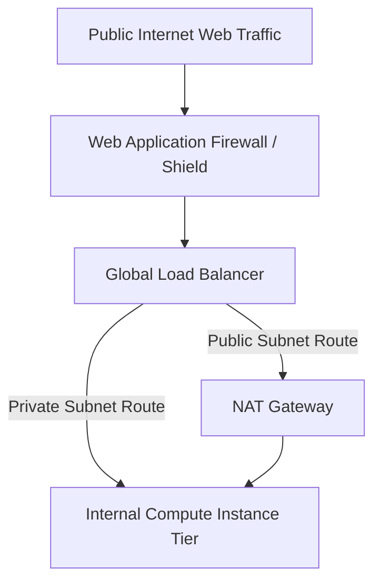
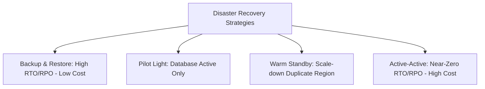

# ☁️ The Enterprise Cloud Solutions Architect Roadmap

Transitioning into a Cloud Architect or Cloud Engineer requires moving past
simply clicking buttons in a cloud vendor console. Modern cloud environments are
massive, distributed, multi-region ecosystems where you must optimize for cost,
design for high availability, enforce perimeter security, and architect around
vendor-neutral or multi-cloud topologies.

This detailed 12-week study plan maps out your progression from cloud
fundamentals to enterprise-scale solution architecture.

---

## 🗺️ Roadmap Core Progression

---

## 🏢 Week 1-2: Cloud Architecture Paradigms & Identity Models

Before provisioning resources, you must understand the Shared Responsibility
Model and how to construct secure, multi-account organizational boundaries.

### 📐 Cloud Computing Frameworks

- **Deployment Models:** Public Cloud (AWS, GCP, Azure), Private Cloud, Hybrid
  Cloud (connecting on-premises data centers to cloud resources), and
  Multi-Cloud architectures.
- **Service Levels:** Infrastructure as a Service (IaaS), Platform as a Service
  (PaaS), and Software as a Service (SaaS). Know when to trade off
  infrastructure control for operational velocity.
- **The Shared Responsibility Model:** Deeply understand the line between
  security **of** the cloud (handled by the vendor: physical data centers,
  hardware) and security **in** the cloud (handled by you: data encryption,
  network firewalls, OS patching).

### 🔑 Identity & Access Management (IAM)

- **The Principle of Least Privilege:** Designing precise, fine-grained access
  policies to ensure users and compute resources only have the exact permissions
  they need to execute.
- **Enterprise Identity Federation:** Implementing Single Sign-On (SSO),
  integration with external identity providers via OpenID Connect (OIDC) or SAML
  2.0, and temporary security credentials.
- **Multi-Account Landing Zones:** Organizing enterprise workloads using
  structural organization units (e.g., AWS Organizations, GCP Folders) to
  isolate production, staging, and development environments into entirely
  separate billing and security boundaries.

---

## ⚡ Week 3-4: Cloud Compute, Microservices & Edge Topologies

Scaling compute workloads from standard virtual machines up to distributed
serverless architectures.

### 🖥️ Virtualization & Container Clusters

- **Elastic Virtual Compute:** Provisioning virtual machines (AWS EC2, GCP
  Compute Engine). Master auto-scaling mechanics, instance types (CPU-optimized
  vs. Memory-optimized), and cost-saving pricing structures (Spot/Preemptible
  instances vs. Reserved capacity).
- **Managed Containers:** Architecting container layers using managed services
  like AWS ECS (Fargate) or Kubernetes runtimes like AWS EKS and GCP GKE.

### 🌊 Serverless & Edge Computing

- **Function-as-a-Service (FaaS):** Architecting event-driven pipelines using
  AWS Lambda or GCP Cloud Functions. Master handling cold-start latencies,
  memory provisioning, execution timeout limitations, and asynchronous event
  destinations.
- **Edge Networks:** Utilizing high-speed, zero-cold-start edge compute
  environments like **Cloudflare Workers** or Vercel Edge networks to intercept
  and modify user requests with sub-millisecond latencies right at the global
  delivery perimeter.

---

## 🌐 Week 5-6: Global Networking, Traffic Routing & Perimeter Security

Connecting multi-region components together while isolating internal assets from
public internet threats.

### 🗺️ Virtual Networks & Private Routing

- **Virtual Private Clouds (VPC):** Structuring custom software-defined
  networks. Designing IPv4/IPv6 CIDR blocks, isolating public subnets (exposed
  to the internet) from private subnets (holding databases and internal
  microservices).
- **Secure Gateways:** Configuring Internet Gateways, NAT Gateways (allowing
  private resources to safely download updates without accepting inbound public
  connections), and VPC Peering.
- **Hybrid Connectivity:** Bridging corporate office networks or on-premises
  servers directly into cloud networks via secure IPSec VPN tunnels or
  high-throughput dedicated physical connections (AWS Direct Connect, GCP
  Dedicated Interconnect).

### 🛡️ Perimeter Security & Traffic Routing

- **Global Load Balancing:** Distributing application requests across multiple
  geographical regions based on latency, geolocations, or failover health
  checks.
- **Shielding Workloads:** Deploying Web Application Firewalls (WAF) to block
  OWASP Top 10 exploits, configuring Distributed Denial of Service (DDoS)
  mitigation layers, and establishing private endpoint links to bypass routing
  over the public internet.

---

## 💾 Week 7-8: Managed Data Architectures & Cloud Storage Tiers

Selecting, implementing, and scaling data management engines across different
structural persistence needs.

### 📦 Object & Block Storage Systems

- **Object Storage:** Storing unstructured data inside massively scalable
  systems like **AWS S3** or **GCP Cloud Storage**. Master object versioning,
  lifecycle configuration rules (auto-archiving older logs to ultra-cheap
  Glacier/Archive tiers), and bucket access control parameters.
- **Block & File Storage:** Provisioning network-attached elastic block storage
  systems (SSD/HDD volumes) directly to active compute engines, alongside
  managing distributed multi-instance file systems (NFS).

### 🐘 Cloud Relational & NoSQL Storage

- **Managed SQL Databases:** Implementing cloud-native relational databases like
  AWS Aurora or GCP Cloud Spanner. Understand cross-region read-replicas,
  automated vertical scaling, automated failover loops, and global
  synchronization metrics.
- **NoSQL Ecosystems:** Leveraging distributed wide-column, key-value, or
  document databases (AWS DynamoDB, GCP Bigtable) to safely process write-heavy
  global scales with consistent single-digit millisecond latency profiles.

---

## 📉 Week 9-10: Cost Optimization (FinOps) & Disaster Recovery Strategies

An architect is directly evaluated on how cost-effectively they run a system and
how fast it recovers from catastrophic cloud-vendor region failures.

### 💰 Cloud Financial Operations (FinOps)

- **Cost Allocation & Governance:** Creating strict tagging strategies to
  attribute every single running resource back to specific engineering teams or
  application departments.
- **Anomaly Detection & Budgets:** Setting up real-time spend alert thresholds,
  automated scaling limits, and utilizing cost optimization tools to identify
  unutilized compute instances, orphan storage blocks, or expensive idle
  components.

### 🌋 Disaster Recovery (DR) Models

- **RTO & RPO Objectives:**
- _Recovery Time Objective (RTO):_ The maximum acceptable duration your
  application can be completely offline during a major failure.
- _Recovery Point Objective (RPO):_ The maximum acceptable data loss window
  measured in time from the moment the disaster occurred.

- **Architecting Resilience Strategies:**
- **Backup & Restore (High RTO/RPO):** Cheap, regular snapshots saved to object
  storage; spin up raw infrastructure only when a crash occurs.
- **Pilot Light (Medium RTO/RPO):** Database replicas are kept continuously
  synchronized in a backup region, but compute microservices remain completely
  turned off or scaled down to zero until manually activated.
- **Warm Standby (Low RTO/RPO):** A minimal, fully functioning duplicate
  environment runs around the clock in a secondary region, ready to scale up
  instantly to accept live traffic.
- **Multi-Site Active-Active (Near-Zero RTO/RPO):** Traffic is split dynamically
  between two or more fully operational geographical regions simultaneously. If
  one region drops entirely, users are rerouted seamlessly to surviving zones
  with zero application downtime.

---

## 🌐 Week 11-12: Multi-Cloud Integration, Governance & Migration Lifecycle

Navigating enterprise governance structures, managing cross-vendor workflows,
and executing large-scale lift-and-shift operations.

### 🏢 Cloud Governance & Auditing

- **Compliance Standards:** Configuring continuous auditing tools to ensure
  active cloud resources adhere to strict data-protection metrics (HIPAA,
  PCI-DSS, GDPR, SOC2).
- **Configuration Drift Tracking:** Deploying tracking monitors (AWS Config, GCP
  Cloud Asset Inventory) to immediately alert or auto-remediate when security
  group configurations or public routing access points are changed outside of
  official change-management channels.

### 🚀 Enterprise Migration Strategies (The 6 R's)

- **Rehost (Lift and Shift):** Moving applications from on-premises servers
  directly to cloud virtual machines with zero architectural code modifications.
- **Replatform (Lift, Tinker, and Shift):** Moving core components over to
  managed cloud frameworks (e.g., migrating a self-hosted database onto a fully
  managed cloud database instance) without altering base program logic.
- **Refactor / Rearchitect:** Completely rewriting application software to
  natively leverage serverless, containerized, or microservice configurations to
  unlock the full efficiency of cloud-native computing.

---

## 🏆 The Cloud Architecture Interview Framework

When an interviewer asks you to "Architect a highly available solution for $X$",
always walk through your solution using this structured sequence:

1. **Quantify the Scale & SLA Targets:** Ask about expected user traffic
   volumes, write-versus-read traffic balance distributions, and expected
   availability uptime targets (e.g., "Do we need 99.9% or 99.999%
   availability?").
2. **Isolate the Failure Domains:** Design every tier assuming components _will_
   fail. Explicitly partition assets across multiple Availability Zones
   (isolated data centers within a region) and specify how traffic switches
   dynamically during localized hardware drops.
3. **Detail the Persistence Layer Trade-Offs:** Clearly explain _why_ you chose
   a specific database pattern (e.g., "We are using DynamoDB here because we
   need consistent horizontal scale and key-value read response latencies under
   5 milliseconds").
4. **Enforce Security Boundaries From Day One:** Detail how data is encrypted
   both at rest (using envelope encryption keys) and in transit (via TLS 1.3),
   alongside specifying exactly how network perimeter gates keep core
   application logic unreachable from the public internet.
