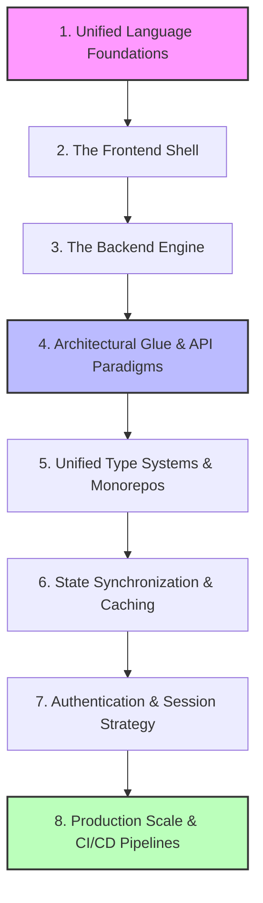
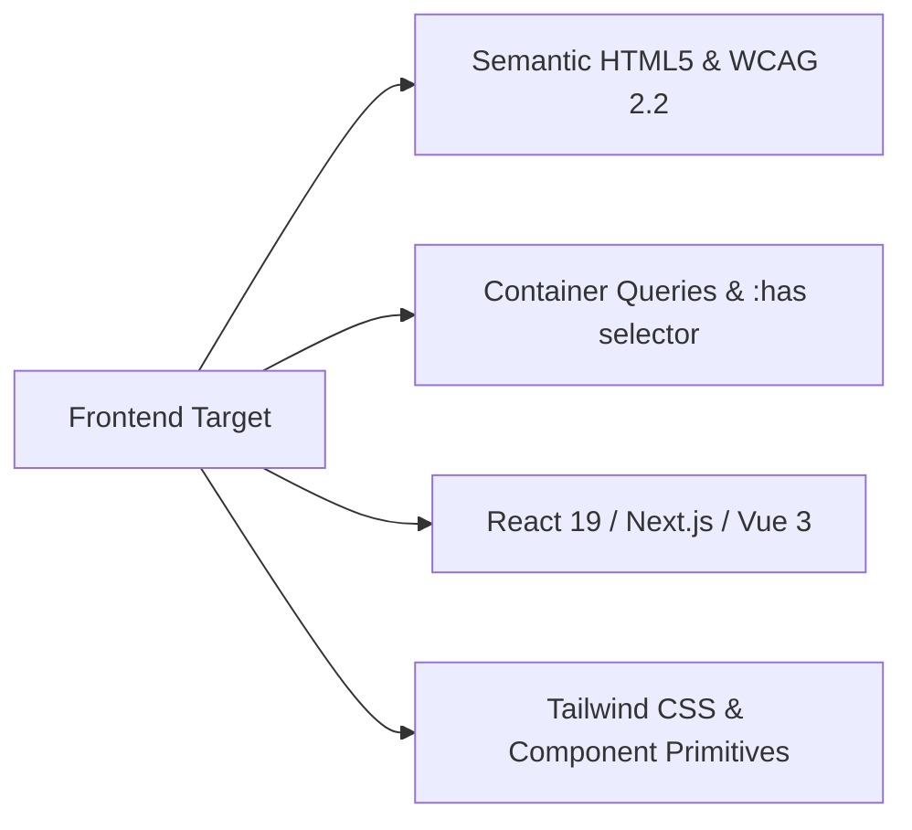
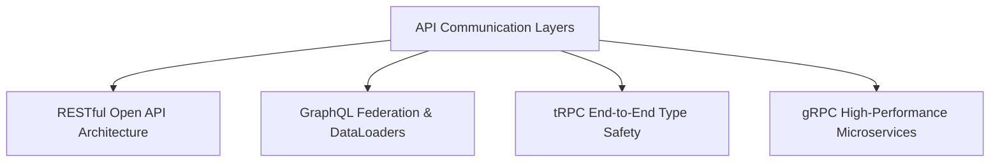
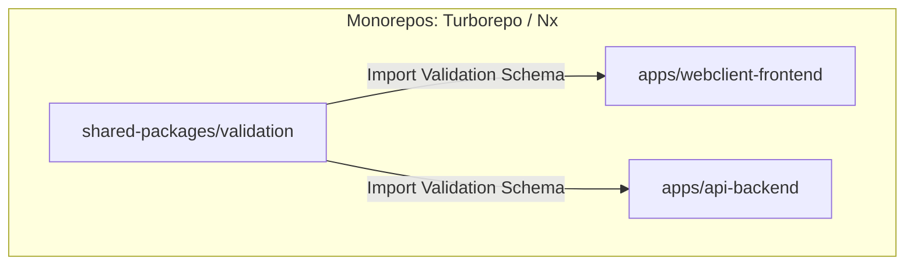
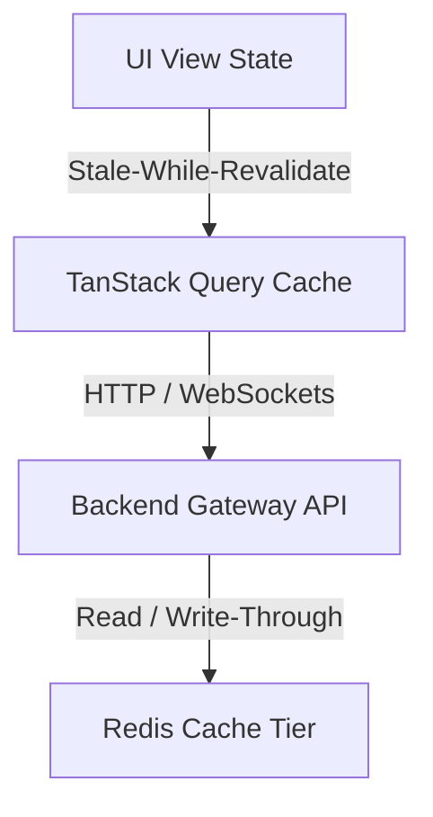
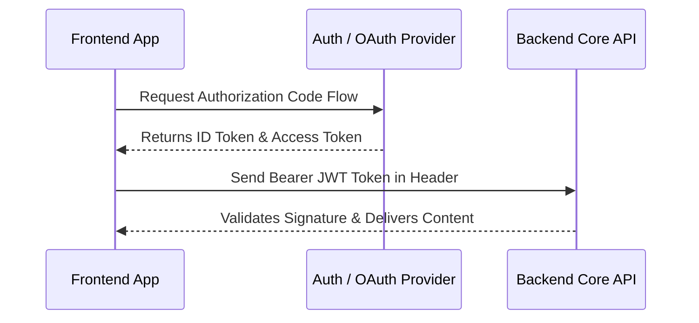

# 🚀 The Ultimate Full-Stack Developer Roadmap

A complete, production-ready blueprint for engineering end-to-end applications.
Rather than just listing front and backend topics, this roadmap focuses on the
**glue** that binds them together—architectural integration, unified type
safety, data-fetching layers, and distributed deployment pipelines.

---

## 🗺️ Roadmap Overview

---

## 1. 🟪 Unified Language Foundations

To excel as a modern full-stack engineer, mastering a unified language stack
drastically lowers cognitive overhead and unlocks end-to-end file sharing.

- 🧬 **TypeScript Mastery:** Strict compilation configuration, structural
  subtyping, generics, conditional utility types, and runtime type-guarding.

- ⏳ **Asynchronous Runtime Engine:** Deep understanding of the Event Loop,
  Microtasks vs. Macrotasks, Worker Threads, and asynchronous execution contexts
  across both browsers and server runtimes.

- 📦 **Data Structures & Algorithms (DSA):** Optimizing application runtimes by
  choosing correct data shapes—Array manipulation, Hash Maps for $O(1)$ lookups,
  and Trees/Graphs for modeling relational interfaces (like Node-based workflow
  dashboards).

---

## 2. 🎨 The Frontend Shell

The user interface must be semantic, fast, accessible, and responsive to
immediate interactions.

- 🌐 **Core Fundamentals:** Web standards built on semantic HTML5 tags and WCAG
  2.2 accessibility parameters (such as managing screen-reader landmarks, focus
  states, and aria attributes).

- 📐 **Modern Layouts & Engineering:** Responsive UI design utilizing CSS Grid,
  Flexbox, Container Queries, and interactive layout engines.

- ⚛️ **Component Frameworks:** Mastery over modern layout
  frameworks—specifically React (including Server Components architecture vs
  Client interactivity loops) or Next-Gen alternatives like Vue 3, SolidJS, or
  Svelte 5.

- 🍃 **Design Foundations:** Utilizing utility-first styling with Tailwind CSS
  paired with accessible unstyled primitives (**shadcn/ui**, Radix UI) to
  structure design tokens efficiently.

---

## 3. 💾 The Backend Engine

Persistence, heavy computations, distributed processes, and security boundaries
live entirely on the server.

- ⚙️ **Modern Runtimes:** Processing workloads within high-velocity JavaScript
  ecosystems (**Node.js**, **Bun**, or **Deno**), or utilizing compiled
  ecosystems like **Go** or **Rust** for CPU-bound performance spikes.

- 🐘 **Data Store Architecture:**
- _Relational:_ PostgreSQL or MySQL for transactions, indexing strategy
  (`EXPLAIN ANALYZE`), and strict normalization protocols.
- _NoSQL / In-Memory:_ MongoDB or DynamoDB for raw horizontal scale, alongside
  **Redis / Valkey** for ephemeral caching systems and real-time operations.

- 📦 **Containerization:** Isolating runtime processes cleanly via **Docker**
  multi-stage configurations, keeping images highly performant and secure.

---

## 4. 🔀 Architectural Glue & API Paradigms

This is where full-stack engineering diverges from simple standalone
development. How your frontend shell communicates with your backend engine
dictates application stability.

- 🌐 **RESTful Architecture:** Designing predictable endpoint paths based on
  deterministic HTTP methods, validation middleware, and standard OpenAPI
  documentation metadata.
- 📐 **GraphQL:** Constructing complex, single-endpoint graph layers to resolve
  multi-resource dependencies while tracking performance pitfalls like the $N+1$
  query dilemma through data-batching engines.
- ⚡ **tRPC (End-to-End Type Safety):** Bypassing standard code-generation
  completely in TypeScript projects by sharing server router definitions
  straight to frontend clients for seamless autocomplete during API calls.
- 🚀 **gRPC & Protobufs:** Setting up lightning-fast internal server-to-server
  microservice networks streaming payloads through binary serialization format
  patterns over HTTP/2.

---

## 5. 🗂️ Unified Type Systems & Monorepos

Enterprise full-stack pipelines share models, validation logic, and utility
functions across clients, servers, and build processes.

- 🧱 **Monorepo Orchestration:** Utilizing **Turborepo** or **Nx** to structure
  multi-project repositories, configuring task caching loops, and distributing
  shared modules efficiently across multiple execution pipelines.
- 📝 **End-to-End Schema Validation:** Declaring structural code safety using
  libraries like **Zod** or **Valibit**. Write a schema once, export it to the
  frontend for client form checking, and enforce it on the backend for incoming
  server requests.

---

## 6. 🔄 State Synchronization & Caching

Managing two versions of reality: user client state on the UI layer and
ground-truth records on database tables.

- 📡 **Client Server-Caching:** Dropping bloated global UI data loops by
  implementing asynchronous caching engines like **TanStack Query** (React
  Query) or SWR. Master caching invalidate strategies, optimistic background
  interface adjustments, and pagination.

- 🐻 **Client Global UI State:** Using minimal localized store containers
  (**Zustand**, Jotai, or Redux Toolkit) to isolate standalone frontend
  interface metadata (like sidebar locks, drawer configurations, or zoom
  stages).

- 🟥 **Distributed Server Cache:** Protecting the direct persistence database
  engine from collapse by adding multi-level caching strategies (Cache-Aside,
  TTL evictions) through **Redis**.

---

## 7. 🔒 Authentication & Session Strategy

Protecting client interface views and enforcing route data boundaries while
remaining highly scalable.

- 🎟️ **Identity & Token Flows:** Constructing modern session
  validation—including OAuth 2.1 protocol layers, OpenID Connect (OIDC) identity
  flows, and securely rotating stateless JSON Web Tokens (JWTs) via HTTP-Only
  cookies.
- 🛡️ **Defensive Engineering:** Securing frontends against Cross-Site Scripting
  (XSS) and Cross-Site Request Forgery (CSRF), while shielding backend APIs
  against SQL Injection, SSRF, and broken Object-Level Access Controls (BOLA).

---

## 8. 🚀 Production Scale, Observability & CI/CD

Building code successfully on your laptop is only 40% of the lifecycle;
full-stack engineers deploy, monitor, and scale code under real load.

- ⏱️ **Performance Metrics:** Auditing User Experiences via Core Web Vitals
  (LCP, INP, CLS) on the presentation layout, while watching backend performance
  latencies, compute overhead, and payload sizes.

- 🧪 **End-to-End Testing:** Running automated browser engine tests using
  frameworks like **Playwright** to execute actual user behavior tracks across
  frontend interfaces while testing backend responses under one script suite.

- 📊 **Unified Observability:** Tracking application life spans by exporting
  telemetry data (logs, time-series metrics, trace routes) using
  **OpenTelemetry** protocols right out into visualization engines (Prometheus +
  Grafana).
- 🚢 **GitOps Deployment & Edge Workloads:** Packaging assets through Continuous
  Integration pipelines straight to edge-oriented cloud infrastructures
  (**Next.js App Router/Remix** configurations running directly on **Cloudflare
  Workers** or Vercel Edge topologies).
