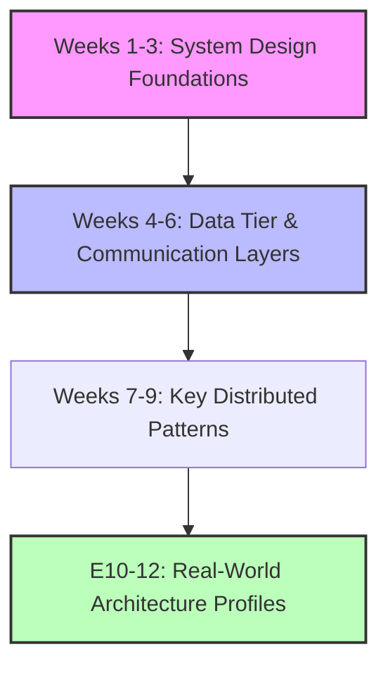
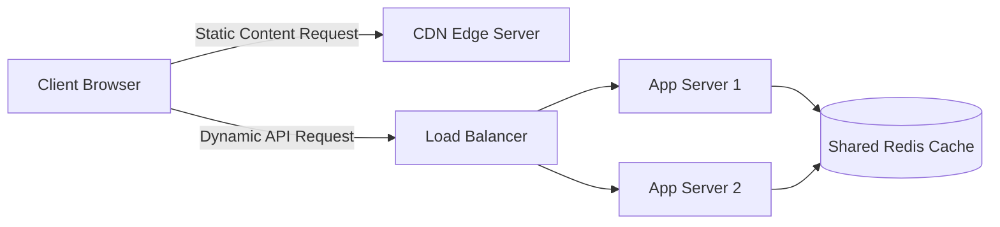
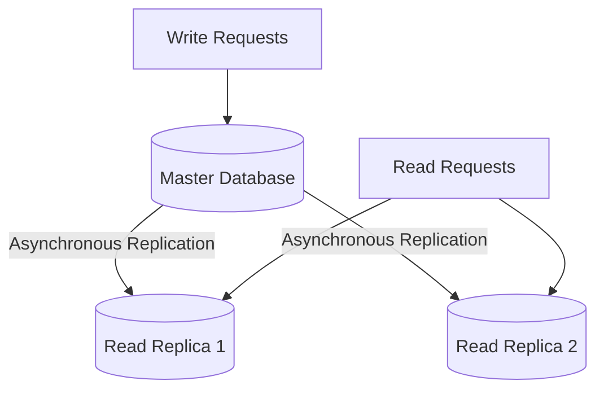
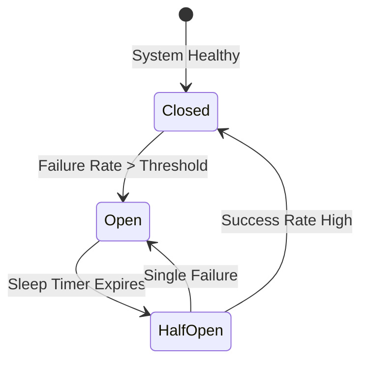
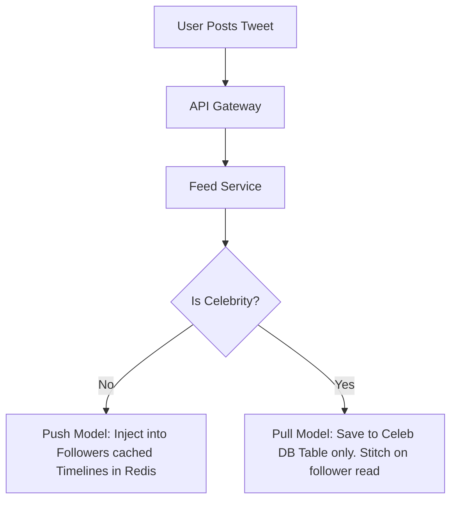

# 🏢 Comprehensive System Design Study Plan

Mastering System Design requires shifting your mindset from writing code to
architecting distributed topologies. In interviews, you are evaluated on how you
navigate ambiguity, handle trade-offs, and prevent systems from collapsing under
massive load.

This detailed 12-week study plan covers everything from core foundational
building blocks to designing complex, production-ready enterprise systems.

---

## 🗺️ Roadmap Core Progression

---

## 🧱 Week 1-3: System Design Foundations & Horizontal Scaling

Before architecting massive ecosystems, you must understand how a single server
scales to millions of users and where bottlenecks occur.

### ⚖️ Scaling Concepts

- **Vertical vs. Horizontal Scaling:** Moving from bigger machines (scale-up) to
  a fleet of commodity servers (scale-out).
- **Load Balancers:** Hardware vs. Software load balancers. Algorithms to
  master: Round Robin, Weighted Round Robin, Least Connections, and Consistent
  Hashing (IP Hash).
- **State Management:** Moving state out of application servers and into a
  centralized data layer to make your computing tier stateless and infinitely
  scalable.

### 🏁 Mathematical Estimation (Back-of-the-Envelope Calculations)

- **Scale & Capacity Estimates:** Translating Daily Active Users (DAU) into
  requests per second (QPS), peak QPS, bandwidth consumption, and raw storage
  calculations over a 5-year span.
- **Latency Numbers Every Engineer Should Know:** Memory access
  ($\approx 100 \text{ ns}$), SSD read ($\approx 16,000 \text{ ns}$), Round-trip
  within a data center ($\approx 500,000 \text{ ns}$), and Continental network
  round-trip ($\approx 150 \text{ ms}$).

### 📦 Caching & Content Delivery Networks (CDNs)

- **CDN Topologies:** Edge servers caching static assets (images, video, JS/CSS
  files) physically closer to users.
- **Caching Tiers:** Database cache, server-level cache, and distributed memory
  grids (Redis).
- **Cache Eviction & Strategies:** Mastering Cache-Aside, Write-Through,
  Write-Behind, and eviction algorithms like LRU (Least Recently Used) and LFU
  (Least Frequently Used).

### 🧠 Core Concepts to Deep Dive

1. **The CAP Theorem:** In a distributed system, you can only guarantee two out
   of three: Consistency, Availability, or Partition Tolerance. In reality,
   network partitions cannot be avoided, forcing a choice between **CP**
   (Consistency/Partition Tolerance) or **AP** (Availability/Partition
   Tolerance).
2. **SLA vs. SLO vs. SLI:** Service Level Agreements (legal), Objectives (target
   internal goals), and Indicators (exact real-world metrics).

---

## 💾 Week 4-6: Data Architecture, Storage & Network Communication

Data is the hardest part of system design. Choosing how to structure, store, and
access records dictates your system's final latency profiles.

### 🐘 Choosing a Database Paradigm

- **Relational Databases (RDBMS):** When to use PostgreSQL or MySQL. Deep dive
  into ACID properties, indexes (B-Trees), and transaction isolation levels.
- **NoSQL Ecosystems:**
- _Key-Value:_ Redis, DynamoDB (ultra-low latency, highly partitionable).
- _Document-based:_ MongoDB (flexible schemas).
- _Wide-Column:_ Cassandra, HBase (designed for write-heavy, append-only big
  data scale).
- _Graph Databases:_ Neo4j (for heavy entity-relationship tracking like social
  graphs).

### ⚙️ Scaling the Data Layer

- **Replication:** Master-Slave configuration (read replicas for read-heavy
  systems) vs. Multi-Master configurations.
- **Sharding (Horizontal Partitioning):** Splitting data across distinct servers
  using a shard key. Understand the pitfalls: Join operations become nearly
  impossible, and celebrity routing hotspots emerge.
- **Consistent Hashing:** The mechanism used to distribute data across cache
  arrays or storage nodes seamlessly, minimizing re-sharding overhead when
  servers drop or spin up.

### 🔌 API Paradigms & Networking

- **Communication Protocols:** When to choose REST (simple CRUD), GraphQL
  (flexible data querying), gRPC (high-performance internal microservices over
  HTTP/2), or WebSockets/Server-Sent Events (real-time stream updates).

---

## 🔀 Week 7-9: Core Distributed Systems Patterns

Modern engineering decouples boundaries using asynchronous message networks and
distributed failure patterns.

### 🚌 Event-Driven Architectures & Message Brokers

- **Message Queues:** RabbitMQ or SQS for transient task processing and
  point-to-point delivery routing.
- **Event Streams:** Apache Kafka or Redpanda. Deep dive into append-only logs,
  consumer groups, offsets, and highly partitionable message systems.
- **Delivery Guarantees:** Understand At-Most-Once, At-Least-Once (requires your
  downstream operations to be idempotent), and Exactly-Once execution flows.

### 🛡️ System Resiliency & Rate Limiting

- **Rate Limiting Algorithms:** Protecting downstream APIs from overload. Master
  Token Bucket, Leaky Bucket, Fixed Window Counter, and Sliding Window Log
  algorithms.
- **Fault Tolerance:** Implementing Circuit Breakers (tripping open when
  downstream microservices crash to protect the parent caller) and Bulkhead
  isolation strategies.

---

## 🏢 Week 10-12: Architectural Blueprints & Real-World Profiles

Apply all the components you've mastered to construct large-scale, end-to-end
architectures frequently requested in interviews.

### 📸 Profile 1: Design a Video Streaming System (e.g., YouTube/Netflix)

- **Core Problems:** Processing petabytes of video uploads, optimizing encoding
  tasks, and delivering content globally with zero buffering.
- **The Architecture:**
- Handing chunked video uploads directly to a raw Object Storage block (S3).
- Spin up asynchronous workers via a Message Queue to transcode source assets
  into multi-resolution formats (HLS/DASH protocols).
- Distribute structural files out into multi-tier localized Content Delivery
  Networks (CDNs).

### 👥 Profile 2: Design a Distributed Social Feed (e.g., Twitter/Instagram Timeline)

- **Core Problems:** Fan-out architecture bottlenecks when users with millions
  of followers post updates.
- **The Architecture:**
- _Pull Model (Fan-out on Read):_ Aggregating friend posts right at the moment a
  user loads their page. Highly efficient for standard accounts, highly
  expensive for deep dependency trees.
- _Push Model (Fan-out on Write):_ Injecting a post directly into pre-cached
  inbox slots for all followers the exact second a tweet is created. Excellent
  for standard accounts, but collapses under a high celebrity following.
- _Hybrid Model:_ Use push for standard accounts, but completely isolate
  high-profile users by lazily stitching their posts via a pull routine when
  followers load their feed.

### 🗺️ Profile 3: Design a Geolocation-Based Service (e.g., Uber / Yelp)

- **Core Problems:** Efficiently querying geometric multi-dimensional
  coordinates in real time.
- **The Architecture:**
- Traditional SQL relational index tracking breaks down under high geographic
  load.
- Implement spatial indexes like **Geohashes** (converting strings into grid
  domains) or **Quadtrees** (hierarchical tree indexing dividing coordinates
  into quadrants).
- Use an in-memory storage array like Redis Geospatial indexes to match active
  drivers or restaurants near users dynamically.

---

## 🏆 System Design Framework for Interviews

When presented with a system design question, do not jump straight into drawing
boxes. Follow this clear 4-step execution plan:

1. **Understand requirements & Scope (5-10 mins):** Clarify functional goals
   (what features matter) and non-functional goals (e.g., High Availability vs.
   High Consistency, Scale, Latency targets).
2. **High-Level Design (10-15 mins):** Sketch out the initial end-to-end
   architecture blueprint (Client $\rightarrow$ API Gateway $\rightarrow$
   Application Tier $\rightarrow$ Databases/Caches).
3. **Deep Dive Component Design (15-20 mins):** Focus heavily on the primary
   core bottleneck specified by the interviewer (e.g., "How do we shard this
   database?", "How do we handle cache stampede?").
4. **Identify Bottlenecks & Wrap-Up (5 mins):** Discuss single points of failure
   (SPOFs), logging/observability configurations, and alternative architectural
   trade-offs.
