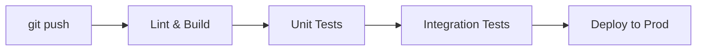

# CI/CD Pipelines

CI/CD stands for Continuous Integration and Continuous Deployment. It is an
automated software pipeline that allows developers to commit code changes and
see them instantly tested and deployed to production servers without manual
intervention.

Think of a CI/CD pipeline as a water filtration system. Raw river water (new
code) goes in, passes through multiple physical and chemical filters (automated
linting, security scanning, unit testing), and comes out clean and drinkable
(deployed production code) on the other side.

<!-- Visual flow for CI/CD Pipelines. -->


#### Why Use CI/CD Pipelines?

- **Fail Fast:** Find bugs within minutes of writing them instead of weeks
  later.
- **Small Releases:** Shipping tiny code updates daily is significantly safer
  than dropping massive updates once a month.

# Example configuration for the topic.
```yaml
## A simple GitHub Actions pipeline that installs dependencies and runs tests
name: Node-CI-Workflow
on: [push, pull_request]
jobs:
  test-app:
    runs-on: ubuntu-latest
    steps:
      - name: Checkout repository code
        uses: actions/checkout@v4
      - name: Set up Node.js environment
        uses: actions/setup-node@v4
        with:
          node-version: 20
      - name: Install dependencies
        run: npm ci
      - name: Run test suite
        run: npm test
```

---

### Monitoring & Observability

Monitoring and Observability are how you understand what is happening inside
your systems after they go live. If a server goes down or a database runs out of
memory at 3:00 AM, monitoring tools alert you instantly.

Think of it like a medical check-up. **Monitoring** tells you your current
vitals—like your heart rate or blood pressure (e.g., CPU usage is at 95%).
**Observability** lets you use those metrics alongside logs and traces to figure
out _why_ your heart rate is so high (e.g., a specific memory leak in a database
query).

#### The Three Core Pillars

- **Metrics:** Numeric values over time (e.g., Memory Usage, Requests Per
  Second).
- **Logs:** Text timestamps of specific execution events (e.g.,
  `Error: Cannot connect to DB at 10:24:01`).
- **Traces:** A map tracking a single user request as it travels across
  different APIs and microservices.

// Basic example showing the core idea.
```javascript
// Example of logging a critical error inside a server router backend
const logger = require('winston');
function handleUserLogin(req, res) {
  try {
    // Attempt authentication logic here
  } catch (error) {
    logger.error(
      `Login failed for user ${req.body.username}: ${error.message}`
    );
    res.status(500).send('Internal Server Error');
  }
}
```

## Quick Reference

| Area | Revision point |
|---|---|
| Definition | State exactly what the topic means. |
| Mechanism | Explain the steps that produce the result. |
| Example | Use a small realistic case. |
| Pitfalls | Know common mistakes and boundary cases. |

## Trade-offs

Architecture decisions are rarely about a single “best” technology. Compare options using scale, latency, consistency, availability, operational cost, complexity, and team capability. State which requirement matters most because the priority determines the design.

## Failure Thinking

Assume a dependency can fail. Decide how the system detects the failure, limits its impact, recovers, and avoids creating a second failure during recovery. Timeouts, retries, idempotency, circuit breakers, and backpressure should be discussed only when they solve a real failure mode.

## Practical Validation

Walk through one realistic request from entry point to storage or response. Then change one condition: a dependency is slow, a node disappears, or traffic spikes. A good design explanation should still make sense after that change.

## Capacity and Reliability

A design should explain what happens as load and failures grow. Identify the main bottleneck, estimate where it could become a limit, and decide which component can scale horizontally or vertically. Then consider dependency failure, retries, timeouts, and data consistency. The strongest design notes connect each architectural component to a requirement and explain the trade-off introduced by that component.

## Final Understanding Check

Before considering **CI/CD Pipelines** revised, make sure you can state the definition without relying on the example, explain the mechanism in the correct order, and predict what happens when one important input or assumption changes. Then check one boundary case and one practical use case. The example should support the explanation rather than replace it. When a result is surprising, inspect the rule that produced it and verify the relevant precondition. This approach is more reliable than memorising a code snippet, formula, command, or interview answer because the same reasoning can be applied to a new problem. For technical topics, also distinguish what is guaranteed by the language, library, protocol, or mathematical rule from what is merely a common convention. That distinction helps you choose the correct solution when the context changes.
