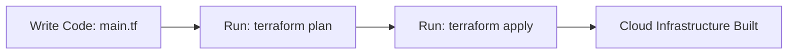
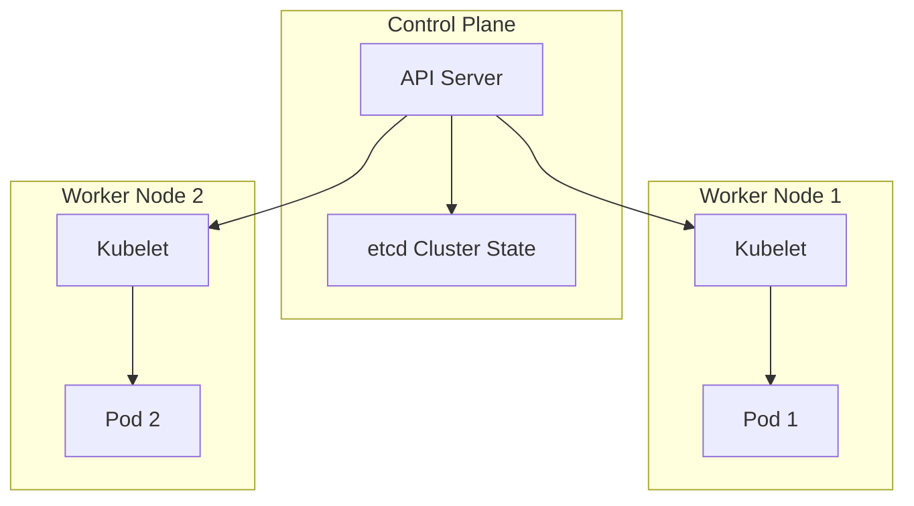

# 📜 Infrastructure as Code (IaC)

Infrastructure as Code (IaC) is the practice of managing and provisioning your
cloud infrastructure (servers, networks, load balancers, databases) using
configuration files rather than manual clicks in a cloud console dashboard.

Think of IaC as a recipe or a blueprint. Instead of manually baking a cake from
memory every time (and risking mistakes), you follow a strict, written script
that guarantees the exact same result every single time you run it.



#### Declarative vs. Imperative

- **Declarative (What you want):** You define the final state. You tell the
  tool, _"I want 3 web servers,"_ and the tool figures out how to build them.
  (Example: Terraform, CloudFormation).
- **Imperative (How to do it):** You list the exact step-by-step commands to
  build the setup. (Example: Bash scripts).

```hcl
// Define an AWS VPC network resource using Terraform
resource "aws_vpc" "main_network" {
  cidr_block           = "10.0.0.0/16"
  enable_dns_hostnames = true

  tags = {
    Environment = "Production"
  }
}

```

---

### ☸️ Kubernetes

Once you have your infrastructure set up, you need a way to run and scale your
applications. Kubernetes (K8s) is an open-source container orchestration
platform that manages the lifecycle of your containerized applications across a
cluster of machines.

Think of Kubernetes as a conductor of an orchestra. The individual musicians
(containers) know how to play their instruments, but the conductor ensures they
all play together, stay on beat, and scale up the volume when needed.



#### Core Concepts

- **Pods:** The smallest runtime unit in Kubernetes. A pod holds one or more
  containers that share the same network resources.
- **Services:** An abstract way to expose your application running on a set of
  Pods as a network service, ensuring steady traffic flow even if individual
  pods crash and restart.

```yaml
# A simple Kubernetes Service configuration to expose your application
apiVersion: v1
kind: Service
metadata:
  name: web-service
spec:
  selector:
    app: web
  ports:
    - protocol: TCP
      port: 80
      targetPort: 8080
  type: LoadBalancer
```
