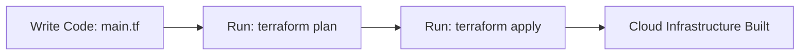
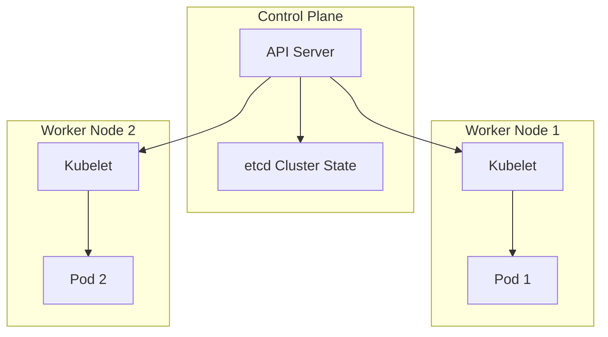

# 📜 Infrastructure as Code (IaC)

Infrastructure as Code (IaC) is the practice of managing and provisioning your
cloud infrastructure (servers, networks, load balancers, databases) using
configuration files rather than manual clicks in a cloud console dashboard.

Think of IaC as a recipe or a blueprint. Instead of manually baking a cake from
memory every time (and risking mistakes), you follow a strict, written script
that guarantees the exact same result every single time you run it.

<!-- Visual flow for 📜 Infrastructure as Code (IaC). -->


#### Declarative vs. Imperative

- **Declarative (What you want):** You define the final state. You tell the
  tool, _"I want 3 web servers,"_ and the tool figures out how to build them.
  (Example: Terraform, CloudFormation).
- **Imperative (How to do it):** You list the exact step-by-step commands to
  build the setup. (Example: Bash scripts).

```hcl
// Define an AWS VPC network resource using Terraform
resource "aws_vpc" "main_network" {
  cidr_block           = "10.0.0.0/16"
  enable_dns_hostnames = true

tags = {
    Environment = "Production"
  }
}

---

```
### Kubernetes

Once you have your infrastructure set up, you need a way to run and scale your
applications. Kubernetes (K8s) is an open-source container orchestration
platform that manages the lifecycle of your containerized applications across a
cluster of machines.

Think of Kubernetes as a conductor of an orchestra. The individual musicians
(containers) know how to play their instruments, but the conductor ensures they
all play together, stay on beat, and scale up the volume when needed.


#### Core Concepts

- **Pods:** The smallest runtime unit in Kubernetes. A pod holds one or more
  containers that share the same network resources.
- **Services:** An abstract way to expose your application running on a set of
  Pods as a network service, ensuring steady traffic flow even if individual
  pods crash and restart.

# Example configuration for the topic.
```yaml
## A simple Kubernetes Service configuration to expose your application
apiVersion: v1
kind: Service
metadata:
  name: web-service
spec:
  selector:
    app: web
  ports:
    - protocol: TCP
      port: 80
      targetPort: 8080
  type: LoadBalancer
```

## Quick Reference

| Area | Revision point |
|---|---|
| Definition | State exactly what the topic means. |
| Mechanism | Explain the steps that produce the result. |
| Example | Use a small realistic case. |
| Pitfalls | Know common mistakes and boundary cases. |

## Trade-offs

Architecture decisions are rarely about a single “best” technology. Compare options using scale, latency, consistency, availability, operational cost, complexity, and team capability. State which requirement matters most because the priority determines the design.

## Failure Thinking

Assume a dependency can fail. Decide how the system detects the failure, limits its impact, recovers, and avoids creating a second failure during recovery. Timeouts, retries, idempotency, circuit breakers, and backpressure should be discussed only when they solve a real failure mode.

## Practical Validation

Walk through one realistic request from entry point to storage or response. Then change one condition: a dependency is slow, a node disappears, or traffic spikes. A good design explanation should still make sense after that change.

## Capacity and Reliability

A design should explain what happens as load and failures grow. Identify the main bottleneck, estimate where it could become a limit, and decide which component can scale horizontally or vertically. Then consider dependency failure, retries, timeouts, and data consistency. The strongest design notes connect each architectural component to a requirement and explain the trade-off introduced by that component.

## Final Understanding Check

Before considering **📜 Infrastructure as Code (IaC)** revised, make sure you can state the definition without relying on the example, explain the mechanism in the correct order, and predict what happens when one important input or assumption changes. Then check one boundary case and one practical use case. The example should support the explanation rather than replace it. When a result is surprising, inspect the rule that produced it and verify the relevant precondition. This approach is more reliable than memorising a code snippet, formula, command, or interview answer because the same reasoning can be applied to a new problem. For technical topics, also distinguish what is guaranteed by the language, library, protocol, or mathematical rule from what is merely a common convention. That distinction helps you choose the correct solution when the context changes.
