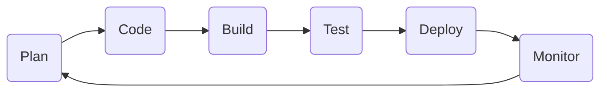
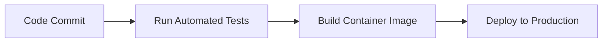

# 📖 Introduction to DevOps

DevOps bridges the gap between software development and IT operations. It helps teams build, test, and release software faster and more reliably. By breaking down traditional silos, companies can ship features at lightning speed.

### What is DevOps?

The term **DevOps** is a blend of "Development" and "Operations." It is not a tool, a programming language, or a single software piece. Instead, it is a culture and a set of practices.

In traditional software setups, developers wrote code and handed it over to the operations team to deploy. If something broke, teams blamed each other. DevOps fixes this by making everyone responsible for the software's entire lifecycle.

### The DevOps Lifecycle

The DevOps workflow is continuous, often represented as an infinity loop. It moves seamlessly through planning, coding, building, testing, deploying, and monitoring.



### Key Benefits

* **Faster Delivery:** Deploy new features to users in minutes instead of months.
* **High Reliability:** Automated testing ensures code changes do not break production.
* **Better Collaboration:** Developers and operations engineers work together daily.

---

## 🐧 Linux for DevOps

Linux is the backbone of modern cloud infrastructure. Most servers, containers, and cloud environments run on Linux, making it an essential skill for any DevOps engineer.

### Why Linux Matters

When you deploy an application to AWS, Azure, or Google Cloud, it almost always runs on a Linux virtual machine. Understanding how to navigate the command line, manage permissions, and look at logs is crucial for troubleshooting issues.

### Essential Linux Commands

Here are the fundamental commands you will use every single day in a DevOps role:

```bash
# Check the current directory path
pwd

# List files and folders with detailed information
ls -la

# View real-time system resource usage like CPU and RAM
top

# Check live application logs as they update
tail -f /var/log/nginx/error.log

```

### Managing File Permissions

Linux secures files using permissions for the **Owner**, **Group**, and **Others**. You will frequently use the `chmod` command to change these permissions, especially when making automation scripts executable.

```bash
# Grant execution rights to a script file
chmod +x deploy.sh

```

---

## 📜 Infrastructure as Code (IaC)

Infrastructure as Code (IaC) lets you manage your servers, networks, and databases using configuration files instead of manual clicks. It treats your hardware infrastructure just like software code.

### The Old Way vs. The IaC Way

Imagine you need 10 virtual servers. In the past, you had to log into a cloud console and click through menus 10 times. With IaC, you write a single configuration file that describes those 10 servers and run a command to spin them up instantly.

### Why Use IaC?

* **Consistency:** Eliminates human error and ensures identical environments every time.
* **Version Control:** You can store your infrastructure code in Git to track changes over time.
* **Speed:** Provision complex cloud environments in seconds.

### Popular IaC Tools

* **Terraform:** An open-source tool that works across multiple clouds like AWS, Azure, and GCP.
* **Ansible:** Great for configuring software inside servers after they are created.

### Example: Terraform Configuration

Here is a simple example of how Terraform creates an AWS server using code.

```hcl
# Define an AWS EC2 server instance
resource "aws_instance" "web_server" {
  ami           = "ami-0c55b159cbfafe1f0"
  instance_type = "t2.micro"

  tags = {
    Name = "DevOps-Web-Server"
  }
}

```

---

## ☸️ Kubernetes

Kubernetes (also known as K8s) is an open-source system that automates the deployment, scaling, and management of containerized applications. Think of it as the captain of your container ship.

### The Container Challenge

Containers (like Docker) package your app with everything it needs to run. But what happens when you have hundreds of containers running across multiple servers? If one container crashes, who restarts it? If traffic spikes, who spins up more containers? Kubernetes handles all of this automatically.

### Core Kubernetes Concepts

* **Pod:** The smallest deployable unit in Kubernetes, which holds one or more containers.
* **Node:** A physical or virtual machine that runs your Pods.
* **Cluster:** A collection of Nodes grouped together and managed by Kubernetes.

### Example: Kubernetes Deployment File

This configuration file tells Kubernetes to run three identical copies (replicas) of an Nginx web server and automatically keep them running.

```yaml
# Define a deployment for an Nginx web server
apiVersion: apps/v1
kind: Deployment
metadata:
  name: nginx-deployment
spec:
  replicas: 3
  selector:
    matchLabels:
      app: web
  template:
    metadata:
      labels:
        app: web
  spec:
    containers:
    - name: nginx
      image: nginx:1.14.2
      ports:
      - containerPort: 80

```

---

## 🔄 CI/CD Pipelines

CI/CD stands for Continuous Integration and Continuous Deployment. It acts as an automated assembly line for your software, taking code from a developer's laptop straight to production safely.

### Continuous Integration (CI)

CI focuses on building and testing the application automatically every time a developer commits new code to Git. This catches bugs early before they reach users.

### Continuous Deployment (CD)

CD takes the successfully tested code from the CI stage and automatically deploys it to your live servers or cloud infrastructure.



### Popular CI/CD Tools

* **GitHub Actions:** Directly integrated into GitHub repositories.
* **Jenkins:** A highly customizable, self-hosted automation server.
* **GitLab CI/CD:** A built-in toolchain for GitLab projects.

---

## 📊 Monitoring & Observability

Once your software is live, you need to know how it is performing. Monitoring and observability give you eyes and ears inside your production systems so you can spot problems before your customers do.

### The Three Pillars of Observability

To fully understand your system's health, you need to collect three types of data:

| Pillar | What it does | Example |
| --- | --- | --- |
| **Metrics** | Numeric data showing system health over time. | CPU usage at 85% |
| **Logs** | Text records of specific events that occurred. | `404 Not Found` error on login page |
| **Traces** | Tracks a single request's journey through multiple services. | User checkout request took 2.4 seconds |

### Popular Tools in the Stack

* **Prometheus:** Collects numeric metrics from your servers and apps.
* **Grafana:** Takes those metrics and turns them into beautiful, easy-to-read dashboards.
* **ELK Stack (Elasticsearch, Logstash, Kibana):** Used for searching and analyzing application logs.