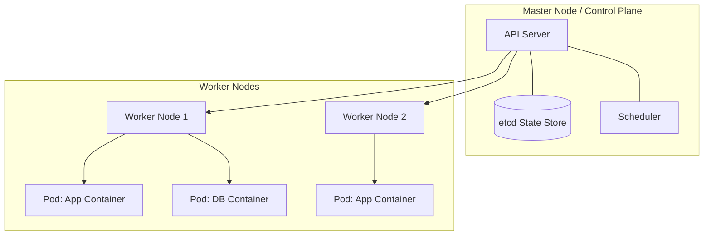

# ☸️ Kubernetes

Kubernetes (K8s) is an open-source system designed to automate deploying, scaling, and managing containerized applications. When you have hundreds of Docker containers running across multiple servers, managing them manually becomes impossible. Kubernetes acts as the operating system for your cloud cluster.

Think of Kubernetes as a massive automated shipping port. Your containers are the standard shipping crates. Instead of workers manually moving every crate and checking if it's broken, an automated crane management system (Kubernetes) places them on the right ships, replaces damaged crates instantly, and scales up space when a massive shipment arrives.



#### Understanding the Architecture

Kubernetes splits your infrastructure into two main operational layers:

* **The Control Plane:** The brains of the operation. It monitors your cluster, decides which nodes get which containers, and tracks the overall health of your system.
* **Worker Nodes:** The physical or virtual machines that actually run your applications. Each worker node runs a tiny background service called a `kubelet` that listens to instructions from the control plane.

#### Key Objects & Components

* **Pods:** The smallest deployable units you can create in Kubernetes. A Pod hosts one or more tightly coupled containers, sharing storage and network resources.
* **Deployments:** A configuration file where you define your application's desired state (e.g., "I always want 3 running copies of my frontend container"). Kubernetes constantly updates the live environment to match this state.
* **Services:** Containers are dynamic and die frequently. A Service gives a group of target Pods a permanent IP address and a single DNS name so traffic always reaches them.

```yaml
# A standard Kubernetes Deployment resource file
apiVersion: apps/v1
kind: Deployment
metadata:
  name: api-service-deployment
  labels:
    app: api-server
spec:
  replicas: 2
  selector:
    matchLabels:
      app: api-server
  template:
    metadata:
      labels:
        app: api-server
    spec:
      containers:
      - name: main-api
        image: node:20-alpine
        ports:
        - containerPort: 5000

```