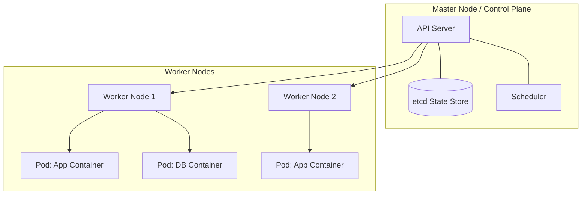

# Kubernetes

Kubernetes (K8s) is an open-source system designed to automate deploying,
scaling, and managing containerized applications. When you have hundreds of
Docker containers running across multiple servers, managing them manually
becomes impossible. Kubernetes acts as the operating system for your cloud
cluster.

Think of Kubernetes as a massive automated shipping port. Your containers are
the standard shipping crates. Instead of workers manually moving every crate and
checking if it's broken, an automated crane management system (Kubernetes)
places them on the right ships, replaces damaged crates instantly, and scales up
space when a massive shipment arrives.

<!-- Visual flow for Kubernetes. -->


#### Understanding the Architecture

Kubernetes splits your infrastructure into two main operational layers:

- **The Control Plane:** The brains of the operation. It monitors your cluster,
  decides which nodes get which containers, and tracks the overall health of
  your system.
- **Worker Nodes:** The physical or virtual machines that actually run your
  applications. Each worker node runs a tiny background service called a
  `kubelet` that listens to instructions from the control plane.

#### Key Objects & Components

- **Pods:** The smallest deployable units you can create in Kubernetes. A Pod
  hosts one or more tightly coupled containers, sharing storage and network
  resources.
- **Deployments:** A configuration file where you define your application's
  desired state (e.g., "I always want 3 running copies of my frontend
  container"). Kubernetes constantly updates the live environment to match this
  state.
- **Services:** Containers are dynamic and die frequently. A Service gives a
  group of target Pods a permanent IP address and a single DNS name so traffic
  always reaches them.

# Example configuration for the topic.
```yaml
## A standard Kubernetes Deployment resource file
apiVersion: apps/v1
kind: Deployment
metadata:
  name: api-service-deployment
  labels:
    app: api-server
spec:
  replicas: 2
  selector:
    matchLabels:
      app: api-server
  template:
    metadata:
      labels:
        app: api-server
    spec:
      containers:
        - name: main-api
          image: node:20-alpine
          ports:
            - containerPort: 5000
```

## Quick Reference

| Area | Revision point |
|---|---|
| Definition | State exactly what the topic means. |
| Mechanism | Explain the steps that produce the result. |
| Example | Use a small realistic case. |
| Pitfalls | Know common mistakes and boundary cases. |

## Trade-offs

Architecture decisions are rarely about a single “best” technology. Compare options using scale, latency, consistency, availability, operational cost, complexity, and team capability. State which requirement matters most because the priority determines the design.

## Failure Thinking

Assume a dependency can fail. Decide how the system detects the failure, limits its impact, recovers, and avoids creating a second failure during recovery. Timeouts, retries, idempotency, circuit breakers, and backpressure should be discussed only when they solve a real failure mode.

## Practical Validation

Walk through one realistic request from entry point to storage or response. Then change one condition: a dependency is slow, a node disappears, or traffic spikes. A good design explanation should still make sense after that change.

## Capacity and Reliability

A design should explain what happens as load and failures grow. Identify the main bottleneck, estimate where it could become a limit, and decide which component can scale horizontally or vertically. Then consider dependency failure, retries, timeouts, and data consistency. The strongest design notes connect each architectural component to a requirement and explain the trade-off introduced by that component.

## Final Understanding Check

Before considering **Kubernetes** revised, make sure you can state the definition without relying on the example, explain the mechanism in the correct order, and predict what happens when one important input or assumption changes. Then check one boundary case and one practical use case. The example should support the explanation rather than replace it. When a result is surprising, inspect the rule that produced it and verify the relevant precondition. This approach is more reliable than memorising a code snippet, formula, command, or interview answer because the same reasoning can be applied to a new problem. For technical topics, also distinguish what is guaranteed by the language, library, protocol, or mathematical rule from what is merely a common convention. That distinction helps you choose the correct solution when the context changes.
