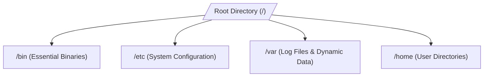

# Linux for DevOps

Linux is the backbone of modern cloud infrastructure. Most servers, containers,
and cloud tools run on top of Linux. As a DevOps engineer, you need to know how
to navigate the command line and manage system resources efficiently.

Think of the Linux operating system as a giant, well-organized file warehouse.
Everything in Linux—including hardware components, processes, and directories—is
treated as a file that you can view, edit, and manage using standard commands.

<!-- Visual flow for Linux for DevOps. -->


#### Key Essential Commands

- `ls -la`: Lists all files in a directory, including hidden ones, with detailed
  permissions.
- `chmod 755 script.sh`: Changes file permissions so the owner can read, write,
  and execute it.
- `ps aux | grep nginx`: Finds running processes related to the Nginx web
  server.
- `df -h`: Displays available disk space in a human-readable format.

# Basic example showing the core idea.
```bash
// Check system resource usage and memory stats
free -m

---

### 📜 Infrastructure as Code (IaC)

Infrastructure as Code (IaC) lets you define and manage your cloud resources
using configuration files. Instead of clicking buttons in a cloud console
dashboard, you write code to provision servers, networks, and databases.

Imagine ordering a custom house. Instead of building it yourself by hand, you
give a blueprint to an automated machine that builds the exact same house every
single time. IaC is that automated blueprint for your servers.

```mermaid
graph LR
    A[Code: main.tf] --> B[IaC Tool: Terraform]
    B --> C[Cloud Provider: AWS/Azure/GCP]

#### Why Use IaC?

- **Speed:** Provision an entire data center in minutes.
- **Consistency:** Avoid human errors and configuration drift between
  environments.
- **Version Control:** Track infrastructure changes using Git history.

// Example demonstrating Linux for DevOps.
```hcl
// Define an AWS EC2 instance using Terraform
resource "aws_instance" "web_server" {
  ami           = "ami-0c55b159cbfafe1f0"
  instance_type = "t2.micro"

tags = {
    Name = "ReviseStack-Web-Dev"
  }
}

### Kubernetes

Kubernetes (K8s) is an open-source container orchestration platform. It
automates the deployment, scaling, and management of containerized applications
across a cluster of machine nodes.

Think of Kubernetes as a cargo ship captain. If a container falls overboard or
breaks, the captain quickly replaces it with a new one to keep the ship balanced
and moving forward.

```mermaid
graph TD
    subgraph Control Plane
        A[API Server] --> B[etcd Cluster State]
    end
    subgraph Worker Nodes
        C[Node 1] --> D[Pod A]
        C --> E[Pod B]
        F[Node 2] --> G[Pod C]
    end
    A --> C
    A --> F

#### Core Components

- **Pod:** The smallest deployable unit in Kubernetes, which holds one or more
  containers.
- **Node:** A physical or virtual worker machine that runs your application
  containers.
- **Deployment:** A configuration file that tells Kubernetes how many copies of
  a pod should run.

# Example configuration for the topic.
```yaml
## A simple Kubernetes deployment for an Nginx web app
apiVersion: apps/v1
kind: Deployment
metadata:
  name: nginx-deployment
spec:
  replicas: 3
  selector:
    matchLabels:
      app: web
  template:
    metadata:
      labels:
        app: web
    spec:
      containers:
        - name: nginx
          image: nginx:1.14.2
          ports:
            - containerPort: 80
```

### CI/CD Pipelines

CI/CD stands for Continuous Integration and Continuous Deployment. It is an
automated workflow that handles building, testing, and deploying your code
changes directly to production servers.

Think of CI/CD as a factory assembly line. Raw code goes in at one end, passes
through automated safety inspection tests, gets packaged up, and ships out to
users automatically.

<!-- Visual flow for Linux for DevOps. -->
```mermaid
graph LR
    A[Code Commit] --> B[Build]
    B --> C[Run Tests]
    C --> D[Deploy to Production]

#### The Two Main Parts

- **Continuous Integration (CI):** Every time you push code, automated tests run
  to catch bugs early.
- **Continuous Deployment (CD):** Validated code moves forward and deploys to
  production without manual steps.

```yaml
## A basic GitHub Actions pipeline configuration file
name: CI-Pipeline
on: [push]
jobs:
  build-and-test:
    runs-on: ubuntu-latest
    steps:
      - uses: actions/checkout@v3
      - name: Run Application Tests
        run: npm test
// Example demonstrating Linux for DevOps.
```

### Monitoring & Observability

Monitoring and Observability keep track of the overall health, performance, and
stability of your live infrastructure applications. They tell you if your
systems are working correctly or slowing down.

Imagine the dashboard inside a car. The speedometer shows how fast you are
moving (monitoring), while the check-engine diagnostic error codes help you
figure out why the engine is overheating (observability).

#### Key Pillars of Observability

- **Metrics:** Numeric values measured over time, like CPU utilization or memory
  usage.
- **Logs:** Text records of specific system events, like an HTTP 500 server
  error code.
- **Traces:** The end-to-end journey of a single user request across multiple
  server microservices.

```javascript
// Send a custom performance metric to a monitoring client
const metricsClient = require('custom-metrics-library');
function handleUserRequest(req, res) {
  metricsClient.increment('http_requests_total', ['method:GET', 'path:/home']);
  res.send('Welcome to ReviseStack!');
}
// Example demonstrating Linux for DevOps.
```

## Quick Reference

| Area | Revision point |
|---|---|
| Definition | State exactly what the topic means. |
| Mechanism | Explain the steps that produce the result. |
| Example | Use a small realistic case. |
| Pitfalls | Know common mistakes and boundary cases. |
