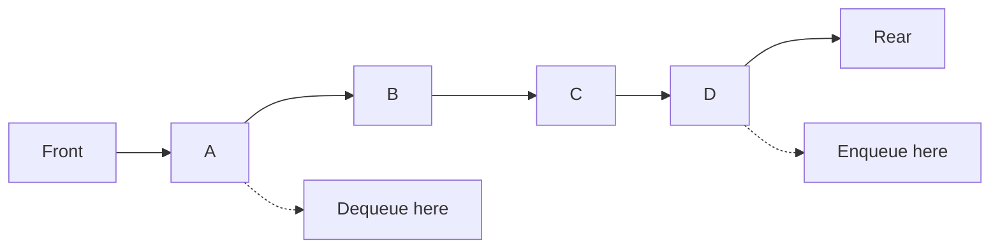
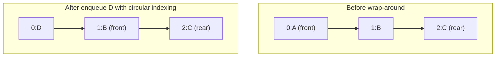
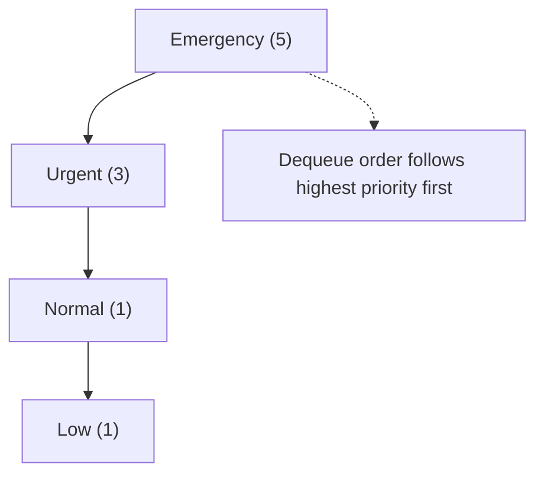
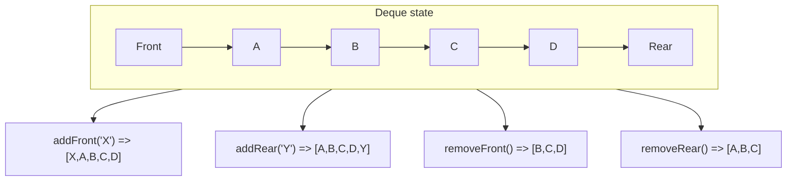

# Complete Guide to Queues in JavaScript

### Definition

A Queue is a linear data structure that follows the **First In, First Out
(FIFO)** principle. Elements are added at the rear (enqueue) and removed from
the front (dequeue), just like people standing in a line.

### Key Characteristics

- **Time Complexity:**
  - Enqueue (add): O(1)
  - Dequeue (remove): O(1)
  - Peek/Front: O(1)
- **Space Complexity:** O(n) where n is the number of elements
- **Key Properties:** FIFO ordering, dynamic size, sequential access

### 💻 Syntax/Implementation

```javascript
class Queue {
  constructor() {
    this.items = [];
  }

enqueue(element) {
    /* Add to rear */
  }
  dequeue() {
    /* Remove from front */
  }
  front() {
    /* Get front element */
  }
  isEmpty() {
    /* Check if empty */
  }
  size() {
    /* Get queue size */
  }
}
```

### Visualization

<!-- Visual flow for Complete Guide to Queues in JavaScript. -->


**Step-by-step:**

1. Start with empty queue: `[]`
2. Enqueue 'A': `[A]`
3. Enqueue 'B': `[A, B]`
4. Dequeue: `[B]` (A removed)

### 🌍 Example

Think of a **printer queue** - documents are printed in the order they were
submitted. The first document sent gets printed first, while new documents wait
at the end of the line.

### 🔧 Code Example

```javascript
// Add element to the rear of queue
  enqueue(element) {
    this.items.push(element);
  }

// Remove and return front element
  dequeue() {
    if (this.isEmpty()) {
      return null;
    }
    return this.items.shift();
  }

// Get front element without removing
  front() {
    if (this.isEmpty()) {
      return null;
    }
    return this.items[0];
  }

// Check if queue is empty
  isEmpty() {
    return this.items.length === 0;
  }

// Get queue size
  size() {
    return this.items.length;
  }
}

// Usage example
const queue = new Queue();
queue.enqueue('Customer 1');
queue.enqueue('Customer 2');
queue.enqueue('Customer 3');

console.log(queue.front()); // "Customer 1"
console.log(queue.dequeue()); // "Customer 1"
console.log(queue.size()); // 2
```

### ⚠ Common Pitfalls

- Using `shift()` method creates O(n) time complexity for dequeue operation
- Not checking if queue is empty before dequeue/front operations
- Confusing queue (FIFO) with stack (LIFO) operations

---

## ⭕ Circular Queue

A Circular Queue is a linear data structure where the last position connects
back to the first position, forming a circle. It efficiently uses memory by
reusing empty spaces created after dequeue operations.

- **Time Complexity:**
  - Enqueue: O(1)
  - Dequeue: O(1)
  - Front/Rear: O(1)
- **Space Complexity:** O(n) with fixed size
- **Key Properties:** Fixed size, circular connection, efficient memory usage

```javascript
class CircularQueue {
  constructor(size) {
    this.items = new Array(size);
    this.maxSize = size;
    this.front = -1;
    this.rear = -1;
    this.count = 0;
  }

enqueue(element) {
    /* Add with circular logic */
  }
  dequeue() {
    /* Remove with circular logic */
  }
  isFull() {
    /* Check if full */
  }
  isEmpty() {
    /* Check if empty */
  }
}
```



Think of a **round-robin CPU scheduling** where processes are given time slices
in a circular manner, or a **circular buffer** in streaming applications where
old data is overwritten by new data.

```javascript
// Add element to circular queue
  enqueue(element) {
    if (this.isFull()) {
      console.log('Queue is full!');
      return false;
    }

if (this.isEmpty()) {
      this.front = 0;
      this.rear = 0;
    } else {
      this.rear = (this.rear + 1) % this.maxSize;
    }

this.items[this.rear] = element;
    this.count++;
    return true;
  }

// Remove element from circular queue
  dequeue() {
    if (this.isEmpty()) {
      console.log('Queue is empty!');
      return null;
    }

const element = this.items[this.front];
    this.items[this.front] = null;

if (this.count === 1) {
      this.front = -1;
      this.rear = -1;
    } else {
      this.front = (this.front + 1) % this.maxSize;
    }

this.count--;
    return element;
  }

isFull() {
    return this.count === this.maxSize;
  }

isEmpty() {
    return this.count === 0;
  }

size() {
    return this.count;
  }
}

// Usage example
const circularQueue = new CircularQueue(3);
circularQueue.enqueue('Task 1');
circularQueue.enqueue('Task 2');
circularQueue.enqueue('Task 3');
circularQueue.enqueue('Task 4'); // Queue is full!

console.log(circularQueue.dequeue()); // "Task 1"
circularQueue.enqueue('Task 4'); // Now it fits!
```

- Forgetting to use modulo operator for circular indexing
- Not properly handling front and rear pointers when queue becomes empty
- Confusing full condition (using count vs pointer comparison)

## Priority Queue

A Priority Queue is a data structure where each element has a priority. Elements
with higher priority are served before elements with lower priority. When
priorities are equal, FIFO order is maintained.

- **Time Complexity:**
  - Enqueue: O(log n) with heap, O(n) with array
  - Dequeue: O(log n) with heap, O(1) with sorted array
  - Peek: O(1)
- **Space Complexity:** O(n)
- **Key Properties:** Priority-based ordering, can have duplicate priorities

```javascript
class PriorityQueue {
  constructor() {
    this.items = [];
  }

enqueue(element, priority) {
    /* Add with priority */
  }
  dequeue() {
    /* Remove highest priority */
  }
  front() {
    /* Get highest priority element */
  }
  isEmpty() {
    /* Check if empty */
  }
}
```

<!-- Visual flow for Complete Guide to Queues in JavaScript. -->


Think of a **hospital emergency room** where patients are treated based on the
severity of their condition, not arrival time. Critical patients get immediate
attention regardless of when they arrived.

```javascript
// Add element with priority
  enqueue(element, priority) {
    const queueElement = { element, priority };
    let added = false;

// Insert in correct position based on priority
    for (let i = 0; i < this.items.length; i++) {
      if (queueElement.priority > this.items[i].priority) {
        this.items.splice(i, 0, queueElement);
        added = true;
        break;
      }
    }

// If not added, add to end (lowest priority)
    if (!added) {
      this.items.push(queueElement);
    }
  }

// Remove highest priority element
  dequeue() {
    if (this.isEmpty()) {
      return null;
    }
    return this.items.shift().element;
  }

// Get highest priority element without removing
  front() {
    if (this.isEmpty()) {
      return null;
    }
    return this.items[0].element;
  }

isEmpty() {
    return this.items.length === 0;
  }

size() {
    return this.items.length;
  }

// Display queue with priorities
  display() {
    return this.items
      .map((item) => `${item.element} (Priority: ${item.priority})`)
      .join(', ');
  }
}

// Usage example
const priorityQueue = new PriorityQueue();
priorityQueue.enqueue('Low priority task', 1);
priorityQueue.enqueue('Critical bug fix', 5);
priorityQueue.enqueue('Medium task', 3);
priorityQueue.enqueue('Another critical', 5);

console.log(priorityQueue.display());
// "Critical bug fix (Priority: 5), Another critical (Priority: 5), Medium task (Priority: 3), Low priority task (Priority: 1)"

console.log(priorityQueue.dequeue()); // "Critical bug fix"
console.log(priorityQueue.dequeue()); // "Another critical"
```

- Not maintaining FIFO order for elements with same priority
- Using wrong comparison logic (confusing high vs low priority)
- Inefficient implementation leading to O(n) operations when O(log n) is
  possible

## ↔ Deque (Double-ended Queue)

A Deque (Double-ended Queue) is a linear data structure that allows insertion
and deletion of elements from both ends (front and rear). It combines the
functionality of both stack and queue.

- **Time Complexity:**
  - Insert/Delete at front: O(1)
  - Insert/Delete at rear: O(1)
  - Access by index: O(1)
- **Space Complexity:** O(n)
- **Key Properties:** Bidirectional operations, flexible access, dynamic size

```javascript
class Deque {
  constructor() {
    this.items = [];
  }

addFront(element) {
    /* Add to front */
  }
  addRear(element) {
    /* Add to rear */
  }
  removeFront() {
    /* Remove from front */
  }
  removeRear() {
    /* Remove from rear */
  }
  getFront() {
    /* Get front element */
  }
  getRear() {
    /* Get rear element */
  }
}
```



Think of a **web browser history** where you can go back (remove from rear) or
forward (remove from front), or a **music playlist** where you can add songs to
the beginning or end and remove from either side.

```javascript
// Add element to front
  addFront(element) {
    this.items.unshift(element);
  }

// Add element to rear
  addRear(element) {
    this.items.push(element);
  }

// Remove element from front
  removeFront() {
    if (this.isEmpty()) {
      return null;
    }
    return this.items.shift();
  }

// Remove element from rear
  removeRear() {
    if (this.isEmpty()) {
      return null;
    }
    return this.items.pop();
  }

// Get front element without removing
  getFront() {
    if (this.isEmpty()) {
      return null;
    }
    return this.items[0];
  }

// Get rear element without removing
  getRear() {
    if (this.isEmpty()) {
      return null;
    }
    return this.items[this.items.length - 1];
  }

display() {
    return this.items.join(' ← → ');
  }
}

// Usage example - Undo/Redo functionality
class UndoRedoManager {
  constructor() {
    this.deque = new Deque();
    this.currentIndex = -1;
  }

// Add new action
  addAction(action) {
    // Remove any actions after current index
    while (this.deque.size() > this.currentIndex + 1) {
      this.deque.removeRear();
    }

this.deque.addRear(action);
    this.currentIndex++;
  }

// Undo last action
  undo() {
    if (this.currentIndex >= 0) {
      const action = this.deque.items[this.currentIndex];
      this.currentIndex--;
      return `Undoing: ${action}`;
    }
    return 'Nothing to undo';
  }

// Redo next action
  redo() {
    if (this.currentIndex < this.deque.size() - 1) {
      this.currentIndex++;
      const action = this.deque.items[this.currentIndex];
      return `Redoing: ${action}`;
    }
    return 'Nothing to redo';
  }
}

// Usage
const undoRedo = new UndoRedoManager();
undoRedo.addAction("Type 'Hello'");
undoRedo.addAction("Type ' World'");
undoRedo.addAction('Add exclamation');

console.log(undoRedo.undo()); // "Undoing: Add exclamation"
console.log(undoRedo.undo()); // "Undoing: Type ' World'"
console.log(undoRedo.redo()); // "Redoing: Type ' World'"
```

- Using `shift()` and `unshift()` which have O(n) complexity in JavaScript
  arrays
- Not considering the difference between front and rear when implementing
  algorithms
- Overusing deque when a simpler queue or stack would suffice
- Memory leaks when not properly managing elements in circular buffer
  implementations

## Summary

Each queue type serves different purposes:

- **Queue (FIFO)**: Basic sequential processing
- **Circular Queue**: Fixed-size buffer with memory efficiency
- **Priority Queue**: Task scheduling with importance levels
- **Deque**: Flexible access from both ends

Choose the right queue type based on your specific needs! 🚀
