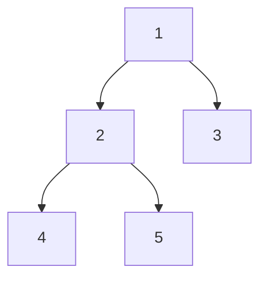
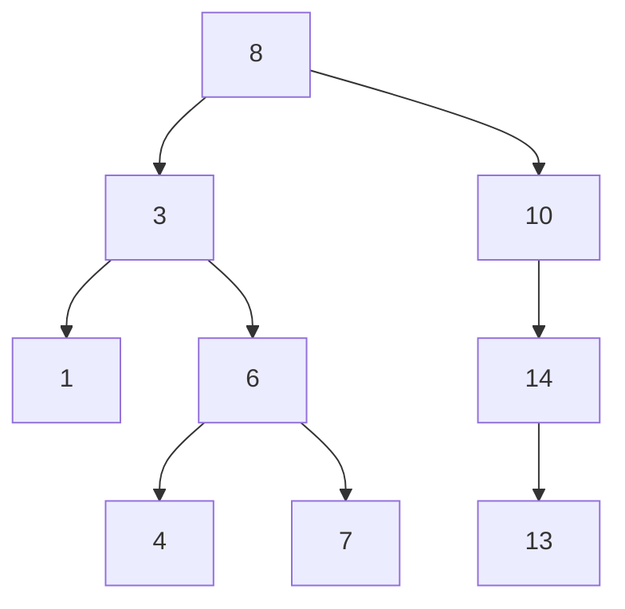
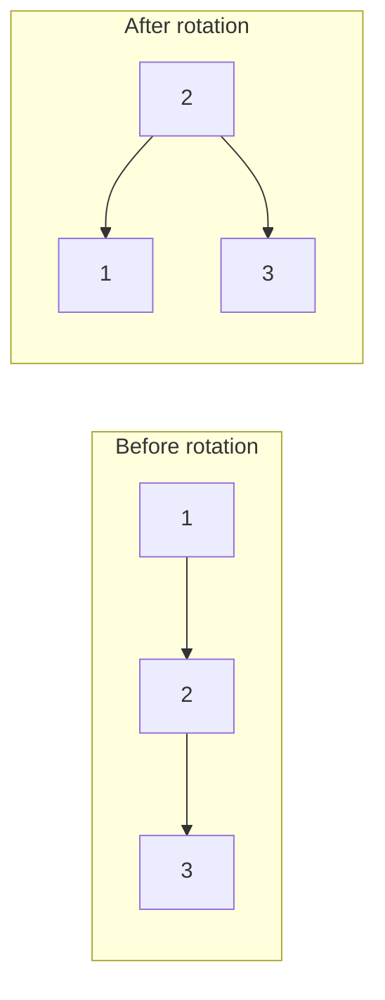
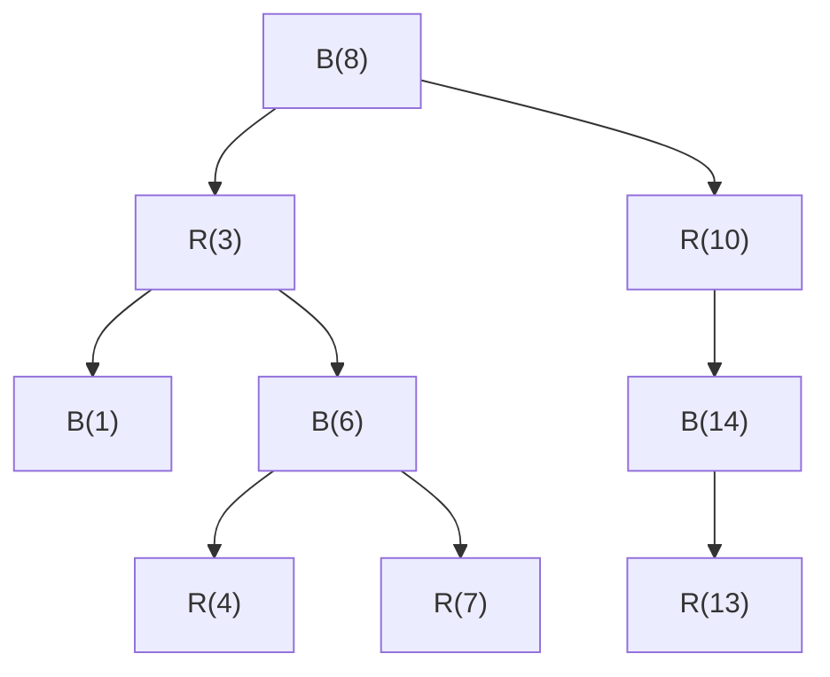
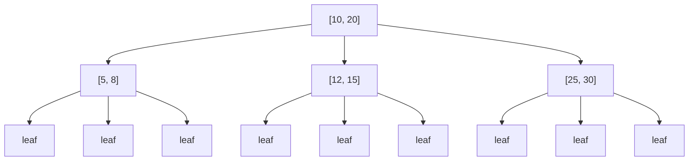
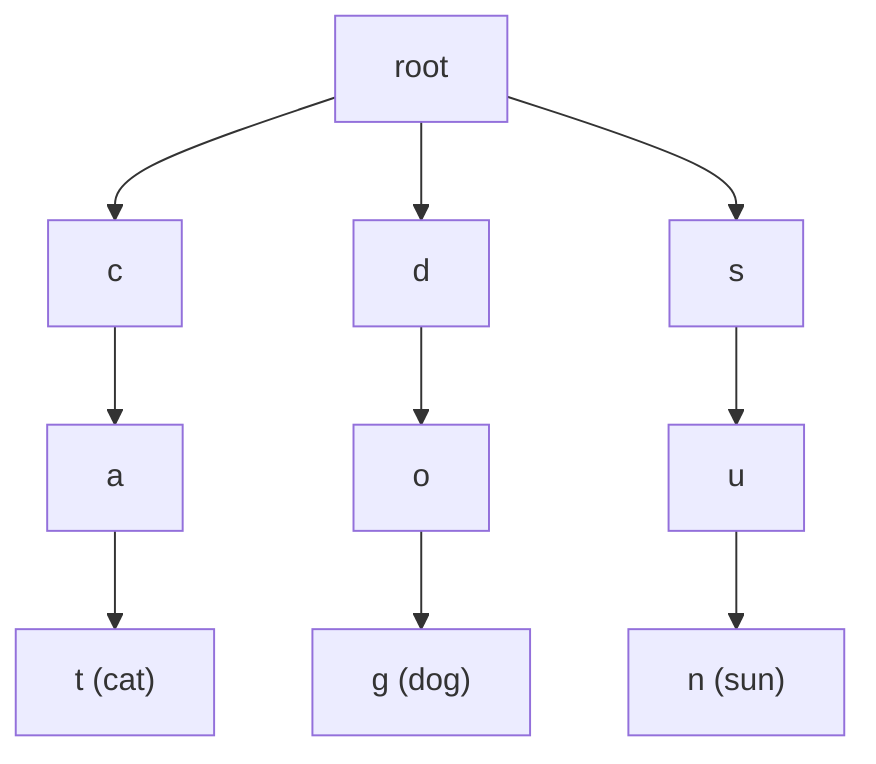
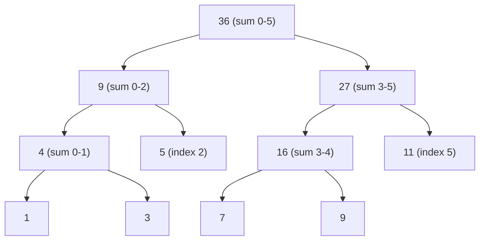
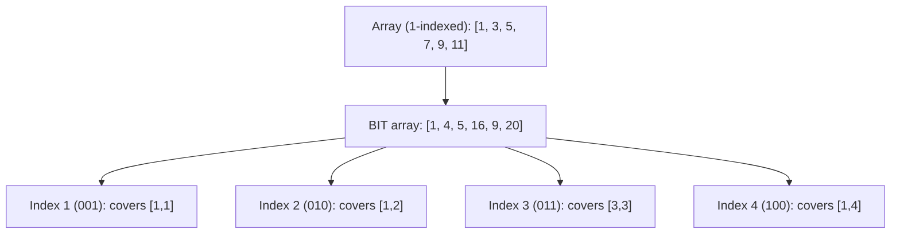

# 🌳 Complete Guide to Trees in JavaScript

### Definition

A binary tree is a tree data structure where each node has at most two children,
called left child and right child. It's like a family tree where each person can
have at most two children.

### Key Characteristics

- **Time Complexity**: O(n) for search, insertion, deletion in worst case
- **Space Complexity**: O(n) for storing n nodes
- **Key Properties**: Each node has at most 2 children, can be complete, full,
  or perfect

### Syntax/Implementation

// Basic example showing the core idea.
```javascript
class TreeNode {
  constructor(val) {
    this.val = val;
    this.left = null;
    this.right = null;
  }
}
```

### Visualization

<!-- Visual flow for 🌳 Complete Guide to Trees in JavaScript. -->


### Example

Think of a family tree where each person can have at most two children. Or
imagine a decision tree where each question has only "yes" or "no" answers.

### Code Example

// Basic example showing the core idea.
```javascript
class BinaryTree {
  constructor() {
    this.root = null;
  }

// Insert node (level order)
  insert(val) {
    const newNode = new TreeNode(val);
    if (!this.root) {
      this.root = newNode;
      return;
    }

const queue = [this.root];
    while (queue.length > 0) {
      const current = queue.shift();

if (!current.left) {
        current.left = newNode;
        break;
      } else if (!current.right) {
        current.right = newNode;
        break;
      } else {
        queue.push(current.left);
        queue.push(current.right);
      }
    }
  }

// In-order traversal
  inOrder(node = this.root, result = []) {
    if (node) {
      this.inOrder(node.left, result);
      result.push(node.val);
      this.inOrder(node.right, result);
    }
    return result;
  }
}

// Usage
const tree = new BinaryTree();
tree.insert(1);
tree.insert(2);
tree.insert(3);
console.log(tree.inOrder()); // [2, 1, 3]
```

### Common Pitfalls

- Forgetting to handle null nodes in traversal
- Not considering edge cases like empty trees
- Mixing up left and right child assignments

---

## 2. Binary Search Trees (BST)

A binary search tree is a binary tree where for each node, all values in the
left subtree are smaller, and all values in the right subtree are larger. It's
like an organized filing cabinet.

- **Time Complexity**: O(log n) average, O(n) worst case for search, insertion,
  deletion
- **Space Complexity**: O(n) for storing n nodes
- **Key Properties**: Left subtree < Node < Right subtree, enables efficient
  searching

// Basic example showing the core idea.
```javascript
class BSTNode {
  constructor(val) {
    this.val = val;
    this.left = null;
    this.right = null;
  }
}
```

<!-- Visual flow for 🌳 Complete Guide to Trees in JavaScript. -->


Like a phone book where names are organized alphabetically - you can quickly
find someone by knowing whether to look left (earlier alphabetically) or right
(later alphabetically).

// Basic example showing the core idea.
```javascript
class BST {
  constructor() {
    this.root = null;
  }

insert(val) {
    this.root = this.insertNode(this.root, val);
  }

insertNode(node, val) {
    if (!node) return new BSTNode(val);

if (val < node.val) {
      node.left = this.insertNode(node.left, val);
    } else if (val > node.val) {
      node.right = this.insertNode(node.right, val);
    }
    return node;
  }

search(val) {
    return this.searchNode(this.root, val);
  }

searchNode(node, val) {
    if (!node) return false;
    if (val === node.val) return true;

return val < node.val
      ? this.searchNode(node.left, val)
      : this.searchNode(node.right, val);
  }
}

// Usage
const bst = new BST();
bst.insert(8);
bst.insert(3);
bst.insert(10);
console.log(bst.search(3)); // true
```

- Not maintaining BST property during insertion/deletion
- Forgetting duplicate value handling strategy
- Not considering tree becoming unbalanced (degenerating to linked list)

## 3. AVL Trees (Balanced BST) ⚖

An AVL tree is a self-balancing binary search tree where the height difference
between left and right subtrees is at most 1. It automatically keeps itself
balanced like a tightrope walker.

- **Time Complexity**: O(log n) guaranteed for search, insertion, deletion
- **Space Complexity**: O(n) for storing n nodes
- **Key Properties**: Height-balanced, balance factor ∈ {-1, 0, 1}, automatic
  rebalancing

// Basic example showing the core idea.
```javascript
class AVLNode {
  constructor(val) {
    this.val = val;
    this.left = null;
    this.right = null;
    this.height = 1;
  }
}
```

<!-- Visual flow for 🌳 Complete Guide to Trees in JavaScript. -->


Like a balanced mobile sculpture where adding weight to one side automatically
adjusts to maintain balance.

// Basic example showing the core idea.
```javascript
class AVLTree {
  constructor() {
    this.root = null;
  }

getHeight(node) {
    return node ? node.height : 0;
  }

getBalance(node) {
    return node ? this.getHeight(node.left) - this.getHeight(node.right) : 0;
  }

rightRotate(y) {
    const x = y.left;
    const T2 = x.right;

x.right = y;
    y.left = T2;

y.height = Math.max(this.getHeight(y.left), this.getHeight(y.right)) + 1;
    x.height = Math.max(this.getHeight(x.left), this.getHeight(x.right)) + 1;

return x;
  }

leftRotate(x) {
    const y = x.right;
    const T2 = y.left;

y.left = x;
    x.right = T2;

x.height = Math.max(this.getHeight(x.left), this.getHeight(x.right)) + 1;
    y.height = Math.max(this.getHeight(y.left), this.getHeight(y.right)) + 1;

return y;
  }

insertNode(node, val) {
    // Standard BST insertion
    if (!node) return new AVLNode(val);

if (val < node.val) {
      node.left = this.insertNode(node.left, val);
    } else if (val > node.val) {
      node.right = this.insertNode(node.right, val);
    } else {
      return node; // Duplicate values not allowed
    }

// Update height
    node.height =
      Math.max(this.getHeight(node.left), this.getHeight(node.right)) + 1;

// Get balance factor
    const balance = this.getBalance(node);

// Left Left Case
    if (balance > 1 && val < node.left.val) {
      return this.rightRotate(node);
    }

// Right Right Case
    if (balance < -1 && val > node.right.val) {
      return this.leftRotate(node);
    }

// Left Right Case
    if (balance > 1 && val > node.left.val) {
      node.left = this.leftRotate(node.left);
      return this.rightRotate(node);
    }

// Right Left Case
    if (balance < -1 && val < node.right.val) {
      node.right = this.rightRotate(node.right);
      return this.leftRotate(node);
    }

return node;
  }
}
```

- Forgetting to update heights after rotations
- Implementing rotation logic incorrectly
- Not handling all four rotation cases (LL, RR, LR, RL)

## 4. Red-Black Trees 🔴⚫

A red-black tree is a self-balancing binary search tree where each node has a
color (red or black) and follows specific coloring rules to maintain balance.
It's like a traffic light system for trees.

- **Time Complexity**: O(log n) guaranteed for search, insertion, deletion
- **Space Complexity**: O(n) for storing n nodes
- **Key Properties**: Every node is red or black, root is black, red nodes can't
  have red children, all paths from root to leaves have same number of black
  nodes

// Basic example showing the core idea.
```javascript
class RBNode {
  constructor(val, color = 'RED') {
    this.val = val;
    this.color = color;
    this.left = null;
    this.right = null;
    this.parent = null;
  }
}
```

<!-- Visual flow for 🌳 Complete Guide to Trees in JavaScript. -->


Like a well-organized parking garage with colored levels where certain rules
ensure no level gets too crowded compared to others.

// Basic example showing the core idea.
```javascript
class RedBlackTree {
  constructor() {
    this.NIL = new RBNode(null, 'BLACK');
    this.root = this.NIL;
  }

leftRotate(x) {
    const y = x.right;
    x.right = y.left;

if (y.left !== this.NIL) {
      y.left.parent = x;
    }

y.parent = x.parent;

if (x.parent === this.NIL) {
      this.root = y;
    } else if (x === x.parent.left) {
      x.parent.left = y;
    } else {
      x.parent.right = y;
    }

y.left = x;
    x.parent = y;
  }

insert(val) {
    const newNode = new RBNode(val, 'RED');
    newNode.left = this.NIL;
    newNode.right = this.NIL;

let parent = this.NIL;
    let current = this.root;

while (current !== this.NIL) {
      parent = current;
      if (newNode.val < current.val) {
        current = current.left;
      } else {
        current = current.right;
      }
    }

newNode.parent = parent;

if (parent === this.NIL) {
      this.root = newNode;
    } else if (newNode.val < parent.val) {
      parent.left = newNode;
    } else {
      parent.right = newNode;
    }

this.fixInsert(newNode);
  }

fixInsert(node) {
    while (node.parent.color === 'RED') {
      if (node.parent === node.parent.parent.left) {
        const uncle = node.parent.parent.right;

if (uncle.color === 'RED') {
          node.parent.color = 'BLACK';
          uncle.color = 'BLACK';
          node.parent.parent.color = 'RED';
          node = node.parent.parent;
        } else {
          if (node === node.parent.right) {
            node = node.parent;
            this.leftRotate(node);
          }
          node.parent.color = 'BLACK';
          node.parent.parent.color = 'RED';
          this.rightRotate(node.parent.parent);
        }
      } else {
        // Mirror case
        const uncle = node.parent.parent.left;
        // ... similar logic
      }
    }
    this.root.color = 'BLACK';
  }
}
```

- Forgetting to maintain parent pointers
- Not handling all cases in fix-up procedures
- Confusing the color-flipping and rotation rules

## 5. B-Trees (for disk-based storage) 💾

A B-tree is a self-balancing tree optimized for systems that read and write
large blocks of data. Each node can have multiple keys and children, like a
filing cabinet with multiple folders per drawer.

- **Time Complexity**: O(log n) for search, insertion, deletion
- **Space Complexity**: O(n) for storing n keys
- **Key Properties**: All leaves at same level, nodes can have multiple keys,
  optimized for disk I/O

// Basic example showing the core idea.
```javascript
class BTreeNode {
  constructor(isLeaf = false) {
    this.keys = [];
    this.children = [];
    this.isLeaf = isLeaf;
  }
}
```

<!-- Visual flow for 🌳 Complete Guide to Trees in JavaScript. -->


Like a library's card catalog system where each drawer can hold multiple cards,
and you can fit more information per "access" to storage.

// Basic example showing the core idea.
```javascript
class BTree {
  constructor(minDegree = 3) {
    this.root = new BTreeNode(true);
    this.minDegree = minDegree; // Minimum degree
  }

search(key, node = this.root) {
    let i = 0;

// Find the first key greater than or equal to key
    while (i < node.keys.length && key > node.keys[i]) {
      i++;
    }

// If key is found
    if (i < node.keys.length && key === node.keys[i]) {
      return { node, index: i };
    }

// If this is a leaf node, key is not present
    if (node.isLeaf) {
      return null;
    }

// Go to the appropriate child
    return this.search(key, node.children[i]);
  }

insert(key) {
    const root = this.root;

// If root is full, create a new root
    if (root.keys.length === 2 * this.minDegree - 1) {
      const newRoot = new BTreeNode(false);
      this.root = newRoot;
      newRoot.children[0] = root;
      this.splitChild(newRoot, 0);
      this.insertNonFull(newRoot, key);
    } else {
      this.insertNonFull(root, key);
    }
  }

insertNonFull(node, key) {
    let i = node.keys.length - 1;

if (node.isLeaf) {
      // Insert key into leaf node
      node.keys.push(0);
      while (i >= 0 && node.keys[i] > key) {
        node.keys[i + 1] = node.keys[i];
        i--;
      }
      node.keys[i + 1] = key;
    } else {
      // Find child to insert into
      while (i >= 0 && node.keys[i] > key) {
        i--;
      }
      i++;

// If child is full, split it
      if (node.children[i].keys.length === 2 * this.minDegree - 1) {
        this.splitChild(node, i);
        if (node.keys[i] < key) {
          i++;
        }
      }
      this.insertNonFull(node.children[i], key);
    }
  }

splitChild(parent, index) {
    const fullChild = parent.children[index];
    const newChild = new BTreeNode(fullChild.isLeaf);
    const midIndex = this.minDegree - 1;

// Copy the last (minDegree-1) keys to new node
    newChild.keys = fullChild.keys.splice(midIndex + 1);

// Copy the last minDegree children to new node
    if (!fullChild.isLeaf) {
      newChild.children = fullChild.children.splice(midIndex + 1);
    }

// Insert new child into parent
    parent.children.splice(index + 1, 0, newChild);
    parent.keys.splice(index, 0, fullChild.keys[midIndex]);

// Remove the middle key from full child
    fullChild.keys.splice(midIndex);
  }
}

// Usage
const btree = new BTree(3);
btree.insert(10);
btree.insert(20);
btree.insert(5);
console.log(btree.search(10)); // Found
```

- Not handling node splitting correctly
- Forgetting that B-trees are designed for disk storage (block-oriented)
- Implementing degree constraints incorrectly

## 6. Trie (Prefix Tree)

A trie is a tree-like data structure used to store strings where each node
represents a character. Common prefixes are shared, making it efficient for
prefix-based operations like autocomplete.

- **Time Complexity**: O(m) for search, insertion, deletion (where m is string
  length)
- **Space Complexity**: O(ALPHABET*SIZE * N \_ M) in worst case
- **Key Properties**: Shared prefixes, efficient prefix operations, good for
  autocomplete

// Basic example showing the core idea.
```javascript
class TrieNode {
  constructor() {
    this.children = {};
    this.isEndOfWord = false;
  }
}
```

<!-- Visual flow for 🌳 Complete Guide to Trees in JavaScript. -->


Like a dictionary where words sharing the same beginning letters are grouped
together, making it easy to find all words starting with "cat".

// Basic example showing the core idea.
```javascript
class Trie {
  constructor() {
    this.root = new TrieNode();
  }

insert(word) {
    let current = this.root;

for (const char of word) {
      if (!current.children[char]) {
        current.children[char] = new TrieNode();
      }
      current = current.children[char];
    }

current.isEndOfWord = true;
  }

search(word) {
    let current = this.root;

for (const char of word) {
      if (!current.children[char]) {
        return false;
      }
      current = current.children[char];
    }

return current.isEndOfWord;
  }

startsWith(prefix) {
    let current = this.root;

for (const char of prefix) {
      if (!current.children[char]) {
        return false;
      }
      current = current.children[char];
    }

return true;
  }

getAllWordsWithPrefix(prefix) {
    let current = this.root;
    const results = [];

// Navigate to prefix
    for (const char of prefix) {
      if (!current.children[char]) {
        return results;
      }
      current = current.children[char];
    }

// DFS to find all words with this prefix
    this.dfs(current, prefix, results);
    return results;
  }

dfs(node, currentWord, results) {
    if (node.isEndOfWord) {
      results.push(currentWord);
    }

for (const [char, childNode] of Object.entries(node.children)) {
      this.dfs(childNode, currentWord + char, results);
    }
  }
}

// Usage
const trie = new Trie();
trie.insert('cat');
trie.insert('car');
trie.insert('card');
trie.insert('dog');

console.log(trie.search('cat')); // true
console.log(trie.startsWith('ca')); // true
console.log(trie.getAllWordsWithPrefix('ca')); // ["cat", "car", "card"]
```

- Not marking end of words properly
- Memory inefficiency with sparse character sets
- Not handling case sensitivity consistently

## 7. Segment Tree

A segment tree is a binary tree used for storing intervals or segments. It
allows querying which segments contain a given point and supports efficient
range queries like sum, minimum, or maximum over an array.

- **Time Complexity**: O(log n) for query and update, O(n) for build
- **Space Complexity**: O(4n) ≈ O(n)
- **Key Properties**: Perfect binary tree, supports range queries, updatable

// Basic example showing the core idea.
```javascript
class SegmentTree {
  constructor(arr) {
    this.n = arr.length;
    this.tree = new Array(4 * this.n);
    this.build(arr, 0, 0, this.n - 1);
  }
}
```

<!-- Visual flow for 🌳 Complete Guide to Trees in JavaScript. -->


Like a corporate hierarchy where each manager knows the total sales of their
department, making it quick to find the total sales of any sub-department.

// Basic example showing the core idea.
```javascript
class SegmentTree {
  constructor(arr) {
    this.n = arr.length;
    this.tree = new Array(4 * this.n).fill(0);
    this.build(arr, 0, 0, this.n - 1);
  }

build(arr, node, start, end) {
    if (start === end) {
      // Leaf node
      this.tree[node] = arr[start];
    } else {
      const mid = Math.floor((start + end) / 2);
      const leftChild = 2 * node + 1;
      const rightChild = 2 * node + 2;

// Build left and right subtrees
      this.build(arr, leftChild, start, mid);
      this.build(arr, rightChild, mid + 1, end);

// Internal node value is sum of children
      this.tree[node] = this.tree[leftChild] + this.tree[rightChild];
    }
  }

query(left, right) {
    return this.queryRange(0, 0, this.n - 1, left, right);
  }

queryRange(node, start, end, left, right) {
    if (right < start || end < left) {
      // No overlap
      return 0;
    }

if (left <= start && end <= right) {
      // Complete overlap
      return this.tree[node];
    }

// Partial overlap
    const mid = Math.floor((start + end) / 2);
    const leftChild = 2 * node + 1;
    const rightChild = 2 * node + 2;

const leftSum = this.queryRange(leftChild, start, mid, left, right);
    const rightSum = this.queryRange(rightChild, mid + 1, end, left, right);

return leftSum + rightSum;
  }

update(index, value) {
    this.updateValue(0, 0, this.n - 1, index, value);
  }

updateValue(node, start, end, index, value) {
    if (start === end) {
      // Leaf node
      this.tree[node] = value;
    } else {
      const mid = Math.floor((start + end) / 2);
      const leftChild = 2 * node + 1;
      const rightChild = 2 * node + 2;

if (index <= mid) {
        this.updateValue(leftChild, start, mid, index, value);
      } else {
        this.updateValue(rightChild, mid + 1, end, index, value);
      }

// Update internal node
      this.tree[node] = this.tree[leftChild] + this.tree[rightChild];
    }
  }
}

// Usage
const arr = [1, 3, 5, 7, 9, 11];
const segTree = new SegmentTree(arr);

console.log(segTree.query(1, 3)); // Sum from index 1 to 3: 3 + 5 + 7 = 15
segTree.update(1, 10); // Update index 1 to value 10
console.log(segTree.query(1, 3)); // New sum: 10 + 5 + 7 = 22
```

- Incorrect array size allocation (should be 4\*n)
- Wrong indexing in recursive calls
- Not handling edge cases in range queries

## 8. Fenwick Tree (Binary Indexed Tree) 🔢

A Fenwick Tree (BIT) is a data structure that efficiently calculates prefix sums
in logarithmic time. It uses clever bit manipulation to achieve this efficiency
with less space than segment trees.

- **Time Complexity**: O(log n) for update and prefix sum query
- **Space Complexity**: O(n)
- **Key Properties**: Uses bit manipulation, 1-indexed typically, efficient
  prefix sums

// Basic example showing the core idea.
```javascript
class FenwickTree {
  constructor(size) {
    this.size = size;
    this.tree = new Array(size + 1).fill(0);
  }
}
```

<!-- Visual flow for 🌳 Complete Guide to Trees in JavaScript. -->


Like a cashier's counting system where each slot holds cumulative totals for
specific ranges, allowing quick calculation of any range sum.

// Basic example showing the core idea.
```javascript
class FenwickTree {
  constructor(size) {
    this.size = size;
    this.tree = new Array(size + 1).fill(0); // 1-indexed
  }

// Update element at index i by adding delta
  update(index, delta) {
    while (index <= this.size) {
      this.tree[index] += delta;
      index += index & -index; // Add least significant bit
    }
  }

// Get prefix sum from 1 to index
  query(index) {
    let sum = 0;
    while (index > 0) {
      sum += this.tree[index];
      index -= index & -index; // Remove least significant bit
    }
    return sum;
  }

// Get range sum from left to right (inclusive)
  rangeQuery(left, right) {
    return this.query(right) - this.query(left - 1);
  }

// Build BIT from array (1-indexed input expected)
  static fromArray(arr) {
    const bit = new FenwickTree(arr.length - 1);
    for (let i = 1; i < arr.length; i++) {
      bit.update(i, arr[i]);
    }
    return bit;
  }
}

// Usage
const bit = new FenwickTree(6);

// Add values: [1, 3, 5, 7, 9, 11] at indices 1-6
bit.update(1, 1);
bit.update(2, 3);
bit.update(3, 5);
bit.update(4, 7);
bit.update(5, 9);
bit.update(6, 11);

console.log(bit.query(3)); // Prefix sum 1+3+5 = 9
console.log(bit.rangeQuery(2, 4)); // Sum from index 2 to 4: 3+5+7 = 15

// Update: add 10 to element at index 2
bit.update(2, 10);
console.log(bit.query(3)); // New prefix sum: 1+13+5 = 19
```

- Using 0-indexed when BIT expects 1-indexed
- Confusing bit manipulation operations (& vs |)
- Not understanding that update adds delta, doesn't set absolute value
- Mixing up least significant bit operations

## Summary

Each tree structure serves specific purposes:

- **Binary Trees**: Basic foundation for all tree structures
- **BST**: Fast searching with ordered data
- **AVL Trees**: Guaranteed balanced performance
- **Red-Black Trees**: Good balance with fewer rotations
- **B-Trees**: Optimal for disk-based storage systems
- **Trie**: Perfect for string prefix operations
- **Segment Trees**: Excellent for range queries and updates
- **Fenwick Trees**: Space-efficient prefix sum operations

Choose the right tree based on your specific use case: search patterns, update
frequency, memory constraints, and required operations! 🌟
