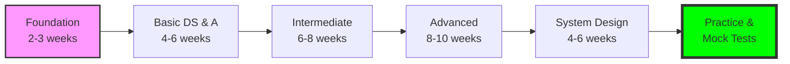
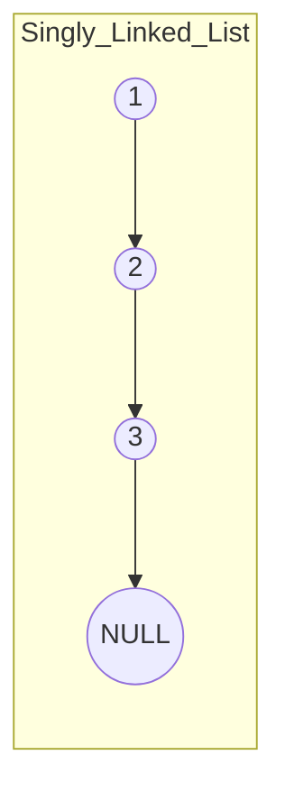
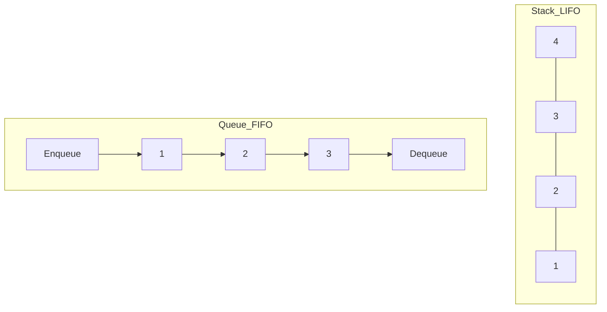
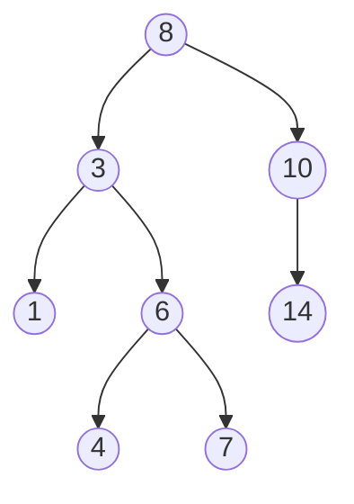
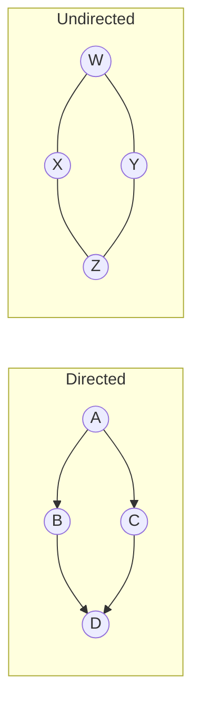
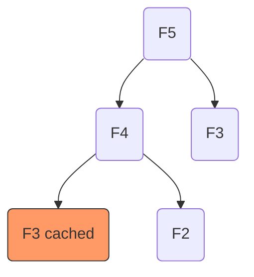
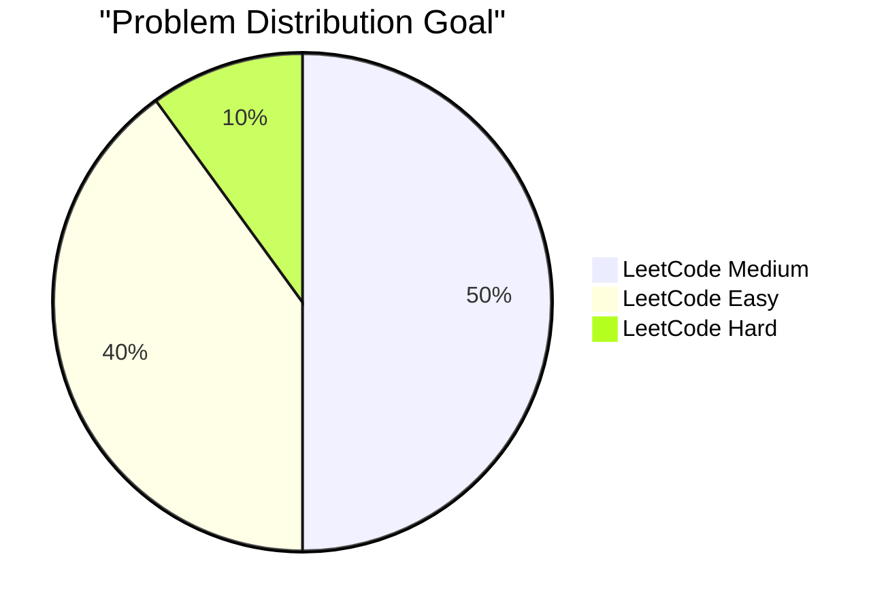
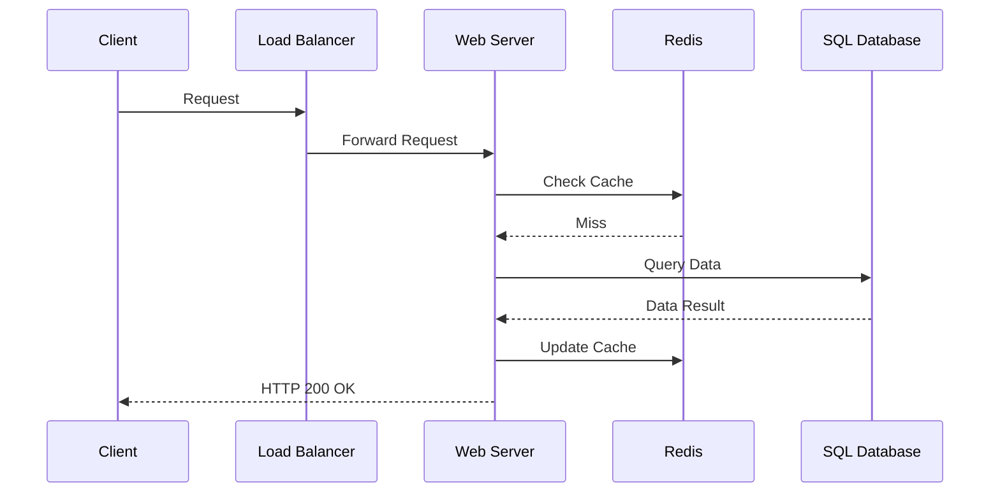

#  Complete Data Structures & Algorithms Roadmap with JavaScript

## Learning Path Overview

<!-- Visual flow for  Complete Data Structures & Algorithms Roadmap with JavaScript. -->

---

### 📚 JavaScript Fundamentals

**Key Topics:**

- **Big O Notation**: Understanding time and space complexity
  $O(n), O(\log n), O(n^2)$
- **JS Engines**: V8, JIT Compilation, Call Stack, and Memory Heap.
- **Closures & Scopes**: Essential for functional programming patterns in DSA.

### 🔗 Linked Lists

<!-- Visual flow for  Complete Data Structures & Algorithms Roadmap with JavaScript. -->

### 📚 Stacks & Queues

<!-- Visual flow for  Complete Data Structures & Algorithms Roadmap with JavaScript. -->

### 🌲 Trees

<!-- Visual flow for  Complete Data Structures & Algorithms Roadmap with JavaScript. -->

### 📈 Graphs

<!-- Visual flow for  Complete Data Structures & Algorithms Roadmap with JavaScript. -->

### Sorting Comparison

| Algorithm  | Best Case     | Average Case  | Worst Case    | Space       |
| :--------- | :------------ | :------------ | :------------ | :---------- |
| **Bubble** | $O(n)$        | $O(n^2)$      | $O(n^2)$      | $O(1)$      |
| **Merge**  | $O(n \log n)$ | $O(n \log n)$ | $O(n \log n)$ | $O(n)$      |
| **Quick**  | $O(n \log n)$ | $O(n \log n)$ | $O(n^2)$      | $O(\log n)$ |

### Dynamic Programming (Fibonacci Memoization)

<!-- Visual flow for  Complete Data Structures & Algorithms Roadmap with JavaScript. -->

### Platform-wise Practice Plan

<!-- Visual flow for  Complete Data Structures & Algorithms Roadmap with JavaScript. -->

### High-Level Architecture

<!-- Visual flow for  Complete Data Structures & Algorithms Roadmap with JavaScript. -->

### Performance Considerations

- **Delete vs Map.delete**: Using `delete obj.prop` is significantly slower than
  `Map.prototype.delete()`.
- **Array Spreading**: Be careful with `[...arr]`. Inside a loop, this turns an
  $O(n)$ operation into $O(n^2)$.
- **TypedArrays**: For heavy mathematical algorithms, use `Int32Array` or
  `Float64Array` for better memory management.

## Final Tips for Success

> **Crucial Rule**: Don't just "grind" LeetCode. If you can't explain the logic
> to a 10-year-old, you don't understand the algorithm yet.

### Mock Interview Structure

1.  **Clarification**: Ask about input size, constraints, and edge cases (empty
    input, nulls).
2.  **Strategy**: Verbalize the brute force, then optimize.
3.  **Big O**: State the complexity **before** you type a single line.
4.  **Dry Run**: Trace your code with a small example.

## Quick Reference

| Operation | What it does |
|---|---|
| Read/inspect | Check the current value or state. |
| Transform | Produce a new value when the API supports it. |
| Update | Change state only when the operation is designed to mutate. |
| Edge case | Handle empty, invalid, or boundary input explicitly. |

## Return Values and Mutation

For every method, check what it returns and whether it mutates the original value. A transformation method commonly returns a new collection, while a mutating method changes the receiver. Knowing this difference prevents subtle bugs when the same data is reused in several parts of an application.

## Edge Cases Worth Testing

Test an empty collection, one element, duplicate values, invalid values, and a larger realistic input. Also check “not found” results and callback behavior for falsey values. Similar method names can have different return types or mutation rules, so verify them instead of relying on memory.
