# ✅ CSS Best Practices

Writing CSS that works is good. Writing CSS that is **maintainable, scalable, performant, and easy to understand** is even better.

CSS Best Practices help teams build applications that remain clean and manageable as they grow.

---

# 🎯 Why Best Practices Matter

Without best practices:

❌ Messy stylesheets

❌ Duplicate code

❌ Specificity conflicts

❌ Difficult debugging

❌ Poor performance

---

With best practices:

✅ Reusable code

✅ Easier maintenance

✅ Better performance

✅ Consistent design

✅ Faster development

---

## Development Flow

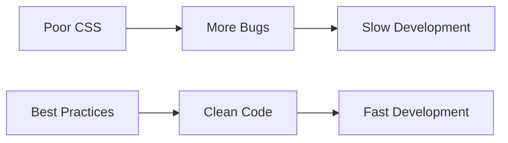

---

# 🎨 Use CSS Variables

Store reusable values in one place.

---

## Good

```css
:root {
  --primary-color: #2563eb;
  --border-radius: 12px;
}

.button {
  background: var(--primary-color);
}
```

---

## Benefits

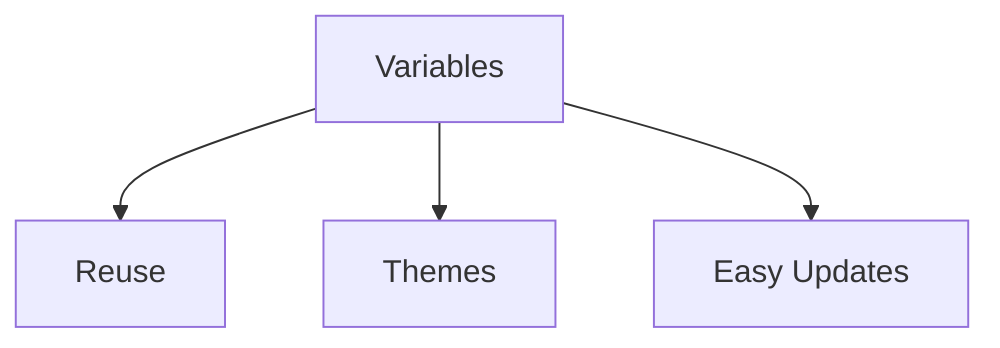

---

# 🎯 Prefer Classes Over IDs

Classes are reusable and have lower specificity.

---

## Avoid

```css
#header {
  background: black;
}
```

---

## Prefer

```css
.header {
  background: black;
}
```

---

# Specificity Hierarchy

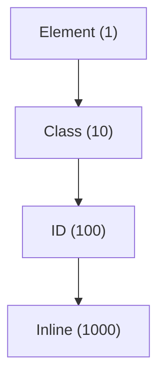

---

# 🎯 Keep Selectors Simple

---

## Avoid

```css
.sidebar ul li a span {
  color: red;
}
```

---

## Prefer

```css
.sidebar-link {
  color: red;
}
```

---

## Selector Comparison

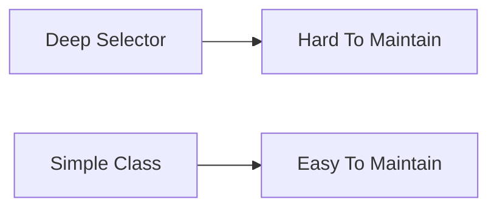

---

# 📱 Design Mobile First

Start with mobile styles and enhance for larger screens.

---

## Mobile First Example

```css
.card {
  width: 100%;
}

@media (min-width: 768px) {
  .card {
    width: 50%;
  }
}
```

---

## Responsive Flow

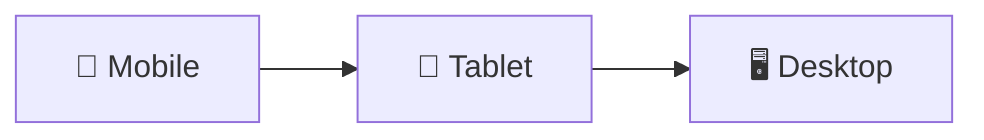

---

# 🎯 Use Flexbox and Grid

Modern layouts should use:

✅ Flexbox

✅ CSS Grid

---

## Flexbox

```css
.container {
  display: flex;
}
```

---

## Grid

```css
.container {
  display: grid;
}
```

---

## Layout Evolution

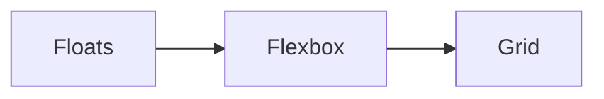

---

# 📦 Use Gap Instead of Margins

---

## Avoid

```css
.card {
  margin-right: 20px;
}
```

---

## Prefer

```css
.container {
  display: flex;
  gap: 20px;
}
```

---

## Why Gap?

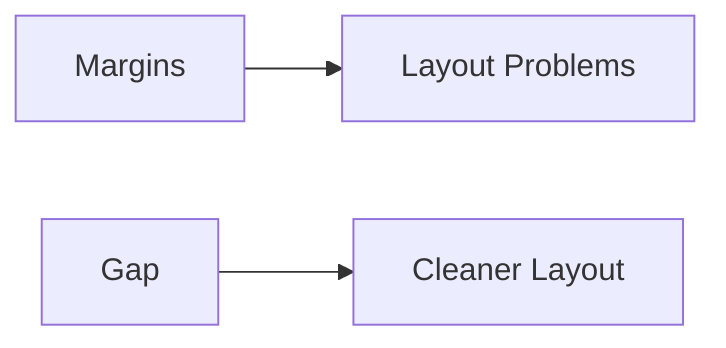

---

# 🎨 Organize CSS Properly

Use a predictable folder structure.

```text
styles/

├── base/
├── layout/
├── components/
├── utilities/
├── pages/
└── main.css
```

---

## Architecture Flow

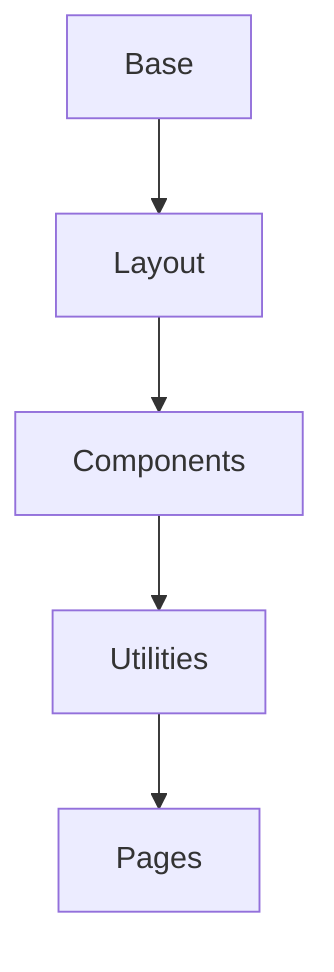

---

# 🎯 Follow a Naming Convention

Popular choice:

### BEM

```css
.card {}

.card__title {}

.card--featured {}
```

---

## BEM Structure

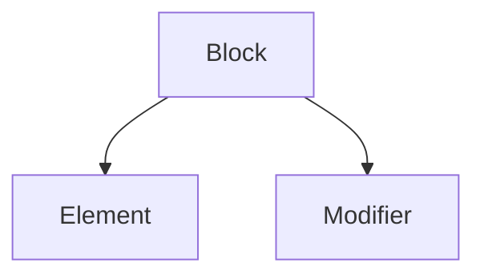

---

# 🚫 Avoid !important

---

## Avoid

```css
.button {
  color: red !important;
}
```

---

## Prefer

```css
.button--danger {
  color: red;
}
```

---

## Specificity Wars

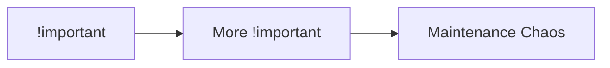

---

# 🎯 Use Relative Units

---

## Avoid

```css
font-size: 32px;
```

---

## Prefer

```css
font-size: 2rem;
```

---

## Benefits

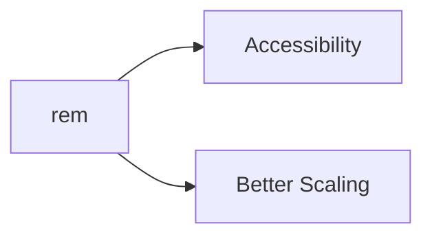

---

# ⚡ Optimize Animations

Animate:

✅ transform

✅ opacity

---

Avoid:

❌ width

❌ height

❌ top

❌ left

---

## Performance Comparison

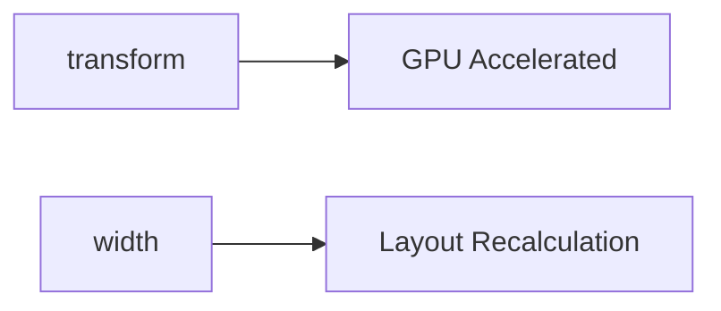

---

# 🎯 Keep Nesting Shallow

---

## Avoid

```scss
.card {
  .header {
    .title {
      .icon {}
    }
  }
}
```

---

## Better

```scss
.card {
  .title {}
}
```

---

## Nesting Structure

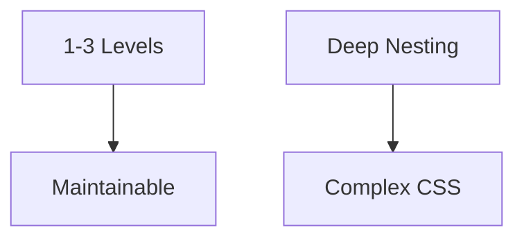

---

# 🎨 Build Reusable Components

Instead of:

```css
.button-primary {}

.button-secondary {}

.button-success {}
```

Create:

```css
.button {}

.button--primary {}

.button--secondary {}

.button--success {}
```

---

## Component Flow

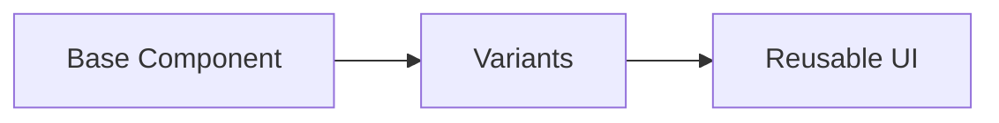

---

# 🎯 Separate Layout from Components

---

## Bad

```css
.card {
  width: 1200px;
}
```

---

## Good

```css
.layout {
  max-width: 1200px;
}

.card {
  padding: 1rem;
}
```

---

# 📱 Test Responsiveness Frequently

Test on:

✅ Mobile

✅ Tablet

✅ Desktop

---

## Testing Workflow

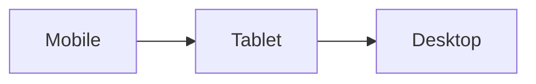

---

# 🎯 Write Accessible CSS

Always maintain focus indicators.

---

## Bad

```css
button:focus {
  outline: none;
}
```

---

## Good

```css
button:focus {
  outline: 2px solid blue;
}
```

---

## Accessibility Flow

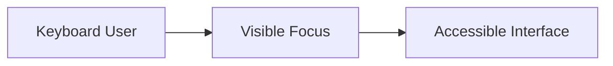

---

# 🧹 Remove Unused CSS

Unused CSS increases bundle size.

Use tools:

* Chrome Coverage
* PurgeCSS
* Tailwind Content Scanner

---

## Optimization Flow

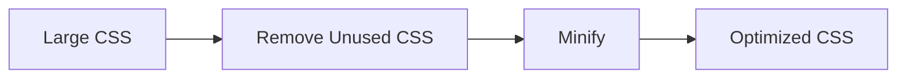

---

# 🎯 Use Modern CSS Features

Prefer modern solutions.

| Old                | Modern            |
| ------------------ | ----------------- |
| Floats             | Flexbox           |
| Positioning Hacks  | Grid              |
| Repeated Values    | Variables         |
| Margin Spacing     | Gap               |
| Fixed Sizes        | Clamp             |
| Complex JS Layouts | Container Queries |

---

## Modern CSS Evolution

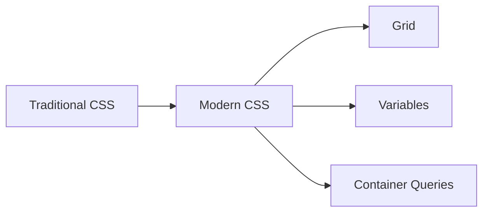

---

# 🧠 CSS Best Practices Checklist

### Architecture

✅ Organize CSS files

✅ Use naming conventions

✅ Keep selectors simple

---

### Responsiveness

✅ Mobile-first

✅ Relative units

✅ Responsive layouts

---

### Performance

✅ Use transform animations

✅ Remove unused CSS

✅ Optimize images

---

### Maintainability

✅ CSS Variables

✅ Reusable components

✅ Consistent naming

---

### Accessibility

✅ Focus states

✅ Readable typography

✅ Proper contrast

---

# 🚀 Key Takeaways

* Use classes instead of IDs.
* Keep selectors simple and predictable.
* Build mobile-first responsive layouts.
* Use Flexbox and Grid for layouts.
* Store reusable values in CSS Variables.
* Optimize animations using `transform` and `opacity`.
* Follow a consistent architecture like BEM or component-based CSS.
* Prioritize accessibility and performance from the start.
* Write CSS that future developers (including yourself) can easily understand and maintain.

---

# 🎉 CSS Learning Path Completed

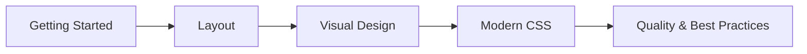