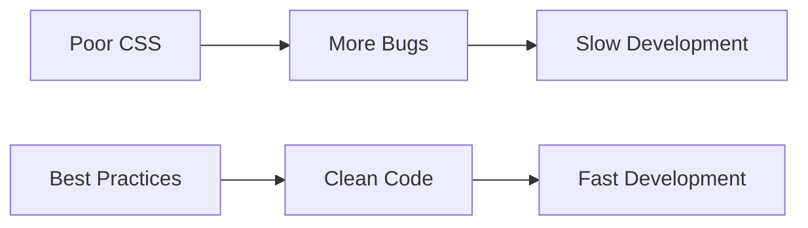
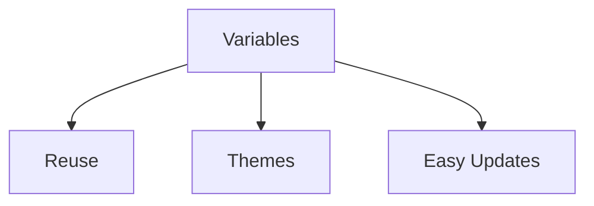

# ✅ CSS Best Practices

Writing CSS that works is good. Writing CSS that is **maintainable, scalable,
performant, and easy to understand** is even better.

CSS Best Practices help teams build applications that remain clean and
manageable as they grow.

---

## Why Best Practices Matter

Without best practices:

❌ Messy stylesheets

❌ Duplicate code

❌ Specificity conflicts

❌ Difficult debugging

❌ Poor performance

With best practices:

✅ Reusable code

✅ Easier maintenance

✅ Better performance

✅ Consistent design

✅ Faster development

## Development Flow

<!-- Visual flow for ✅ CSS Best Practices. -->


## Use CSS Variables

Store reusable values in one place.

## Good

/* Basic example showing the core idea. */
```css
:root {
  --primary-color: #2563eb;
  --border-radius: 12px;
}

.button {
  background: var(--primary-color);
}
```

## Benefits

<!-- Visual flow for ✅ CSS Best Practices. -->


## Prefer Classes Over IDs

Classes are reusable and have lower specificity.

## Avoid

/* Basic example showing the core idea. */
```css
#header {
  background: black;
}
```

## Prefer

/* Basic example showing the core idea. */
```css
.header {
  background: black;
}
```

## Specificity Hierarchy

Element["Element (1)"]

Class["Class (10)"]

ID["ID (100)"]

Inline["Inline (1000)"]

Element --> Class
    Class --> ID
    ID --> Inline
// Example demonstrating ✅ CSS Best Practices.
```

## Keep Selectors Simple

```css
.sidebar ul li a span {
  color: red;
}
// Example demonstrating ✅ CSS Best Practices.
```

```css
.sidebar-link {
  color: red;
}
// Example demonstrating ✅ CSS Best Practices.
```

## Selector Comparison

Deep["Deep Selector"]

Complex["Hard To Maintain"]

Simple["Simple Class"]

Easy["Easy To Maintain"]

Deep --> Complex

Simple --> Easy
```

## 📱 Design Mobile First

Start with mobile styles and enhance for larger screens.

## Mobile First Example

/* Basic example showing the core idea. */
```css
.card {
  width: 100%;
}

@media (min-width: 768px) {
  .card {
    width: 50%;
  }
}
```

## Responsive Flow

Mobile["📱 Mobile"]

Tablet["📲 Tablet"]

Desktop["🖥️ Desktop"]

Mobile --> Tablet --> Desktop
// Example demonstrating ✅ CSS Best Practices.
```

## Use Flexbox and Grid

Modern layouts should use:

✅ Flexbox

✅ CSS Grid

## Flexbox

```css
.container {
  display: flex;
}
// Example demonstrating ✅ CSS Best Practices.
```

## Grid

```css
.container {
  display: grid;
}
// Example demonstrating ✅ CSS Best Practices.
```

## Layout Evolution

Float["Floats"]

Flex["Flexbox"]

Grid["Grid"]

Float --> Flex --> Grid
```

## Use Gap Instead of Margins

/* Basic example showing the core idea. */
```css
.card {
  margin-right: 20px;
}
```

/* Basic example showing the core idea. */
```css
.container {
  display: flex;
  gap: 20px;
}
```

## Why Gap?

Margin["Margins"]

Gap["Gap"]

Margin --> Problems["Layout Problems"]

Gap --> Clean["Cleaner Layout"]
// Example demonstrating ✅ CSS Best Practices.
```

## Organize CSS Properly

Use a predictable folder structure.

```text
styles/

├── base/
├── layout/
├── components/
├── utilities/
├── pages/
└── main.css
// Example demonstrating ✅ CSS Best Practices.
```

## Architecture Flow

Base

Layout

Components

Utilities

Pages

Base --> Layout
    Layout --> Components
    Components --> Utilities
    Utilities --> Pages
```

## Follow a Naming Convention

Popular choice:

### BEM

/* Basic example showing the core idea. */
```css
.card {
}

.card__title {
}

.card--featured {
}
```

## BEM Structure

Block["Block"]

Element["Element"]

Modifier["Modifier"]

Block --> Element
    Block --> Modifier
// Example demonstrating ✅ CSS Best Practices.
```

## 🚫 Avoid !important

```css
.button {
  color: red !important;
}
// Example demonstrating ✅ CSS Best Practices.
```

```css
.button--danger {
  color: red;
}
// Example demonstrating ✅ CSS Best Practices.
```

## Specificity Wars

Important["!important"]

More["More !important"]

Chaos["Maintenance Chaos"]

Important --> More --> Chaos
```

## Use Relative Units

/* Basic example showing the core idea. */
```css
font-size: 32px;
```

/* Basic example showing the core idea. */
```css
font-size: 2rem;
```

Rem["rem"]

Accessibility["Accessibility"]

Scaling["Better Scaling"]

Rem --> Accessibility
    Rem --> Scaling
// Example demonstrating ✅ CSS Best Practices.
```

## Optimize Animations

Animate:

✅ transform

✅ opacity

Avoid:

❌ width

❌ height

❌ top

❌ left

## Performance Comparison

Transform["transform"]

GPU["GPU Accelerated"]

Width["width"]

Layout["Layout Recalculation"]

Transform --> GPU
    Width --> Layout
```

## Keep Nesting Shallow

// Example demonstrating ✅ CSS Best Practices.
```scss
.card {
  .header {
    .title {
      .icon {
      }
    }
  }
}
```

## Better

// Example demonstrating ✅ CSS Best Practices.
```scss
.card {
  .title {
  }
}
```

## Nesting Structure

Good["1-3 Levels"]

Bad["Deep Nesting"]

Good --> Maintainable["Maintainable"]

Bad --> Complex["Complex CSS"]
// Example demonstrating ✅ CSS Best Practices.
```

## Build Reusable Components

Instead of:

```css
.button-primary {
}

.button-secondary {
}

.button-success {
}
// Example demonstrating ✅ CSS Best Practices.
```

Create:

```css
.button {
}

.button--primary {
}

.button--secondary {
}

.button--success {
}
// Example demonstrating ✅ CSS Best Practices.
```

## Component Flow

Base["Base Component"]

Variants["Variants"]

Reusable["Reusable UI"]

Base --> Variants --> Reusable
```

## Bad

/* Basic example showing the core idea. */
```css
.card {
  width: 1200px;
}
```

/* Basic example showing the core idea. */
```css
.layout {
  max-width: 1200px;
}

.card {
  padding: 1rem;
}
```

## 📱 Test Responsiveness Frequently

Test on:

✅ Mobile

✅ Tablet

✅ Desktop

## Testing Workflow

Mobile

Tablet

Desktop

## Write Accessible CSS

Always maintain focus indicators.

/* Basic example showing the core idea. */
```css
button:focus {
  outline: none;
}
```

/* Basic example showing the core idea. */
```css
button:focus {
  outline: 2px solid blue;
}
```

## Accessibility Flow

Keyboard["Keyboard User"]

Focus["Visible Focus"]

Accessibility["Accessible Interface"]

Keyboard --> Focus --> Accessibility
// Example demonstrating ✅ CSS Best Practices.
```

## 🧹 Remove Unused CSS

Unused CSS increases bundle size.

Use tools:

- Chrome Coverage
- PurgeCSS
- Tailwind Content Scanner

## Optimization Flow

Large["Large CSS"]

Remove["Remove Unused CSS"]

Minify["Minify"]

Small["Optimized CSS"]

Large --> Remove --> Minify --> Small
```

## Use Modern CSS Features

Prefer modern solutions.

| Old                | Modern            |
| ------------------ | ----------------- |
| Floats             | Flexbox           |
| Positioning Hacks  | Grid              |
| Repeated Values    | Variables         |
| Margin Spacing     | Gap               |
| Fixed Sizes        | Clamp             |
| Complex JS Layouts | Container Queries |

## Modern CSS Evolution

Old["Traditional CSS"]

Modern["Modern CSS"]

Old --> Modern

Modern --> Grid
    Modern --> Variables
    Modern --> ContainerQueries["Container Queries"]
// Example demonstrating ✅ CSS Best Practices.
```

### Architecture

✅ Organize CSS files

✅ Use naming conventions

✅ Keep selectors simple

### Responsiveness

✅ Mobile-first

✅ Relative units

✅ Responsive layouts

### Performance

✅ Use transform animations

✅ Remove unused CSS

✅ Optimize images

### Maintainability

✅ CSS Variables

✅ Reusable components

✅ Consistent naming

### Accessibility

✅ Focus states

✅ Readable typography

✅ Proper contrast

## Key Takeaways

- Use classes instead of IDs.
- Keep selectors simple and predictable.
- Build mobile-first responsive layouts.
- Use Flexbox and Grid for layouts.
- Store reusable values in CSS Variables.
- Optimize animations using `transform` and `opacity`.
- Follow a consistent architecture like BEM or component-based CSS.
- Prioritize accessibility and performance from the start.
- Write CSS that future developers (including yourself) can easily understand
  and maintain.

## 🎉 CSS Learning Path Completed

Basics["Getting Started"]

Layout["Layout"]

Visual["Visual Design"]

Quality["Quality & Best Practices"]

Basics --> Layout --> Visual --> Modern --> Quality
```
